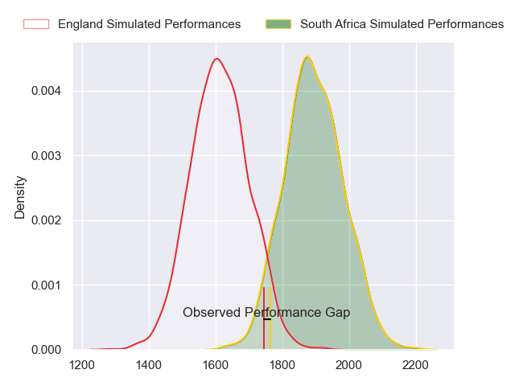
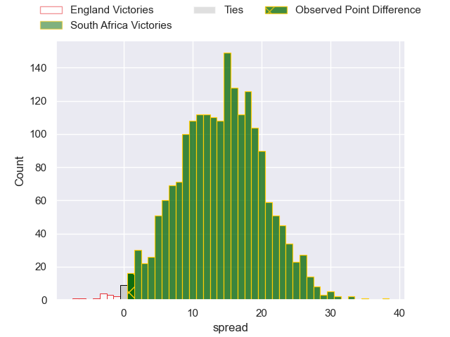
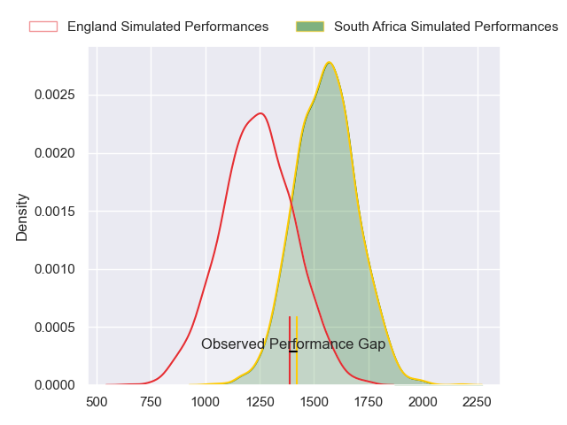
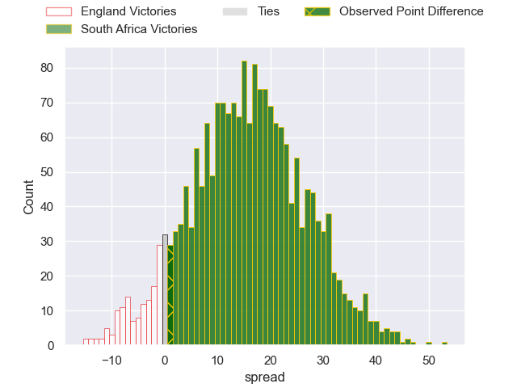
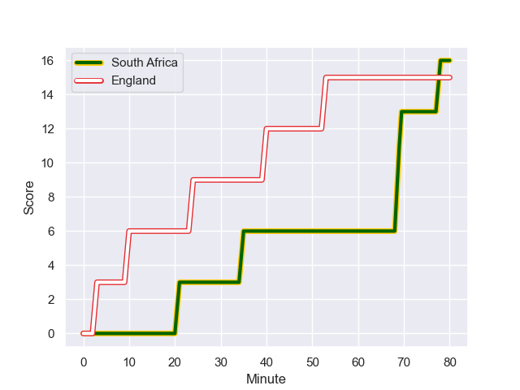
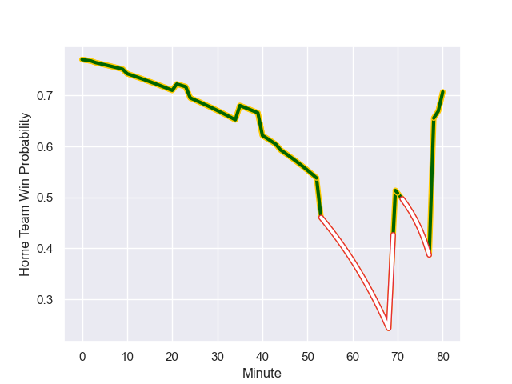

---  
layout: page  
title: England at South Africa; 15.0-16.0  
date: 2023-10-21 18:00:00 -0500  
categories: "Rugby World Cup 2023" match review  
---
# England at South Africa; 15.0-16.0

# Club Level Predictions

The first set of predictions treats a club as the smallest object, as the club develops its members, organizes a gameplan, and deploys its players as needed for each match. This club model has a prediction of 0.827, which translates to predicting South Africa to win by 14.1.

Each club has a rating and a rating deviation (similar to a Glicko rating), and expected performances can be generated. This allows for simulated matches and spreads like the ones below.
## Projected Performances - Club Model

## Projected Spreads - Club Model

## Projected Results - Club Model

# Player Level Predictions - Version 2

Treating teams instead as an entity made up of the currently active players, I have ratings for each player in an altogether different system. These can be combined to form team ratings once teamsheets are announced, weighting starters a bit higher than the reserves. After the match is played, players can be weighted by their minutes on the field, allowing for an accurate measure of the team's composition. With these compiled team ratings, we can make predictions, measure inaccuracy, and update the individual player ratings.
## Prediction with Player Minutes: South Africa by 13.4

South Africa by 13.4 on a neutral field
## Prediction without Player Minutes: South Africa by 13.4

South Africa by 13.4 on a neutral pitch

## Projected Performances - Player Model

## Projected Spreads - Player Model

## Projected Results - Player Model

## Scores over Time

## Win Probability over Time

There were 8 large changes in win probability in this match

|   Away Minutes | Away Player     |   Away elo |   Number |   Home elo | Home Player          |   Home Minutes |
|---------------:|:----------------|-----------:|---------:|-----------:|:---------------------|---------------:|
|             53 | Joe Marler      |      96.6  |        1 |      97.03 | Steven Kitshoff      |             49 |
|             80 | Jamie George    |     110.63 |        2 |     101.24 | Bongi Mbonambi       |             80 |
|             56 | Dan Cole        |      47.65 |        3 |      84.96 | Frans Malherbe       |             56 |
|             80 | Maro Itoje      |     107.4  |        4 |     111.79 | Eben Etzebeth        |             46 |
|             53 | George Martin   |      68    |        5 |     113.79 | Franco Mostert       |             80 |
|             80 | Courtney Lawes  |      86.86 |        6 |     114.4  | Siya Kolisi          |             51 |
|             69 | Tom Curry       |      67.87 |        7 |      78.79 | Pieter-Steph du Toit |             80 |
|             80 | Ben Earl        |      94.91 |        8 |     126.15 | Duane Vermeulen      |             51 |
|             53 | Alex Mitchell   |      67.97 |        9 |      87.32 | Cobus Reinach        |             42 |
|             80 | Owen Farrell    |     131.99 |       10 |      74.83 | Manie Libbok         |             31 |
|             80 | Elliot Daly     |      64.12 |       11 |     136.39 | Cheslin Kolbe        |             80 |
|             74 | Manu Tuilagi    |     104.07 |       12 |      88.57 | Damian de Allende    |             80 |
|             80 | Joe Marchant    |      82.61 |       13 |     134.39 | Jesse Kriel          |             80 |
|             78 | Jonny May       |      41.88 |       14 |     109.93 | Kurt-Lee Arendse     |             80 |
|             80 | Freddie Steward |      55.88 |       15 |     111.9  | Damian Willemse      |             44 |
|             27 | Ellis Genge     |      34.53 |       16 |     103.35 | Handre Pollard       |             49 |
|             27 | Ollie Chessum   |      60.23 |       17 |     108.42 | Faf de Klerk         |             38 |
|             27 | Danny Care      |     135.06 |       18 |     106.34 | Willie le Roux       |             36 |
|             24 | Kyle Sinckler   |      62.98 |       19 |     117.09 | RG Snyman            |             34 |
|             11 | Billy Vunipola  |     122.55 |       20 |     107.71 | Ox Nche              |             31 |
|              6 | Ollie Lawrence  |      56.08 |       21 |      91.37 | Deon Fourie          |             29 |
|              2 | George Ford     |      97.25 |       22 |      68.96 | Kwagga Smith         |             29 |
|            nan | nan             |     nan    |       23 |      48.27 | Vincent Koch         |             24 |

