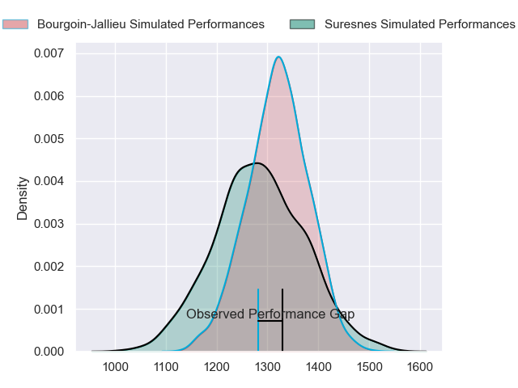
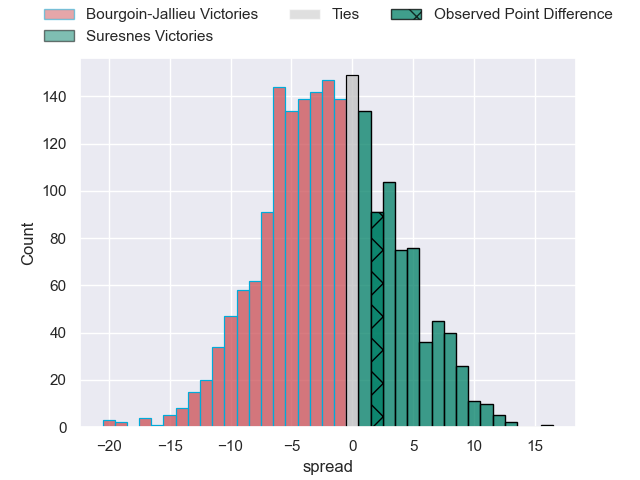
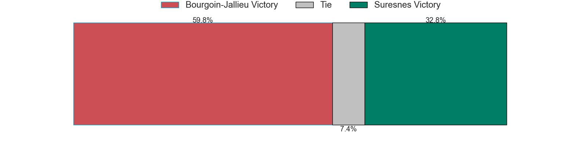
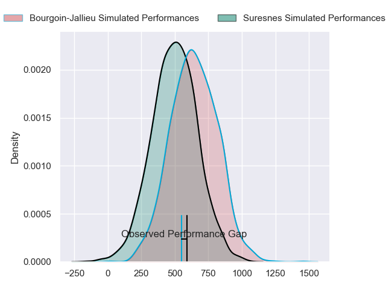
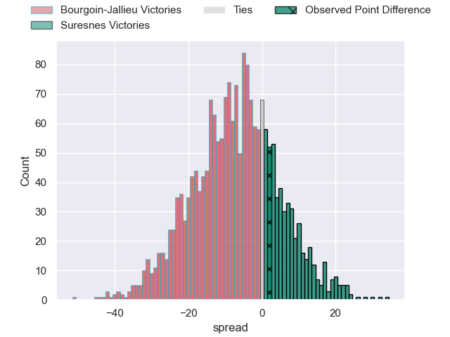
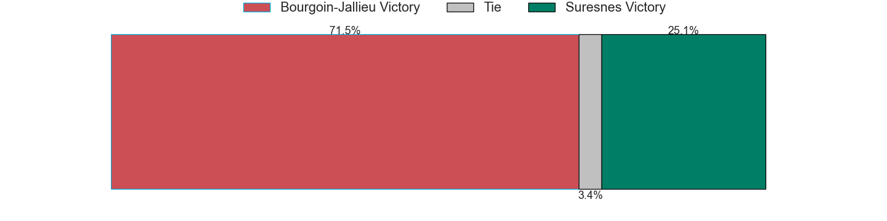
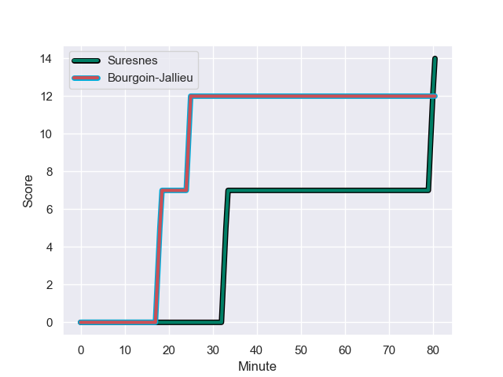
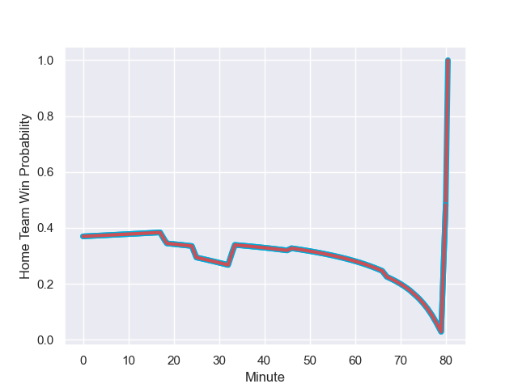

---  
layout: page  
title: Bourgoin-Jallieu at Suresnes; 12.0-14.0  
date: 2023-10-21 18:00:00 -0500  
categories: "Nationale 2023" match review  
---
# Bourgoin-Jallieu at Suresnes; 12.0-14.0

# Club Level Predictions

The first set of predictions treats a club as the smallest object, as the club develops its members, organizes a gameplan, and deploys its players as needed for each match. This club model has a prediction of 0.447, which translates to predicting Bourgoin-Jallieu to win by 1.9.

Each club has a rating and a rating deviation (similar to a Glicko rating), and expected performances can be generated. This allows for simulated matches and spreads like the ones below.
## Projected Performances - Club Model

## Projected Spreads - Club Model

## Projected Results - Club Model

# Player Level Predictions - Version 2

Treating teams instead as an entity made up of the currently active players, I have ratings for each player in an altogether different system. These can be combined to form team ratings once teamsheets are announced, weighting starters a bit higher than the reserves. After the match is played, players can be weighted by their minutes on the field, allowing for an accurate measure of the team's composition. With these compiled team ratings, we can make predictions, measure inaccuracy, and update the individual player ratings.
## Prediction with Player Minutes: Bourgoin-Jallieu by 5.9

Bourgoin-Jallieu by 9.2 on a neutral field
## Prediction without Player Minutes: Bourgoin-Jallieu by 5.5

Bourgoin-Jallieu by 8.7 on a neutral pitch

## Projected Performances - Player Model

## Projected Spreads - Player Model

## Projected Results - Player Model

## Scores over Time

## Win Probability over Time

There were 7 large changes in win probability in this match

|   Away Minutes | Away Player              |   Away elo |   Number |   Home elo | Home Player         |   Home Minutes |
|---------------:|:-------------------------|-----------:|---------:|-----------:|:--------------------|---------------:|
|             74 | Romain Favaretto         |      46.78 |        1 |      46.64 | Elias Coulibaly     |             67 |
|             46 | Louis Ponton             |      46.65 |        2 |      33.25 | Hayam El Bibouji    |             67 |
|             66 | Osman Dimen              |      47.32 |        3 |      29.86 | Leandro Mario Assi  |             67 |
|             66 | Robin Gascou             |      47.86 |        4 |      33.16 | Sacha Yahi          |             80 |
|             80 | Morgan Eames             |      -8.25 |        5 |      53.9  | Marvin Woki         |             73 |
|             80 | Kevin Chaudouard         |      51.91 |        6 |      20.41 | Florian Desbordes   |             73 |
|             80 | Bynjamin Rabatel         |      67.55 |        7 |      16.89 | Wian Vosloo         |             80 |
|             80 | Poutasi Luafutu          |      49.45 |        8 |      46.22 | Lakisipone Lee      |             80 |
|             59 | Adrien Pontarollo        |      34.2  |        9 |      28.41 | Thomas Lacroix      |             67 |
|             80 | Nicolas Vuillemin        |      59.58 |       10 |      55.59 | Victor Barnier      |             67 |
|             80 | Quentin Lefort           |      26.47 |       11 |       5.7  | Alexis Clement      |             80 |
|             80 | Pieter Morton            |      59.53 |       12 |      42.08 | Petero Tuwai        |             80 |
|             66 | Brieuc Plessis-Couillaud |      31.75 |       13 |      -3.95 | JJ Taulagi          |             80 |
|             80 | Paul-Hugo Champ          |      49.71 |       14 |       3.08 | Ervin Muric         |             80 |
|             80 | Remi Bouet               |      27.6  |       15 |      13.21 | Thomas Baudy        |             80 |
|              6 | Paul Mazzilli            |      46.65 |       16 |      14.42 | Lucas Dycke         |             13 |
|             34 | Mohamed Khribache        |      29.76 |       17 |      34.35 | Anthony Bajart      |             13 |
|             14 | Maxime Calliet           |      46.65 |       18 |      34.6  | Victor Damian Arias |             13 |
|             14 | Jonathan Kpoku           |      43.72 |       19 |      20.8  | Yakine Djebarri     |              7 |
|             21 | Tomas Munilla lo Duca    |      62.89 |       20 |      48.98 | Damien Bozic        |              7 |
|             14 | Christopher Bosch        |      38.22 |       21 |      23.87 | Théo Bachiri        |             13 |
|            nan | nan                      |     nan    |       22 |      43.2  | Tanguy Lacoste      |             13 |

