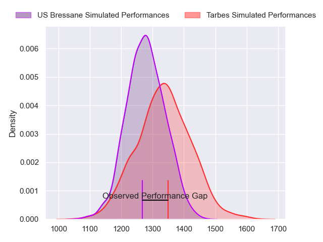
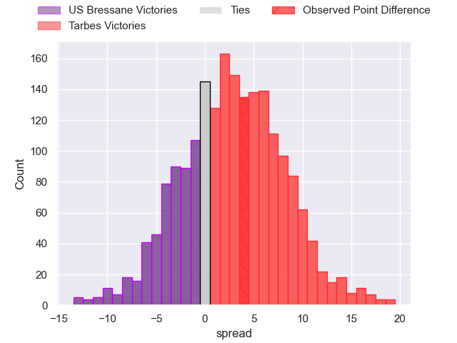
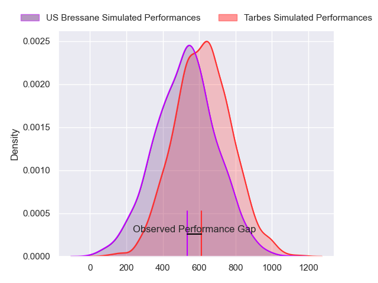
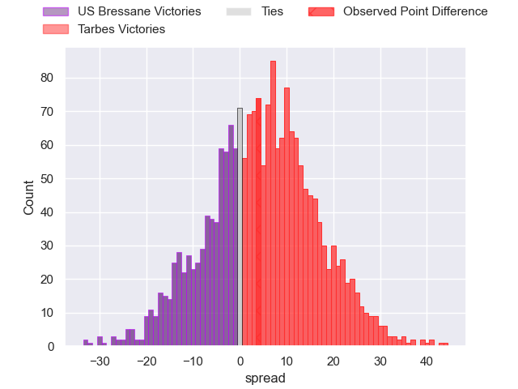
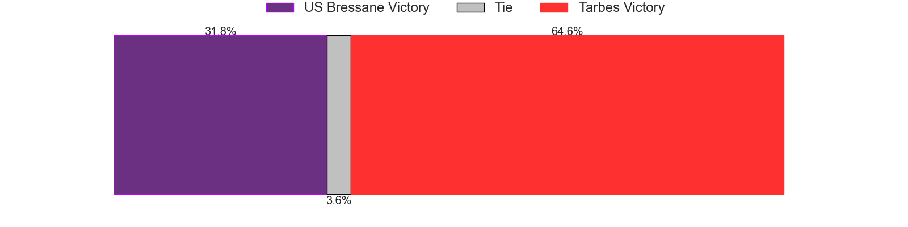
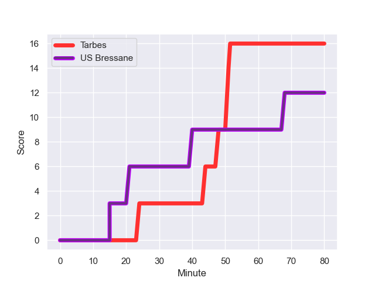
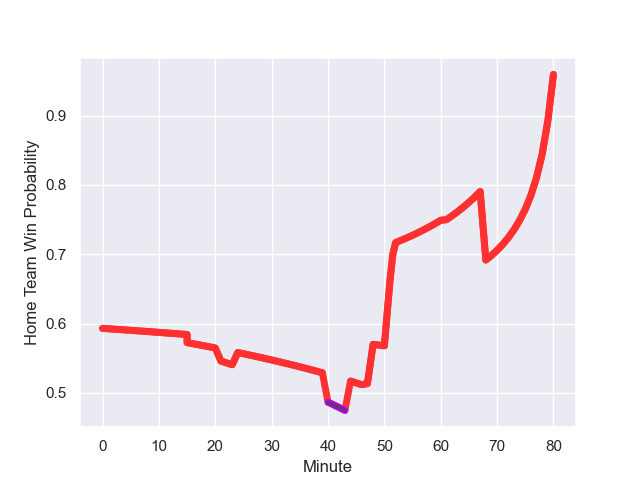

---  
layout: page  
title: US Bressane at Tarbes; 12.0-16.0  
date: 2023-10-21 18:00:00 -0500  
categories: "Nationale 2023" match review  
---
# US Bressane at Tarbes; 12.0-16.0

# Club Level Predictions

The first set of predictions treats a club as the smallest object, as the club develops its members, organizes a gameplan, and deploys its players as needed for each match. This club model has a prediction of 0.582, which translates to predicting Tarbes to win by 2.9.

Each club has a rating and a rating deviation (similar to a Glicko rating), and expected performances can be generated. This allows for simulated matches and spreads like the ones below.
## Projected Performances - Club Model

## Projected Spreads - Club Model

## Projected Results - Club Model

# Player Level Predictions - Version 2

Treating teams instead as an entity made up of the currently active players, I have ratings for each player in an altogether different system. These can be combined to form team ratings once teamsheets are announced, weighting starters a bit higher than the reserves. After the match is played, players can be weighted by their minutes on the field, allowing for an accurate measure of the team's composition. With these compiled team ratings, we can make predictions, measure inaccuracy, and update the individual player ratings.
## Prediction with Player Minutes: Tarbes by 4.2

Tarbes by 0.1 on a neutral field
## Prediction without Player Minutes: Tarbes by 4.4

Tarbes by 0.2 on a neutral pitch

## Projected Performances - Player Model

## Projected Spreads - Player Model

## Projected Results - Player Model

## Scores over Time

## Win Probability over Time

There were 10 large changes in win probability in this match

|   Away Minutes | Away Player               |   Away elo |   Number |   Home elo | Home Player        |   Home Minutes |
|---------------:|:--------------------------|-----------:|---------:|-----------:|:-------------------|---------------:|
|             61 | Quentin Drancourt         |      33.22 |        1 |      33.72 | Alexandre Combier  |             48 |
|             48 | Arnaud Feltrin            |      41.91 |        2 |      44.78 | Florian Lamothe    |             61 |
|             48 | Ma'afu Fia                |      53.62 |        3 |      42.82 | Toma Taufa         |             61 |
|             68 | Maselino Paulino          |     -10.34 |        4 |      45.33 | Francis Rolland    |             80 |
|             80 | Josh Peters               |      26.22 |        5 |      42.27 | Baptiste Peytavi   |             52 |
|             80 | Pierre Reynaud            |      34.12 |        6 |      33.69 | Léo Saint-Guilhem  |             47 |
|             80 | Thomas Déliance           |      42.96 |        7 |      39.59 | Léo Estaque        |             80 |
|             73 | Joseph Penitito           |      50.8  |        8 |      29.6  | Len Massyn         |             80 |
|             73 | Robin Graulle             |      30.61 |        9 |      50.09 | Mickael Thébault   |             52 |
|             80 | Fred Zeilinga             |      52.25 |       10 |      14.47 | Anthony Fuertes    |             80 |
|             80 | Thibaut Perrette          |      23.5  |       11 |      29.31 | Savenaca Rawaca    |             80 |
|             80 | Benjamin Doy              |      44.98 |       12 |      41.46 | Kalione Nasoko     |             80 |
|             58 | Parataiso Silafai-Lea'ana |      -3.39 |       13 |      33.76 | William Pees       |             80 |
|             80 | Kavekini Tabu             |      43.68 |       14 |      10.09 | Jone Tuva          |             52 |
|             80 | François Grange           |      43.64 |       15 |      31.63 | Mathieu Berbizier  |             80 |
|             19 | Teo Bordenave             |      38.53 |       16 |      45.57 | Antoine Palisse    |             32 |
|             32 | Clement Jullien           |      45.76 |       17 |      32.86 | Johan Mees Erasmus |             19 |
|             32 | Vazha Kapanadze           |      40    |       18 |      45.2  | Vincent Dolier     |             19 |
|             12 | Loic Baradel              |      32.92 |       19 |      42.24 | Aurelien Ricart    |             33 |
|              7 | Nail Ait Naceur           |      45.94 |       20 |       2.23 | Filipe Manu        |             28 |
|              7 | Jeremy Valencot           |      41.33 |       21 |      30.29 | Thibaut Dulucq     |             28 |
|             22 | Maile Mamao               |      28.44 |       22 |      42.05 | Yon Camou          |             28 |

