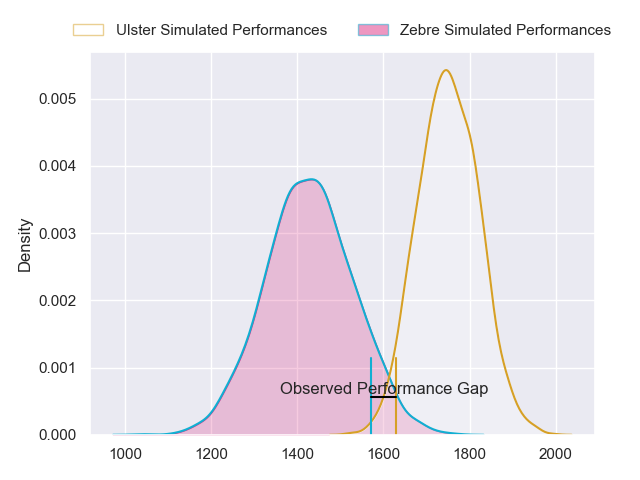
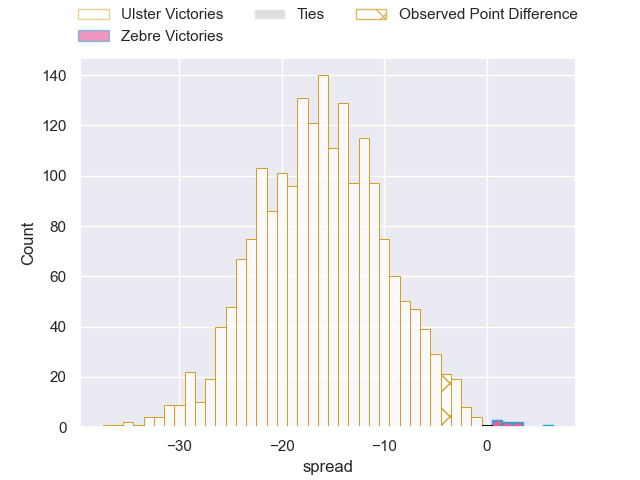
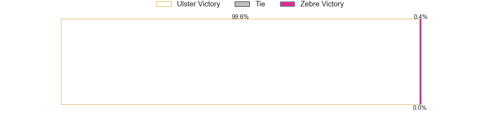
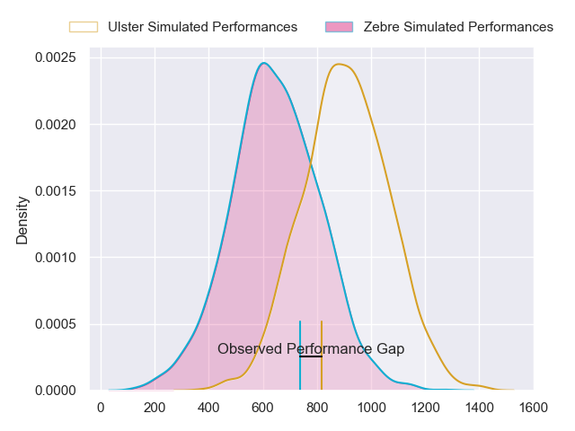
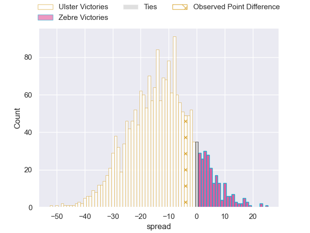
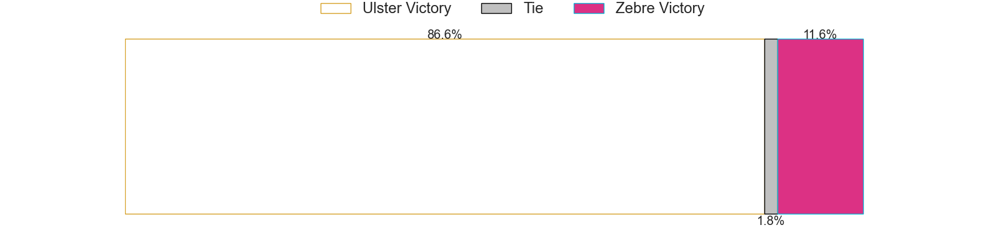
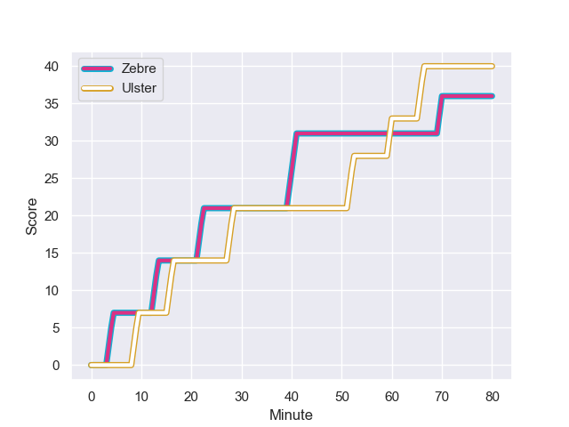
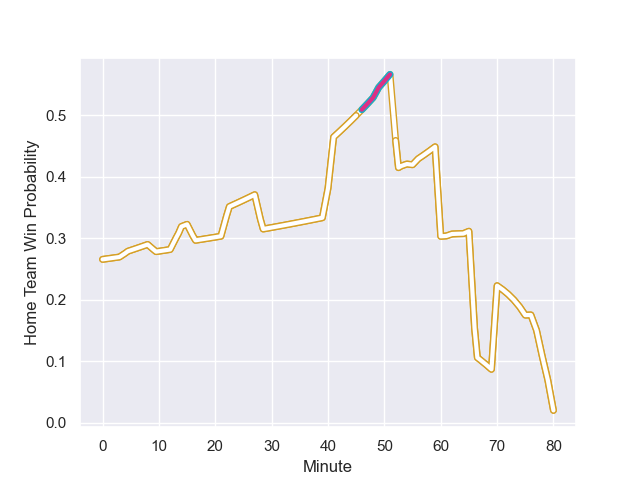

---  
layout: page  
title: Ulster at Zebre; 40.0-36.0  
date: 2023-10-21 18:00:00 -0500  
categories: "United Rugby Championship 2023" match review  
---
# Ulster at Zebre; 40.0-36.0

# Club Level Predictions

The first set of predictions treats a club as the smallest object, as the club develops its members, organizes a gameplan, and deploys its players as needed for each match. This club model has a prediction of 0.142, which translates to predicting Ulster to win by 16.0.

Each club has a rating and a rating deviation (similar to a Glicko rating), and expected performances can be generated. This allows for simulated matches and spreads like the ones below.
## Projected Performances - Club Model

## Projected Spreads - Club Model

## Projected Results - Club Model

# Player Level Predictions - Version 2

Treating teams instead as an entity made up of the currently active players, I have ratings for each player in an altogether different system. These can be combined to form team ratings once teamsheets are announced, weighting starters a bit higher than the reserves. After the match is played, players can be weighted by their minutes on the field, allowing for an accurate measure of the team's composition. With these compiled team ratings, we can make predictions, measure inaccuracy, and update the individual player ratings.
## Prediction with Player Minutes: Ulster by 11.2

Ulster by 14.9 on a neutral field
## Prediction without Player Minutes: Ulster by 10.3

Ulster by 14.0 on a neutral pitch

## Projected Performances - Player Model

## Projected Spreads - Player Model

## Projected Results - Player Model

## Scores over Time

## Win Probability over Time

There were 13 large changes in win probability in this match

|   Away Minutes | Away Player      |   Away elo |   Number |   Home elo | Home Player             |   Home Minutes |
|---------------:|:-----------------|-----------:|---------:|-----------:|:------------------------|---------------:|
|             49 | Andrew Warwick   |      52.06 |        1 |      39.75 | Paolo Buonfiglio        |             56 |
|             76 | Tom Stewart      |      40.92 |        2 |      40.99 | Luca Bigi               |             54 |
|             49 | Greg McGrath     |      31.8  |        3 |      32.77 | Juan Manuel Pitinari    |             65 |
|             49 | Matthew Rea      |      53.99 |        4 |       5.79 | Dave Sisi               |             68 |
|             80 | Kieran Treadwell |      59.34 |        5 |      31.53 | Andrea Zambonin         |             80 |
|             80 | Dave Ewers       |     107.16 |        6 |      47.9  | Guido Volpi             |             80 |
|             49 | Marcus Rea       |      82.81 |        7 |      39.44 | Giacomo Ferrari         |             80 |
|             80 | David McCann     |      57.99 |        8 |      34.29 | Giovanni Licata         |             62 |
|             76 | Nathan Doak      |      50.2  |        9 |      21.17 | Gonzalo Jesus Garcia    |             55 |
|             55 | Jake Flannery    |      48.86 |       10 |      66.15 | Geronimo Prisciantelli  |             78 |
|             80 | Jacob Stockdale  |      64.36 |       11 |       6.29 | Simone Gesi             |             80 |
|             40 | Angus Curtis     |      42.25 |       12 |      41.67 | Enrico Lucchin          |             80 |
|             80 | James Hume       |      63.04 |       13 |      60.82 | Fetuli Paea             |             80 |
|             80 | Michael Lowry    |      46.72 |       14 |      36.42 | Ben Cambriani           |             14 |
|             80 | Will Addison     |      86.7  |       15 |      20.59 | Lorenzo Pani            |             80 |
|             40 | Stewart Moore    |      84.9  |       16 |      48.4  | Scott Gregory           |             66 |
|             31 | Callum Reid      |      49.05 |       17 |      36.65 | Giampietro Ribaldi      |             26 |
|             31 | James French     |      49.04 |       18 |      27.8  | Alessandro Fusco        |             25 |
|             31 | Cormac Izuchukwu |      46.25 |       19 |      46.96 | Muhamed Hasa            |             24 |
|             31 | Nick Timoney     |      65.08 |       20 |      41.02 | Bautista Stavile Bravin |             18 |
|             25 | Billy Burns      |      69.1  |       21 |      43.2  | Riccardo Genovese       |             15 |
|              4 | David Shanahan   |      35.67 |       22 |      65.06 | Matteo Canali           |             12 |
|              4 | John Andrew      |      45.44 |       23 |      46.65 | Thomas Dominguez        |              2 |

