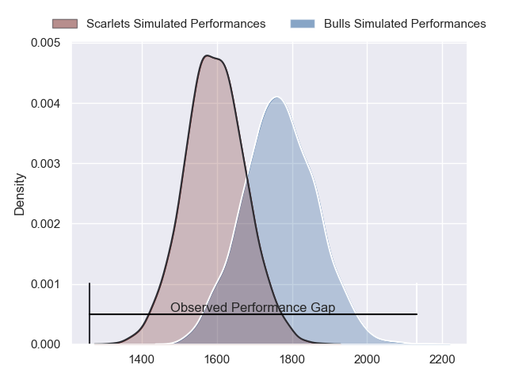
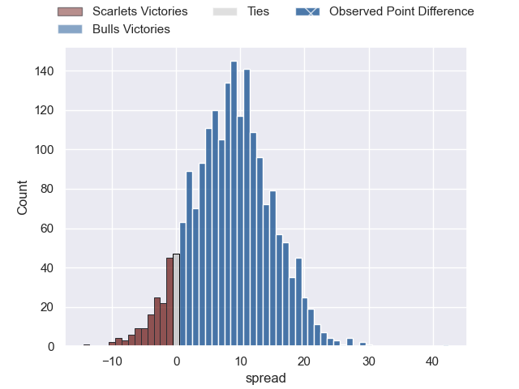
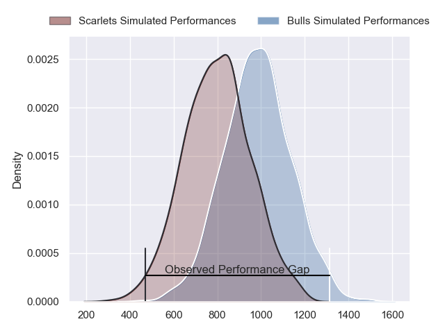
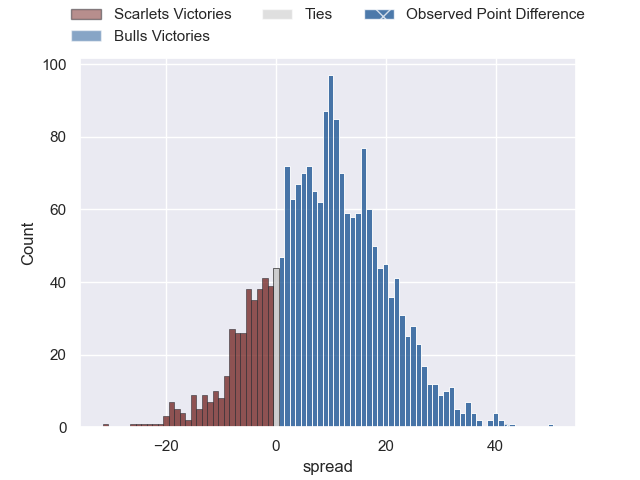
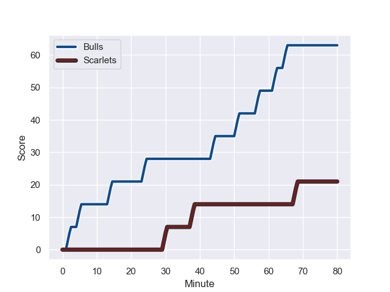
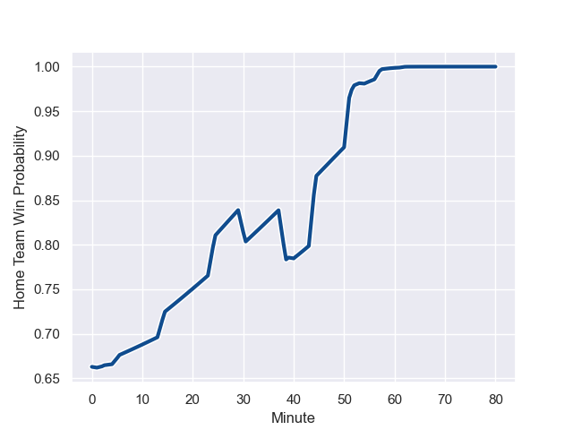

---  
layout: page  
title: Scarlets at Bulls; 21.0-63.0  
date: 2023-10-22 18:00:00 -0500  
categories: "United Rugby Championship 2023" match review  
---
# Scarlets at Bulls; 21.0-63.0

# Club Level Predictions

The first set of predictions treats a club as the smallest object, as the club develops its members, organizes a gameplan, and deploys its players as needed for each match. This club model has a prediction of 0.725, which translates to predicting Bulls to win by 8.7.

Each club has a rating and a rating deviation (similar to a Glicko rating), and expected performances can be generated. This allows for simulated matches and spreads like the ones below.
## Projected Performances - Club Model

## Projected Spreads - Club Model

## Projected Results - Club Model

# Player Level Predictions - Version 2

Treating teams instead as an entity made up of the currently active players, I have ratings for each player in an altogether different system. These can be combined to form team ratings once teamsheets are announced, weighting starters a bit higher than the reserves. After the match is played, players can be weighted by their minutes on the field, allowing for an accurate measure of the team's composition. With these compiled team ratings, we can make predictions, measure inaccuracy, and update the individual player ratings.
## Prediction with Player Minutes: Bulls by 7.4

Bulls by 3.6 on a neutral field
## Prediction without Player Minutes: Bulls by 8.5

Bulls by 4.7 on a neutral pitch

## Projected Performances - Player Model

## Projected Spreads - Player Model

## Projected Results - Player Model

## Scores over Time

## Win Probability over Time

There were 4 large changes in win probability in this match

|   Away Minutes | Away Player      |   Away elo |   Number |   Home elo | Home Player             |   Home Minutes |
|---------------:|:-----------------|-----------:|---------:|-----------:|:------------------------|---------------:|
|             51 | Kemsley Mathias  |      65.61 |        1 |      57.01 | Gerhard Steenekamp      |             54 |
|             72 | Shaun Evans      |      33.41 |        2 |      84.16 | Johan Grobbelaar        |             54 |
|             40 | Sam Wainwright   |      50.49 |        3 |      96.98 | Wilco Louw              |             54 |
|             80 | Alex Craig       |      48.33 |        4 |      24.78 | Ruan Vermaak            |             80 |
|             52 | Sam Lousi        |      72.08 |        5 |      50.46 | Ruan Nortje             |             61 |
|             80 | Taine Plumtree   |      59.34 |        6 |      82.22 | Marcell Coetzee         |             54 |
|             80 | Dan Davis        |      66.66 |        7 |      56.51 | Elrigh Louw             |             80 |
|             51 | Ben Williams     |      47.3  |        8 |      41.4  | Cameron Hanekom         |             80 |
|             51 | Kieran Hardy     |      60.93 |        9 |      71.83 | Embrose Papier          |             61 |
|             80 | Ioan Lloyd       |      34.47 |       10 |      46.24 | Johan Goosen            |             80 |
|             80 | Ryan Conbeer     |      50.64 |       11 |      35.41 | Stravino Jacobs         |             80 |
|             52 | Jonathan Davies  |      46.83 |       12 |      95.04 | Harold Vorster          |             49 |
|             80 | Joe Roberts      |      65.05 |       13 |      53.13 | David Kriel             |             80 |
|             59 | Tom Rogers       |      48.11 |       14 |      87.38 | Sebastian de Klerk      |             80 |
|             80 | Johnny McNicholl |      73.96 |       15 |      43.31 | Devon Williams          |             67 |
|             40 | Wyn Jones        |      62.41 |       16 |      49.74 | Stedman-Gee Rivett Gans |             31 |
|             29 | Archie Hughes    |      46.18 |       17 |      75.69 | Nizaam Carr             |             26 |
|             29 | Carwyn Tuipulotu |      50.42 |       18 |      92.39 | Akker van der Merwe     |             26 |
|             29 | Steffan Thomas   |      42.83 |       19 |      50.53 | Mornay Smith            |             26 |
|             28 | Ioan Nicholas    |      51.07 |       20 |      29.59 | Reinhardt Ludwig        |             19 |
|             21 | Charlie Titcombe |      46.65 |       21 |      67.01 | Zak Burger              |             19 |
|              8 | Isaac Young      |      46.65 |       22 |      49.96 | Jaco van der Walt       |             13 |
|             28 | Morgan Jones     |      16.31 |       23 |      51.83 | Simphiwe Matanzima      |             26 |

