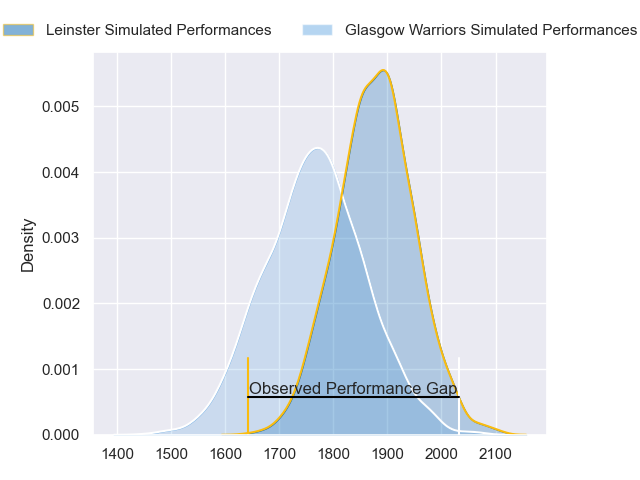
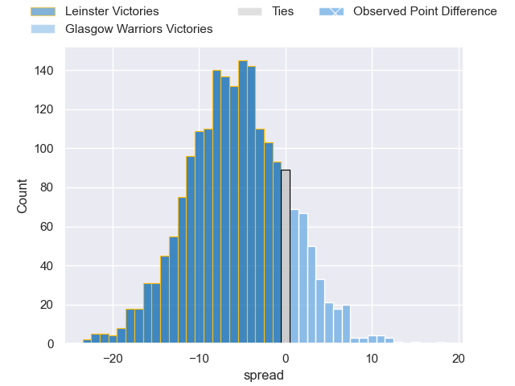
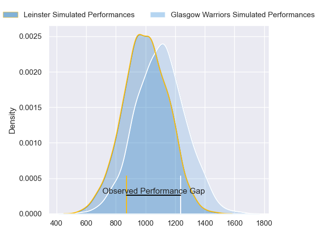
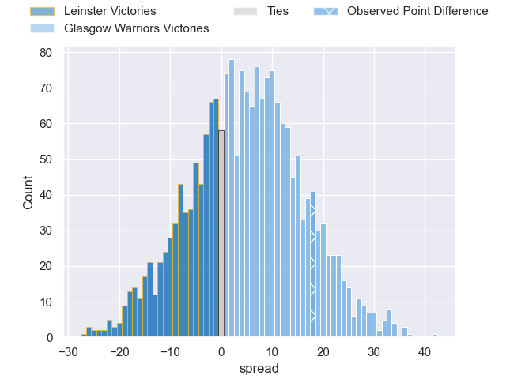
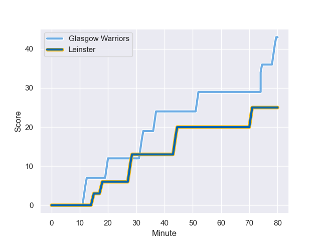
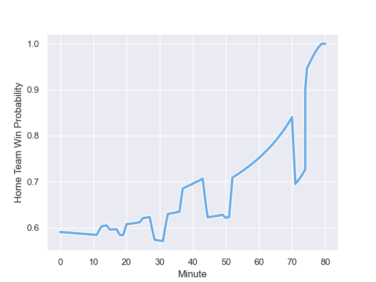

---  
layout: page  
title: Leinster at Glasgow Warriors; 25.0-43.0  
date: 2023-10-22 18:00:00 -0500  
categories: "United Rugby Championship 2023" match review  
---
# Leinster at Glasgow Warriors; 25.0-43.0

# Club Level Predictions

The first set of predictions treats a club as the smallest object, as the club develops its members, organizes a gameplan, and deploys its players as needed for each match. This club model has a prediction of 0.347, which translates to predicting Leinster to win by 5.6.

Each club has a rating and a rating deviation (similar to a Glicko rating), and expected performances can be generated. This allows for simulated matches and spreads like the ones below.
## Projected Performances - Club Model

## Projected Spreads - Club Model

## Projected Results - Club Model

# Player Level Predictions - Version 2

Treating teams instead as an entity made up of the currently active players, I have ratings for each player in an altogether different system. These can be combined to form team ratings once teamsheets are announced, weighting starters a bit higher than the reserves. After the match is played, players can be weighted by their minutes on the field, allowing for an accurate measure of the team's composition. With these compiled team ratings, we can make predictions, measure inaccuracy, and update the individual player ratings.
## Prediction with Player Minutes: Glasgow Warriors by 4.0

Glasgow Warriors by 0.2 on a neutral field
## Prediction without Player Minutes: Glasgow Warriors by 5.5

Glasgow Warriors by 1.3 on a neutral pitch

## Projected Performances - Player Model

## Projected Spreads - Player Model

## Projected Results - Player Model

## Scores over Time

## Win Probability over Time

There were 9 large changes in win probability in this match

|   Away Minutes | Away Player     |   Away elo |   Number |   Home elo | Home Player           |   Home Minutes |
|---------------:|:----------------|-----------:|---------:|-----------:|:----------------------|---------------:|
|             50 | Jack Boyle      |      47.78 |        1 |      88.53 | Oli Kebble            |             51 |
|             25 | John McKee      |      59.27 |        2 |      45.16 | Angus Fraser          |             51 |
|             50 | Thomas Clarkson |      55.21 |        3 |     111.28 | Zander Fagerson       |             59 |
|             80 | Ross Molony     |      85.65 |        4 |      13.56 | Greg Peterson         |             80 |
|             50 | Jason Jenkins   |      55.28 |        5 |     109.31 | Scott Cummings        |             75 |
|             80 | Max Deegan      |      80.32 |        6 |      45.97 | Gregor Brown          |             63 |
|             73 | Scott Penny     |      63.93 |        7 |      64.69 | Rory Darge            |             80 |
|             50 | James Culhane   |      37.64 |        8 |      98.94 | Henco Venter          |             51 |
|             50 | Luke McGrath    |     122.35 |        9 |      51.18 | Jamie Dobie           |             80 |
|             80 | Harry Byrne     |      72.1  |       10 |      45.11 | Tom Jordan            |             75 |
|             80 | Jordan Larmour  |      70.46 |       11 |     104.6  | Kyle Steyn            |             51 |
|             80 | Charlie Ngatai  |      99.84 |       12 |      74.03 | Stafford McDowall     |             80 |
|             66 | Liam Turner     |      59.76 |       13 |      43.66 | Huw Jones             |             80 |
|             80 | Tommy O'Brien   |      50.97 |       14 |     104.54 | Sebastian Cancelliere |             80 |
|             80 | Ciaran Frawley  |      56.12 |       15 |      41.5  | Josh McKay            |             80 |
|             55 | Lee Barron      |      45.36 |       16 |      47.43 | Nathan McBeth         |             29 |
|             30 | Rhys Ruddock    |     129.97 |       17 |      37.23 | Johnny Matthews       |             29 |
|             30 | Paddy McCarthy  |      46.65 |       18 |     128.73 | George Horne          |             29 |
|             30 | Rory McGuire    |      46.65 |       19 |      18.92 | Ally Miller           |             29 |
|             30 | Brian Deeny     |      46.45 |       20 |      69.39 | Lucio Sordoni         |             21 |
|             30 | Cormac Foley    |      49.91 |       21 |      84.25 | Tom Gordon            |             17 |
|             14 | Sam Prendergast |      38.71 |       22 |      48.45 | Alex Samuel           |              5 |
|              7 | Will Connors    |      58.36 |       23 |      62.33 | Duncan Weir           |              5 |

