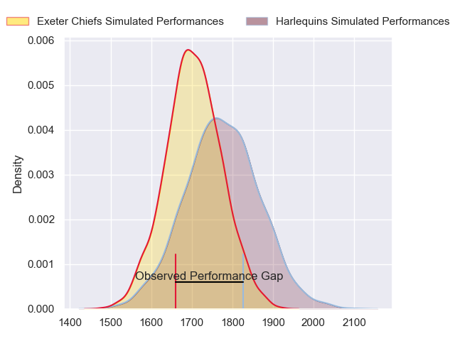
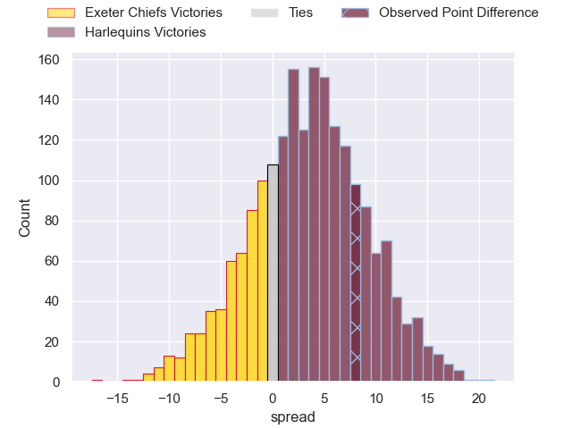
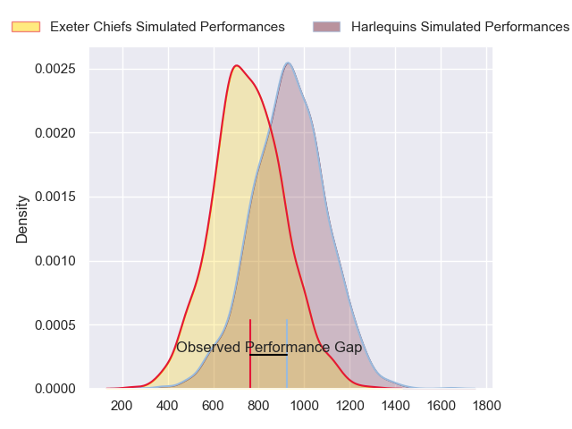
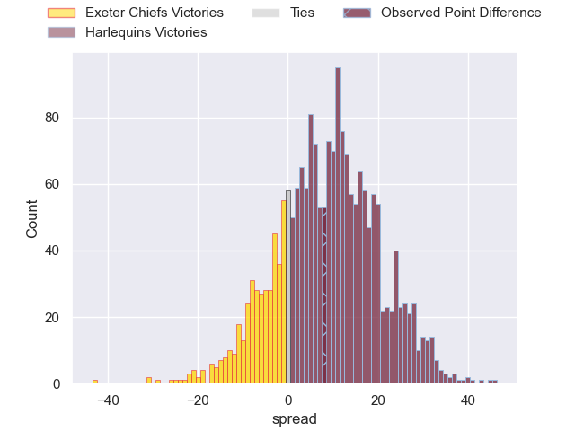
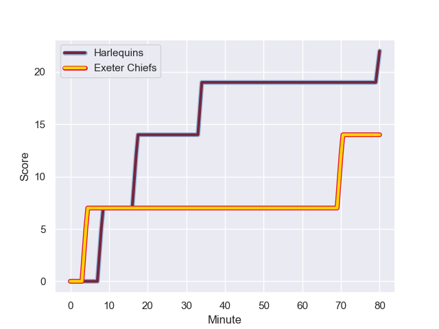
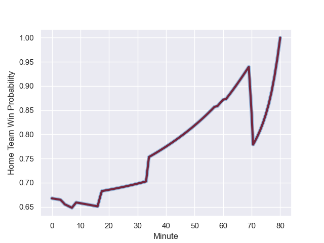

---  
layout: page  
title: Exeter Chiefs at Harlequins; 14.0-22.0  
date: 2023-10-22 18:00:00 -0500  
categories: "Gallagher Premiership 2023" match review  
---
# Exeter Chiefs at Harlequins; 14.0-22.0

# Club Level Predictions

The first set of predictions treats a club as the smallest object, as the club develops its members, organizes a gameplan, and deploys its players as needed for each match. This club model has a prediction of 0.598, which translates to predicting Harlequins to win by 3.5.

Each club has a rating and a rating deviation (similar to a Glicko rating), and expected performances can be generated. This allows for simulated matches and spreads like the ones below.
## Projected Performances - Club Model

## Projected Spreads - Club Model

## Projected Results - Club Model

# Player Level Predictions - Version 2

Treating teams instead as an entity made up of the currently active players, I have ratings for each player in an altogether different system. These can be combined to form team ratings once teamsheets are announced, weighting starters a bit higher than the reserves. After the match is played, players can be weighted by their minutes on the field, allowing for an accurate measure of the team's composition. With these compiled team ratings, we can make predictions, measure inaccuracy, and update the individual player ratings.
## Prediction with Player Minutes: Harlequins by 7.7

Harlequins by 2.9 on a neutral field
## Prediction without Player Minutes: Harlequins by 8.0

Harlequins by 3.2 on a neutral pitch

## Projected Performances - Player Model

## Projected Spreads - Player Model

## Projected Results - Player Model

## Scores over Time

## Win Probability over Time

There were 7 large changes in win probability in this match

|   Away Minutes | Away Player           |   Away elo |   Number |   Home elo | Home Player     |   Home Minutes |
|---------------:|:----------------------|-----------:|---------:|-----------:|:----------------|---------------:|
|             50 | Scott Sio             |      76.25 |        1 |      29.18 | Fin Baxter      |             69 |
|             50 | Jack Yeandle          |      70.59 |        2 |      42.18 | Sam Riley       |             53 |
|             50 | Ehren Painter         |      47.3  |        3 |      69.61 | Will Collier    |             53 |
|             58 | Rusiate Tuima         |      22.51 |        4 |      98.28 | Joe Launchbury  |             80 |
|             80 | Lewis Pearson         |      36.23 |        5 |       9.32 | George Hammond  |             61 |
|             80 | Ethan Roots           |      48.69 |        6 |      78.97 | Jack Kenningham |             77 |
|             61 | Jacques Vermeulen     |      53.95 |        7 |      46.01 | Will Evans      |             80 |
|             80 | Greg Fisilau          |      45.61 |        8 |      62.34 | Alex Dombrandt  |             80 |
|             57 | Tom Cairns            |      48.25 |        9 |      30.46 | Will Porter     |             61 |
|             80 | Harvey Skinner        |      25.38 |       10 |      78.44 | Jarrod Evans    |             80 |
|             80 | Tom Wyatt             |      64.63 |       11 |      58.08 | Louis Lynagh    |             61 |
|             80 | Tom Hendrickson       |      47.15 |       12 |      66.95 | Luke Northmore  |             69 |
|             80 | Henry Slade           |      90.21 |       13 |      57.68 | Will Joseph     |             80 |
|             72 | Ben Hammersley        |      46.65 |       14 |      58.73 | Tyrone Green    |             80 |
|             29 | Josh Hodge            |      11.94 |       15 |      29.9  | Nick David      |             80 |
|             30 | Billy Keast           |      52.85 |       16 |      35.9  | Jordan Els      |             11 |
|             30 | Dan Frost             |      48.74 |       17 |      51.01 | Nathan Jibulu   |             27 |
|             30 | Josh Iosefa-Scott     |      75.6  |       18 |      47.65 | Simon Kerrod    |             27 |
|             22 | Aidon Davis           |      35.62 |       19 |      73.36 | Dino Lamb       |             19 |
|             19 | Ross Micheal Vintcent |      46.65 |       20 |      76.18 | James Chisholm  |              3 |
|             23 | Niall Armstrong       |      46.65 |       21 |      40.06 | Max Green       |             19 |
|              8 | Will Haydon-Wood      |      34.72 |       22 |      46.48 | Oscar Beard     |             19 |
|             51 | Immanuel Feyi-Waboso  |      51.8  |       23 |      51.84 | Will Edwards    |             11 |

