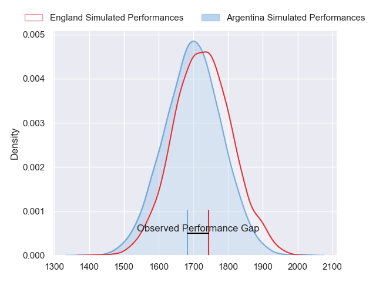
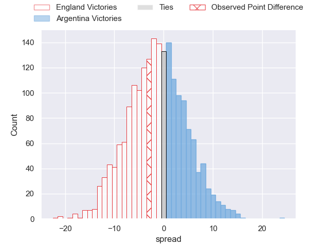
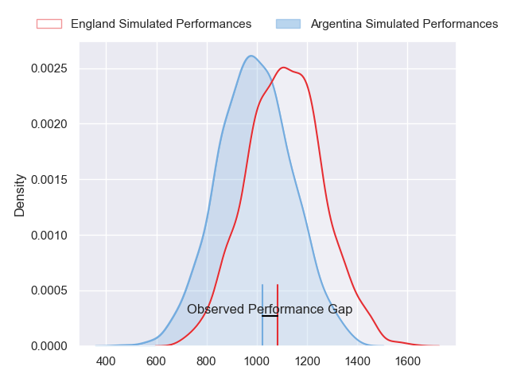
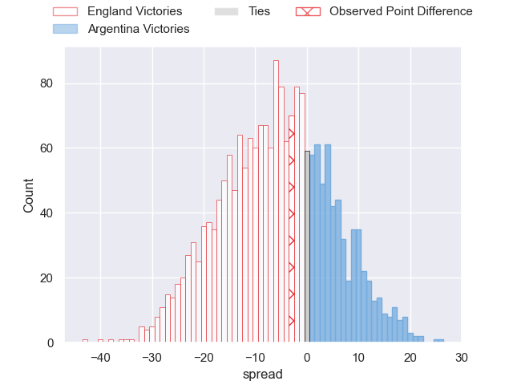
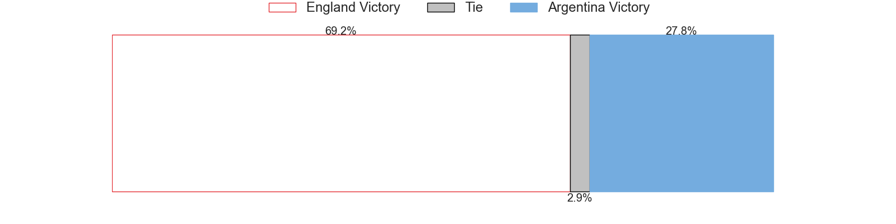
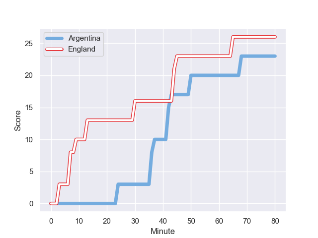
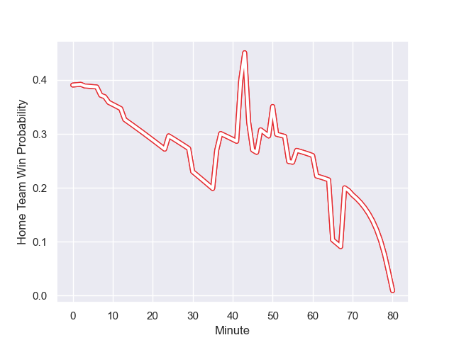

---  
layout: page  
title: England at Argentina; 26.0-23.0  
date: 2023-10-27 18:00:00 -0500  
categories: "Rugby World Cup 2023" match review  
---
# England at Argentina; 26.0-23.0

# Club Level Predictions

The first set of predictions treats a club as the smallest object, as the club develops its members, organizes a gameplan, and deploys its players as needed for each match. This club model has a prediction of 0.463, which translates to predicting England to win by 1.3.

Each club has a rating and a rating deviation (similar to a Glicko rating), and expected performances can be generated. This allows for simulated matches and spreads like the ones below.
## Projected Performances - Club Model

## Projected Spreads - Club Model

## Projected Results - Club Model

# Player Level Predictions - Version 2

Treating teams instead as an entity made up of the currently active players, I have ratings for each player in an altogether different system. These can be combined to form team ratings once teamsheets are announced, weighting starters a bit higher than the reserves. After the match is played, players can be weighted by their minutes on the field, allowing for an accurate measure of the team's composition. With these compiled team ratings, we can make predictions, measure inaccuracy, and update the individual player ratings.
## Prediction with Player Minutes: England by 4.9

England by 4.9 on a neutral field
## Prediction without Player Minutes: England by 3.6

England by 3.6 on a neutral pitch

## Projected Performances - Player Model

## Projected Spreads - Player Model

## Projected Results - Player Model

## Scores over Time

## Win Probability over Time

There were 17 large changes in win probability in this match

|   Away Minutes | Away Player     |   Away elo |   Number |   Home elo | Home Player            |   Home Minutes |
|---------------:|:----------------|-----------:|---------:|-----------:|:-----------------------|---------------:|
|             50 | Ellis Genge     |      34.64 |        1 |      58.87 | Thomas Gallo           |             66 |
|             54 | Theo Dan        |      44.58 |        2 |      79.55 | Julian Montoya         |             56 |
|             50 | Will Stuart     |      28.56 |        3 |      76.43 | Francisco Gomez Kodela |             61 |
|             80 | Maro Itoje      |     107.24 |        4 |      52.81 | Guido Petti            |             80 |
|             70 | Ollie Chessum   |      60.26 |        5 |      47.42 | Pedro Rubiolo          |             66 |
|             50 | Tom Curry       |      67.99 |        6 |      69.38 | Juan Martin Gonzalez   |             80 |
|             80 | Sam Underhill   |      46.65 |        7 |      40.72 | Marcos Kremer          |             80 |
|             80 | Ben Earl        |      94.84 |        8 |      94.93 | Facundo Isa            |             47 |
|             51 | Ben Youngs      |      68.54 |        9 |      46.1  | Tomas Cubelli          |             51 |
|             80 | Owen Farrell    |     132.54 |       10 |      71.12 | Santiago Carreras      |             56 |
|             66 | Henry Arundell  |      47.5  |       11 |      48.41 | Mateo Carreras         |             80 |
|             56 | Manu Tuilagi    |     104.01 |       12 |     107.7  | Jeronimo de la Fuente  |             80 |
|             80 | Joe Marchant    |      82.55 |       13 |      46.88 | Lucio Cinti            |             47 |
|             80 | Freddie Steward |      55.85 |       14 |      47.66 | Emiliano Boffelli      |             80 |
|             80 | Marcus Smith    |      76.62 |       15 |      85.88 | Juan Cruz Mallia       |             80 |
|             26 | Jamie George    |     110.55 |       16 |      88.86 | Agustin Creevy         |             24 |
|             30 | Bevan Rodd      |      63.43 |       17 |      60.54 | Joel Sclavi            |             14 |
|             30 | Dan Cole        |      47.68 |       18 |      11.92 | Eduardo Bello          |             19 |
|             10 | David Ribbans   |      66.89 |       19 |      54.66 | Matias Alemanno        |             14 |
|             30 | Lewis Ludlam    |      59.22 |       20 |      92.33 | Rodrigo Bruni          |             33 |
|             29 | Danny Care      |     135.25 |       21 |      49.41 | Lautaro Bazan Velez    |             29 |
|             24 | George Ford     |      97.35 |       22 |      92.13 | Nicolas Sanchez        |             24 |
|             14 | Ollie Lawrence  |      56.5  |       23 |     109.15 | Matias Moroni          |             33 |

