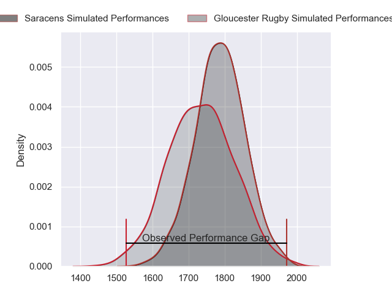
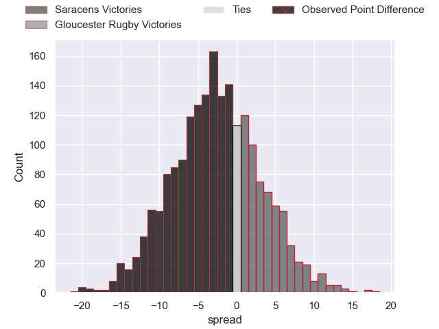
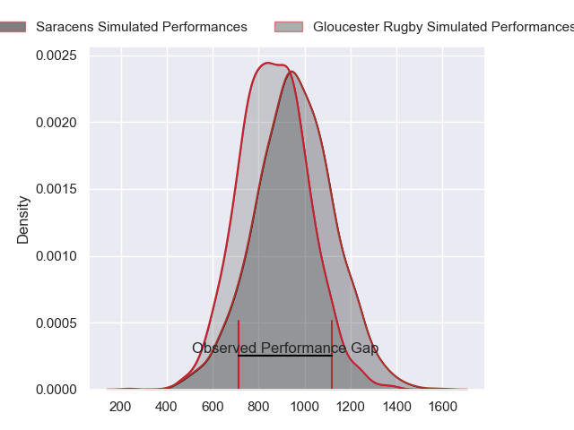
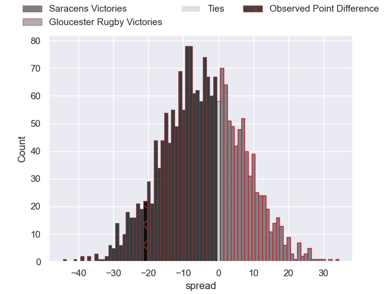
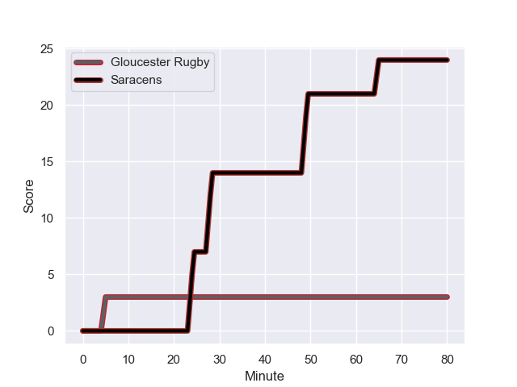
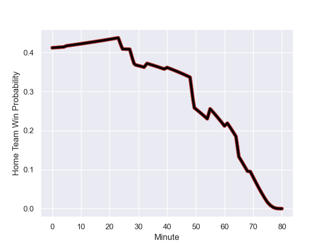

---  
layout: page  
title: Saracens at Gloucester Rugby; 24.0-3.0  
date: 2023-10-27 18:00:00 -0500  
categories: "Gallagher Premiership 2023" match review  
---
# Saracens at Gloucester Rugby; 24.0-3.0

# Club Level Predictions

The first set of predictions treats a club as the smallest object, as the club develops its members, organizes a gameplan, and deploys its players as needed for each match. This club model has a prediction of 0.432, which translates to predicting Saracens to win by 2.4.

Each club has a rating and a rating deviation (similar to a Glicko rating), and expected performances can be generated. This allows for simulated matches and spreads like the ones below.
## Projected Performances - Club Model

## Projected Spreads - Club Model

## Projected Results - Club Model

# Player Level Predictions - Version 2

Treating teams instead as an entity made up of the currently active players, I have ratings for each player in an altogether different system. These can be combined to form team ratings once teamsheets are announced, weighting starters a bit higher than the reserves. After the match is played, players can be weighted by their minutes on the field, allowing for an accurate measure of the team's composition. With these compiled team ratings, we can make predictions, measure inaccuracy, and update the individual player ratings.
## Prediction with Player Minutes: Saracens by 4.0

Saracens by 8.9 on a neutral field
## Prediction without Player Minutes: Saracens by 5.3

Saracens by 10.3 on a neutral pitch

## Projected Performances - Player Model

## Projected Spreads - Player Model

## Projected Results - Player Model

## Scores over Time

## Win Probability over Time

There were 4 large changes in win probability in this match

|   Away Minutes | Away Player        |   Away elo |   Number |   Home elo | Home Player         |   Home Minutes |
|---------------:|:-------------------|-----------:|---------:|-----------:|:--------------------|---------------:|
|             61 | Mako Vunipola      |     120.36 |        1 |      17.37 | Jamal Ford-Robinson |             55 |
|             78 | James Hadfield     |      41.75 |        2 |      55.49 | George McGuigan     |             33 |
|             40 | Christian Judge    |      60.18 |        3 |      56.59 | Kirill Gotovtsev    |             55 |
|             80 | Callum Hunter-Hill |      45.35 |        4 |      38.46 | Freddie Clarke      |             55 |
|             75 | Hugh Tizard        |      35.28 |        5 |      43.31 | Freddie Thomas      |             80 |
|             55 | Nick Isiekwe       |      82.47 |        6 |      84.51 | Albert Tuisue       |             80 |
|             80 | Andy Christie      |      46.32 |        7 |      46.56 | Lewis Ludlow        |             80 |
|             80 | Tom Willis         |      38.65 |        8 |      51.4  | Zach Mercer         |             29 |
|             69 | Aled Davies        |      70.25 |        9 |      33.49 | Stephen Varney      |             61 |
|             80 | Manu Vunipola      |      54.75 |       10 |      53.72 | George Barton       |             80 |
|             74 | Alex Lewington     |      46.39 |       11 |      77.63 | Ollie Thorley       |             80 |
|             78 | Nick Tompkins      |     107.68 |       12 |      24.99 | Sebastien Atkinson  |             80 |
|             80 | Alex Lozowski      |      67.75 |       13 |      73.16 | Chris Harris        |             80 |
|             80 | Sean Maitland      |      97.56 |       14 |      39.5  | Alex Hearle         |             55 |
|             80 | Alex Goode         |      88.07 |       15 |      12.01 | Jake Morris         |             63 |
|             19 | Eroni Mawi         |      44.75 |       16 |      36.55 | Harry Elrington     |             25 |
|             40 | Alec Clarey        |      41.16 |       17 |      86.68 | Jack Singleton      |             47 |
|              2 | Sam Crean          |      48.26 |       18 |      29.58 | Ciaran Knight       |             25 |
|              5 | Ollie Stonham      |      28.91 |       19 |      61.26 | Cameron Jordan      |             25 |
|             25 | Toby Knight        |      34.73 |       20 |      44.85 | Jack Clement        |             51 |
|             11 | Ivan van Zyl       |      61.9  |       21 |      40.67 | Charlie Chapman     |             19 |
|              6 | Tom Parton         |     102.04 |       22 |      77.54 | Max Llewellyn       |             17 |
|              2 | Olly Hartley       |      26.45 |       23 |      46.65 | Josh Hathaway       |             25 |

