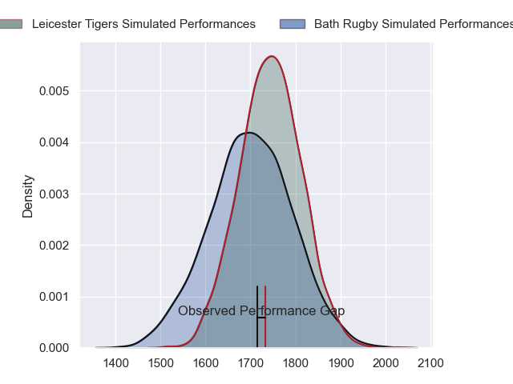
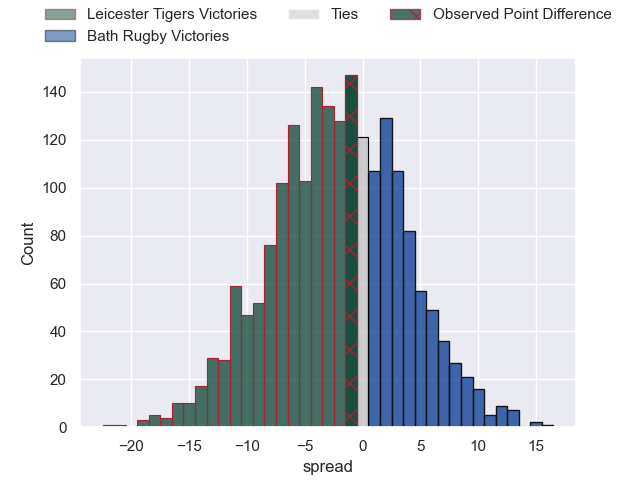
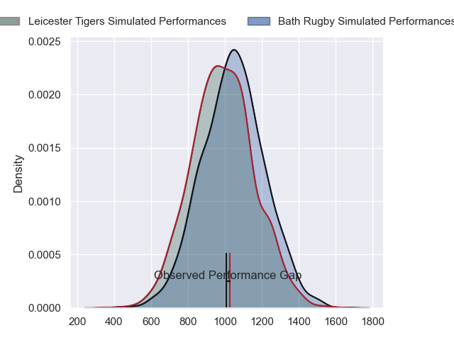
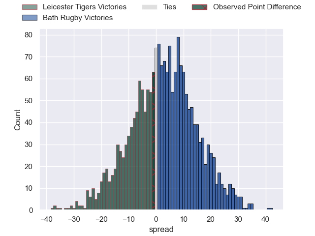
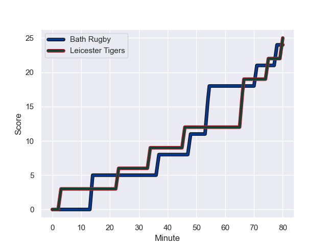
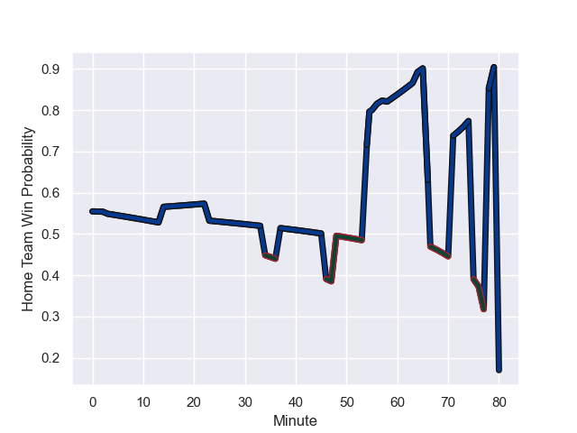

---  
layout: page  
title: Leicester Tigers at Bath Rugby; 25.0-24.0  
date: 2023-10-28 18:00:00 -0500  
categories: "Gallagher Premiership 2023" match review  
---
# Leicester Tigers at Bath Rugby; 25.0-24.0

# Club Level Predictions

The first set of predictions treats a club as the smallest object, as the club develops its members, organizes a gameplan, and deploys its players as needed for each match. This club model has a prediction of 0.438, which translates to predicting Leicester Tigers to win by 2.2.

Each club has a rating and a rating deviation (similar to a Glicko rating), and expected performances can be generated. This allows for simulated matches and spreads like the ones below.
## Projected Performances - Club Model

## Projected Spreads - Club Model

## Projected Results - Club Model

# Player Level Predictions - Version 2

Treating teams instead as an entity made up of the currently active players, I have ratings for each player in an altogether different system. These can be combined to form team ratings once teamsheets are announced, weighting starters a bit higher than the reserves. After the match is played, players can be weighted by their minutes on the field, allowing for an accurate measure of the team's composition. With these compiled team ratings, we can make predictions, measure inaccuracy, and update the individual player ratings.
## Prediction with Player Minutes: Bath Rugby by 2.4

Leicester Tigers by 2.4 on a neutral field
## Prediction without Player Minutes: Bath Rugby by 0.9

Leicester Tigers by 3.9 on a neutral pitch

## Projected Performances - Player Model

## Projected Spreads - Player Model

## Projected Results - Player Model

## Scores over Time

## Win Probability over Time

There were 17 large changes in win probability in this match

|   Away Minutes | Away Player           |   Away elo |   Number |   Home elo | Home Player       |   Home Minutes |
|---------------:|:----------------------|-----------:|---------:|-----------:|:------------------|---------------:|
|             62 | James Cronin          |      67.87 |        1 |      50.77 | Beno Obano        |             67 |
|             77 | Charlie Clare         |      29.55 |        2 |      82.29 | Tom Dunn          |             67 |
|             62 | Joe Heyes             |      65.69 |        3 |      77.04 | Thomas du Toit    |             67 |
|             80 | Cameron Henderson     |      66.54 |        4 |      69.78 | Josh McNally      |             73 |
|             64 | Harry Wells           |      64.64 |        5 |      25.33 | Charlie Ewels     |             80 |
|             80 | Hanro Liebenberg      |      83.92 |        6 |      27.81 | Fergus Lee-Warner |             56 |
|             80 | Tommy Reffell         |      60.17 |        7 |      75.05 | Miles Reid        |             80 |
|             58 | Matt Rogerson         |      82.82 |        8 |      40.56 | Alfie Barbeary    |             72 |
|             64 | Tom Whiteley          |      40.29 |        9 |      41.1  | Ben Spencer       |             80 |
|             80 | James Shillcock       |      33.3  |       10 |     129.11 | Finn Russell      |             80 |
|             80 | Ollie Hassell-Collins |      70.64 |       11 |       7.2  | Will Muir         |             36 |
|             80 | Dan Kelly             |      79.86 |       12 |      54.34 | Cameron Redpath   |             80 |
|             80 | Guy Porter            |      63.16 |       13 |      44.12 | Max Ojomoh        |             80 |
|             80 | Josh Bassett          |      78.02 |       14 |      77.6  | Joe Cokanasiga    |             80 |
|             80 | Mike Brown            |     103.11 |       15 |     101.59 | Matt Gallagher    |             80 |
|             18 | Francois van Wyk      |      65.92 |       16 |      40.53 | Juan Schoeman     |             13 |
|              3 | Nic Dolly             |      56.99 |       17 |      38.21 | Niall Annett      |             13 |
|             18 | Will Hurd             |      46.66 |       18 |      32.58 | Johannes Jonker   |             13 |
|             16 | Emeka Remigius Ilione |      43.13 |       19 |      38.21 | Ewan Richards     |              7 |
|             22 | Sam Carter            |      99.75 |       20 |     121.91 | Chris Cloete      |             24 |
|             16 | Joe Powell            |      55.63 |       21 |      44.72 | Jaco Coetzee      |              8 |
|            nan | nan                   |     nan    |       22 |      39.52 | Orlando Bailey    |             44 |

