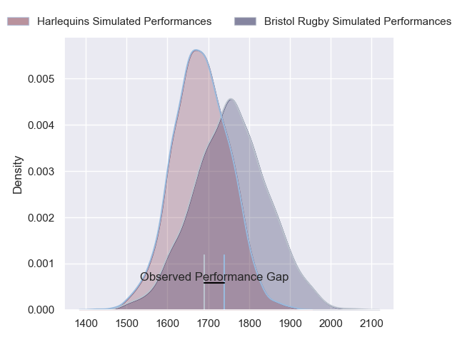
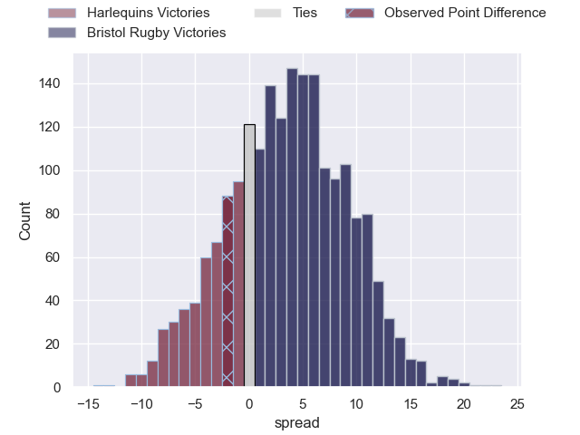
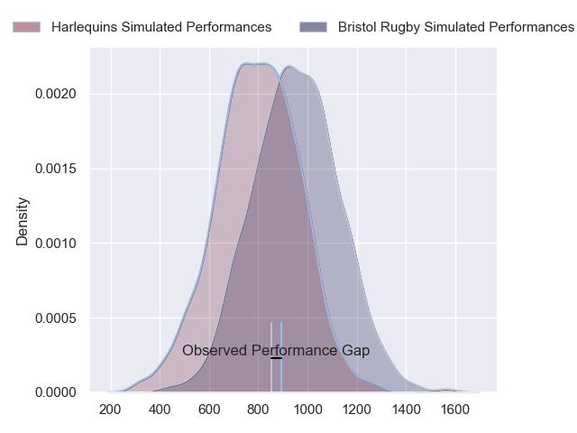
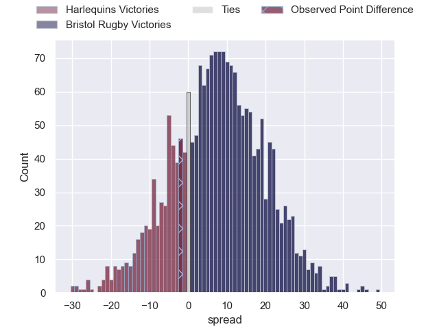
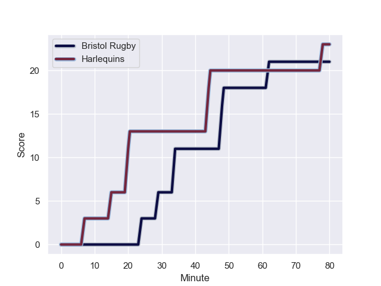
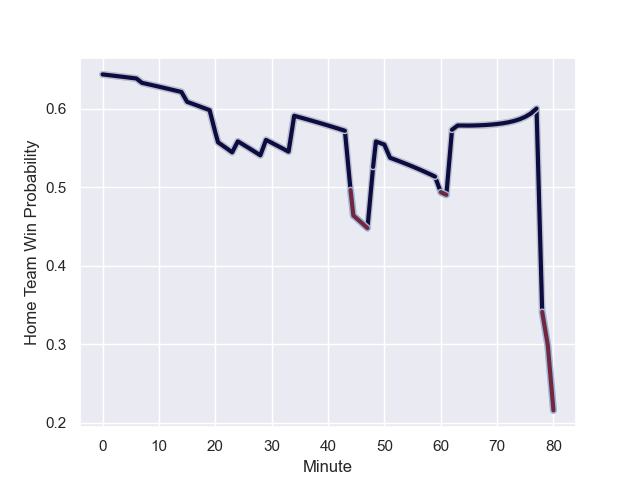

---  
layout: page  
title: Harlequins at Bristol Rugby; 23.0-21.0  
date: 2023-10-28 18:00:00 -0500  
categories: "Gallagher Premiership 2023" match review  
---
# Harlequins at Bristol Rugby; 23.0-21.0

# Club Level Predictions

The first set of predictions treats a club as the smallest object, as the club develops its members, organizes a gameplan, and deploys its players as needed for each match. This club model has a prediction of 0.599, which translates to predicting Bristol Rugby to win by 3.6.

Each club has a rating and a rating deviation (similar to a Glicko rating), and expected performances can be generated. This allows for simulated matches and spreads like the ones below.
## Projected Performances - Club Model

## Projected Spreads - Club Model

## Projected Results - Club Model

# Player Level Predictions - Version 2

Treating teams instead as an entity made up of the currently active players, I have ratings for each player in an altogether different system. These can be combined to form team ratings once teamsheets are announced, weighting starters a bit higher than the reserves. After the match is played, players can be weighted by their minutes on the field, allowing for an accurate measure of the team's composition. With these compiled team ratings, we can make predictions, measure inaccuracy, and update the individual player ratings.
## Prediction with Player Minutes: Bristol Rugby by 6.6

Bristol Rugby by 2.7 on a neutral field
## Prediction without Player Minutes: Bristol Rugby by 7.0

Bristol Rugby by 3.2 on a neutral pitch

## Projected Performances - Player Model

## Projected Spreads - Player Model

## Projected Results - Player Model

## Scores over Time

## Win Probability over Time

There were 10 large changes in win probability in this match

|   Away Minutes | Away Player     |   Away elo |   Number |   Home elo | Home Player                |   Home Minutes |
|---------------:|:----------------|-----------:|---------:|-----------:|:---------------------------|---------------:|
|             63 | Fin Baxter      |      29.18 |        1 |      55.71 | Jake Woolmore              |             80 |
|             55 | Sam Riley       |      42.18 |        2 |      65.78 | Harry Thacker              |             79 |
|             63 | Will Collier    |      69.85 |        3 |      43.17 | Max Lahiff                 |             74 |
|             65 | Joe Launchbury  |      98.29 |        4 |      57.86 | James Dun                  |             60 |
|             80 | George Hammond  |       9.31 |        5 |      52.32 | Joe Batley                 |             80 |
|             80 | Jack Kenningham |      78.98 |        6 |      54.58 | Fitz Harding               |             80 |
|             51 | Will Evans      |      45.99 |        7 |      46.74 | Daniel Thomas              |             65 |
|             80 | Alex Dombrandt  |      62.51 |        8 |      43.57 | Magnus Bradbury            |             80 |
|             74 | Will Porter     |      30.49 |        9 |      68.69 | Harry Randall              |             74 |
|             80 | Jarrod Evans    |      78.42 |       10 |      73.17 | Callum Sheedy              |             69 |
|             80 | Louis Lynagh    |      58.02 |       11 |      62.23 | Gabriel Ibitoye            |             80 |
|             80 | Lennox Anyanwu  |      55.91 |       12 |      65.41 | Benhard Janse van Rensburg |             80 |
|             74 | Oscar Beard     |      46.49 |       13 |      97.06 | Virimi Vakatawa            |             53 |
|             80 | Tyrone Green    |      58.74 |       14 |      48.17 | Noah Heward                |             80 |
|             80 | Nick David      |      29.93 |       15 |      61.85 | Richard Lane               |             80 |
|             17 | Jordan Els      |      36    |       16 |      34.16 | Will Capon                 |              1 |
|             25 | Nathan Jibulu   |      51    |       17 |      49.08 | George Kloska              |              6 |
|             17 | Simon Kerrod    |      47.69 |       18 |      63.76 | Josh Caulfield             |             20 |
|             15 | Dino Lamb       |      73.84 |       19 |      46.25 | Jake Heenan                |             15 |
|             29 | James Chisholm  |      76.38 |       20 |      76.56 | Kieran Marmion             |              6 |
|              6 | Max Green       |      40.09 |       21 |      31.74 | James Williams             |             11 |
|              6 | Bryn Bradley    |      41.57 |       22 |      21.25 | Piers O'Conor              |             27 |

