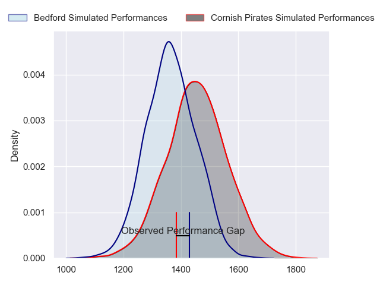
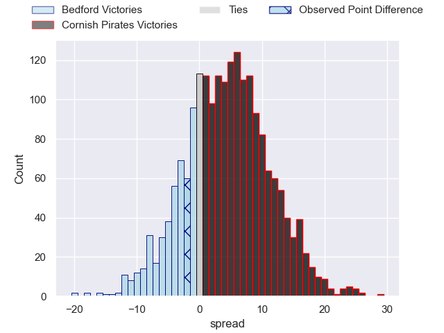
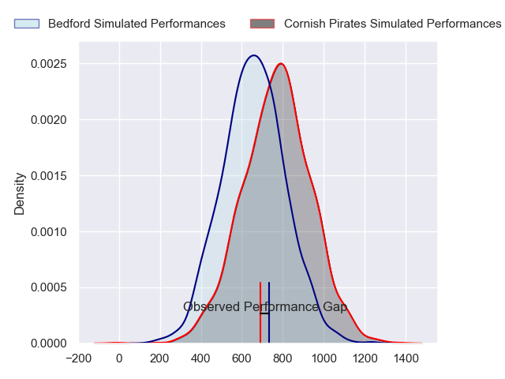
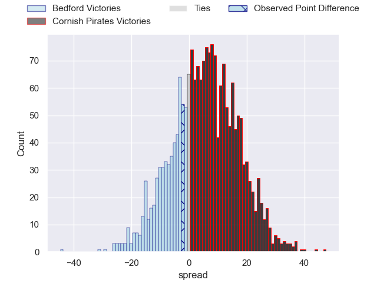
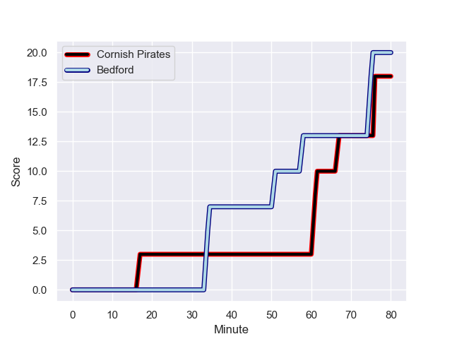
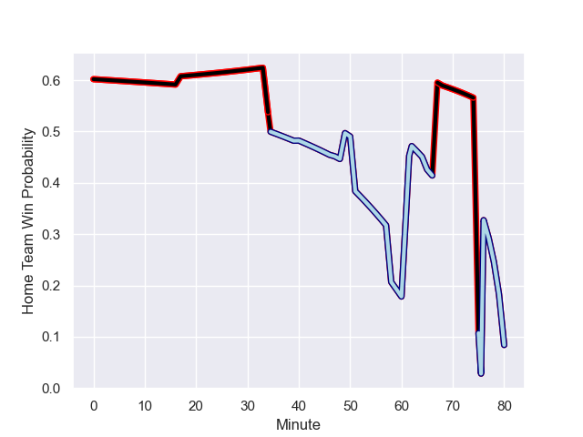

---  
layout: page  
title: Bedford at Cornish Pirates; 20.0-18.0  
date: 2023-10-28 18:00:00 -0500  
categories: "RFU Championship 2023" match review  
---
# Bedford at Cornish Pirates; 20.0-18.0

# Club Level Predictions

The first set of predictions treats a club as the smallest object, as the club develops its members, organizes a gameplan, and deploys its players as needed for each match. This club model has a prediction of 0.62, which translates to predicting Cornish Pirates to win by 4.4.

Each club has a rating and a rating deviation (similar to a Glicko rating), and expected performances can be generated. This allows for simulated matches and spreads like the ones below.
## Projected Performances - Club Model

## Projected Spreads - Club Model

## Projected Results - Club Model

# Player Level Predictions - Version 2

Treating teams instead as an entity made up of the currently active players, I have ratings for each player in an altogether different system. These can be combined to form team ratings once teamsheets are announced, weighting starters a bit higher than the reserves. After the match is played, players can be weighted by their minutes on the field, allowing for an accurate measure of the team's composition. With these compiled team ratings, we can make predictions, measure inaccuracy, and update the individual player ratings.
## Prediction with Player Minutes: Cornish Pirates by 4.5

Cornish Pirates by 1.2 on a neutral field
## Prediction without Player Minutes: Cornish Pirates by 3.9

Cornish Pirates by 0.5 on a neutral pitch

## Projected Performances - Player Model

## Projected Spreads - Player Model

## Projected Results - Player Model

## Scores over Time

## Win Probability over Time

There were 15 large changes in win probability in this match

|   Away Minutes | Away Player          |   Away elo |   Number |   Home elo | Home Player          |   Home Minutes |
|---------------:|:---------------------|-----------:|---------:|-----------:|:---------------------|---------------:|
|             49 | Joey Conway          |      50.96 |        1 |      51.5  | Jack Andrew          |             17 |
|             58 | James Fish           |      40.92 |        2 |      44.75 | Morgan Nelson        |             80 |
|             49 | Oisin Heffernan      |      63.32 |        3 |      43.98 | Marlen Walker        |             40 |
|             49 | Robin Williams       |      57.52 |        4 |      51.14 | Josh Williams        |             68 |
|             80 | Alex Woolford        |      37.56 |        5 |      46.65 | Steele Robert Barker |             80 |
|             80 | Luke Frost           |      15.46 |        6 |      46.65 | Harry Dugmore        |             80 |
|             58 | Jac Arthur           |      41.5  |        7 |      57.52 | Will Gibson          |             80 |
|             80 | Joe Howard           |      21.48 |        8 |      46.65 | Hugh Bokenham        |             47 |
|             76 | Alex Day             |      60.23 |        9 |      44.02 | Ruaridh Dawson       |             58 |
|             80 | William Maisey       |      59.82 |       10 |      46.65 | Iwan Jenkins         |             80 |
|             62 | Dean Adamson         |      60.65 |       11 |      50.05 | Arthur Relton        |             80 |
|             80 | Jordan Venter        |      44.85 |       12 |      37.98 | Joe Elderkin         |             80 |
|             47 | Michael Le Bourgeois |      60.84 |       13 |      46.65 | Ioan Evans           |             79 |
|             80 | Sean French          |      38.26 |       14 |      45.79 | Will Trewin          |             65 |
|             80 | Matthew Worley       |      46.06 |       15 |      33.51 | Dan John             |             80 |
|             33 | Ethan Grayson        |      58.33 |       16 |      46.71 | Lefty Zigiriadis     |             63 |
|             31 | Jamie Jack           |      31.03 |       17 |      48.55 | Matt Johnson         |             40 |
|             31 | Bryan O'Connor       |      46.65 |       18 |      46.65 | Peter Everett        |             33 |
|             31 | Jordan Onojaife      |      28.06 |       19 |      42.2  | Alex Schwarz         |             22 |
|             22 | Jacob Fields         |      54.74 |       20 |      23.19 | Matthew McNab        |             15 |
|             22 | Cameron King         |      13.04 |       21 |      46.65 | Josh King            |             12 |
|             18 | Louis Grimoldby      |      24.52 |       22 |      54.21 | Tom Pittman          |              1 |
|              4 | James Lennon         |      22.49 |       23 |     nan    | nan                  |            nan |

