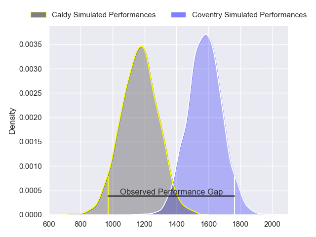
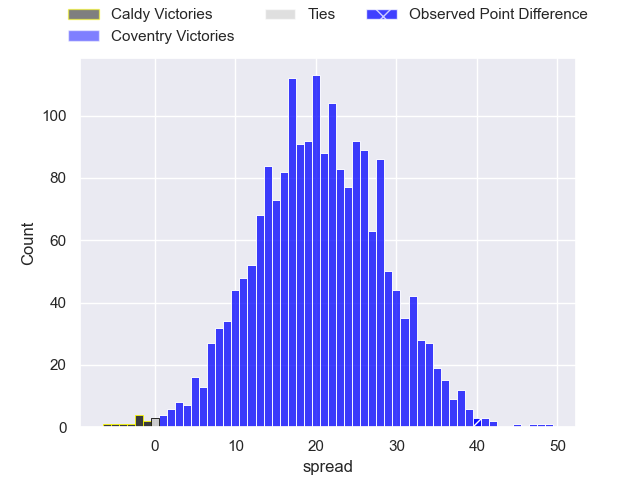
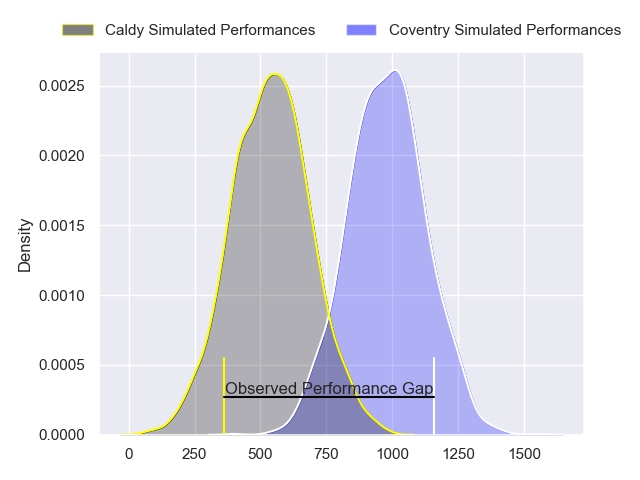
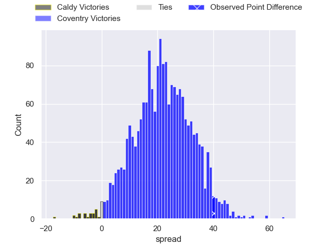
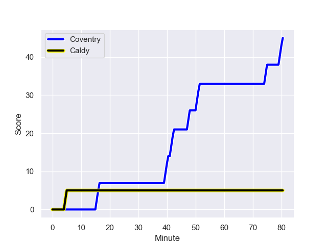
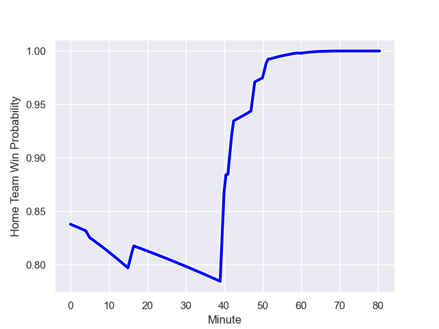

---  
layout: page  
title: Caldy at Coventry; 5.0-45.0  
date: 2023-10-28 18:00:00 -0500  
categories: "RFU Championship 2023" match review  
---
# Caldy at Coventry; 5.0-45.0

# Club Level Predictions

The first set of predictions treats a club as the smallest object, as the club develops its members, organizes a gameplan, and deploys its players as needed for each match. This club model has a prediction of 0.902, which translates to predicting Coventry to win by 20.5.

Each club has a rating and a rating deviation (similar to a Glicko rating), and expected performances can be generated. This allows for simulated matches and spreads like the ones below.
## Projected Performances - Club Model

## Projected Spreads - Club Model

## Projected Results - Club Model

# Player Level Predictions - Version 2

Treating teams instead as an entity made up of the currently active players, I have ratings for each player in an altogether different system. These can be combined to form team ratings once teamsheets are announced, weighting starters a bit higher than the reserves. After the match is played, players can be weighted by their minutes on the field, allowing for an accurate measure of the team's composition. With these compiled team ratings, we can make predictions, measure inaccuracy, and update the individual player ratings.
## Prediction with Player Minutes: Coventry by 18.0

Coventry by 14.8 on a neutral field
## Prediction without Player Minutes: Coventry by 17.6

Coventry by 14.3 on a neutral pitch

## Projected Performances - Player Model

## Projected Spreads - Player Model

## Projected Results - Player Model

## Scores over Time

## Win Probability over Time

There were 3 large changes in win probability in this match

|   Away Minutes | Away Player       |   Away elo |   Number |   Home elo | Home Player        |   Home Minutes |
|---------------:|:------------------|-----------:|---------:|-----------:|:-------------------|---------------:|
|             60 | Nathan Rushton    |      33.11 |        1 |      44.23 | Elliott Chilvers   |             48 |
|             48 | Oliver Hearn      |      24.24 |        2 |      65.62 | Jordon Poole       |             48 |
|             52 | Joe Sproston      |      22.1  |        3 |      46.65 | Eliot Salt         |             40 |
|             80 | Josiah Dickinson  |      27.51 |        4 |      46.65 | Obinna Nkwocha     |             54 |
|             52 | Martin Gerrard    |      39.23 |        5 |      48.55 | George Smith       |             80 |
|             68 | Ewan Murphy       |      46.65 |        6 |      40.83 | Paddy Ryan         |             80 |
|             80 | Nyle Davidson     |      36.55 |        7 |      38.77 | Matt Kvesic        |             80 |
|             80 | Sam Dickinson     |      48.67 |        8 |      50.34 | Jack Bartlett      |             48 |
|             48 | Joseph Murray     |      40.89 |        9 |     141.39 | Will Chudley       |             60 |
|             52 | Lewis Barker      |      33.27 |       10 |      42.65 | Evan Mitchell      |             40 |
|             80 | Michael Cartmill  |      15.76 |       11 |      78.56 | James Martin       |             80 |
|             58 | Michael Barlow    |      43.99 |       12 |      65.43 | Lucas Titherington |             40 |
|             80 | Connor Wilkinson  |      46.65 |       13 |      63.79 | Will Wand          |             80 |
|             80 | William Robinson  |      46.05 |       14 |      45.64 | Ryan Hutler        |             80 |
|             80 | Rhys Hayes        |      28.15 |       15 |      48.14 | Louis James        |             80 |
|             32 | Matt Gallagher    |      53.84 |       16 |      86.52 | Patrick Pellegrini |             40 |
|             32 | Chris Pilgrim     |      24.24 |       17 |      92.98 | Will Rigg          |             40 |
|             28 | Ryan Higginson    |      40.6  |       18 |      53.01 | Adam Nicol         |             40 |
|             28 | Sam Rogers        |      46.65 |       19 |      48.33 | Arthur Cordwell    |             32 |
|             28 | Harrison Crowe    |      21.65 |       20 |      58.43 | Suva Ma'asi        |             32 |
|             22 | Benjamin Jones    |      28.32 |       21 |      80.75 | Tom Ball           |             32 |
|             20 | William Sanderson |      42.8  |       22 |      50.16 | Rhys Anstey        |             26 |
|             12 | Sam Olyott        |      39.93 |       23 |      60.89 | Will Lane          |             20 |

