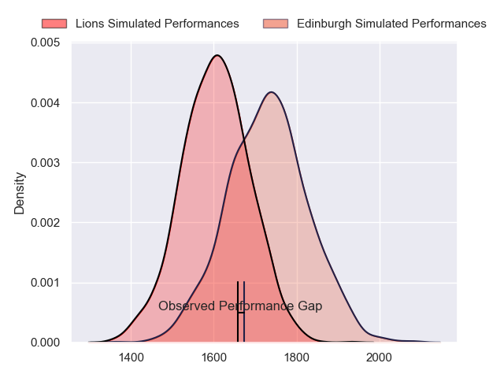
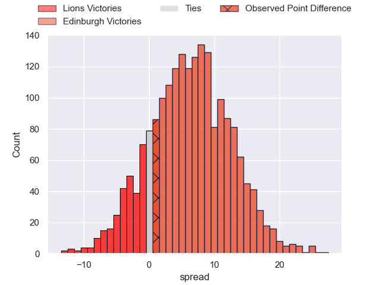
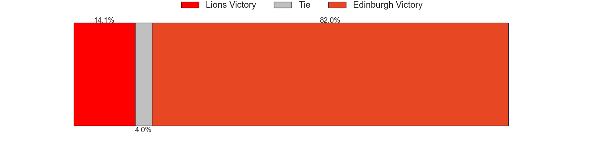
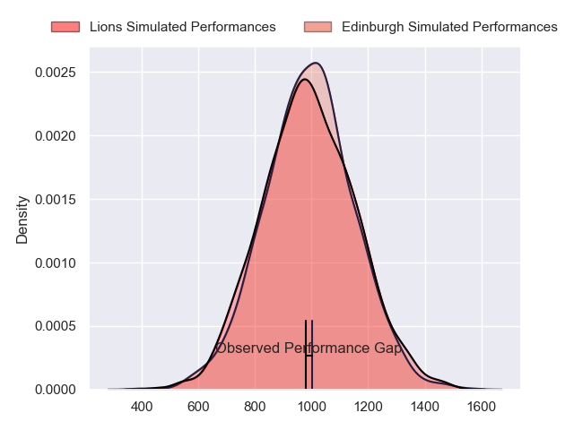
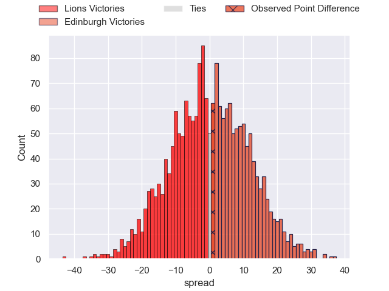
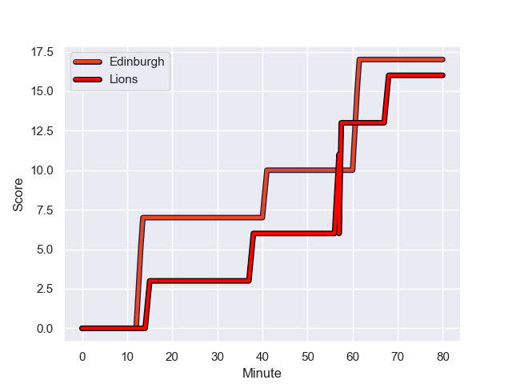
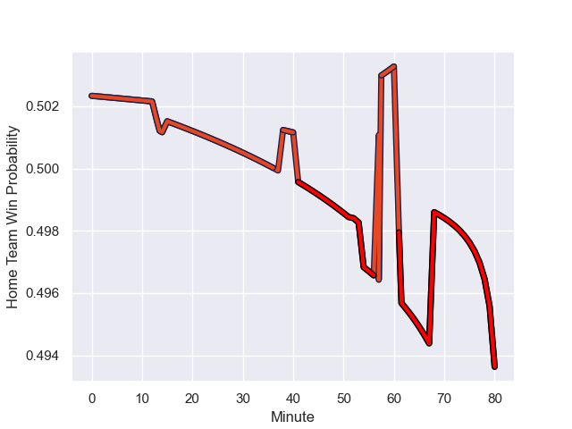

---  
layout: page  
title: Lions at Edinburgh; 16-17  
date: 2023-10-28 18:00:00 -0500  
categories: "United Rugby Championship 2023" match review  
---
# Lions at Edinburgh; 16-17

# Club Level Predictions

The first set of predictions treats a club as the smallest object, as the club develops its members, organizes a gameplan, and deploys its players as needed for each match. This club model has a prediction of 0.667, which translates to predicting Edinburgh to win by 6.2.

Each club has a rating and a rating deviation (similar to a Glicko rating), and expected performances can be generated. This allows for simulated matches and spreads like the ones below.
## Projected Performances - Club Model

## Projected Spreads - Club Model

## Projected Results - Club Model

# Player Level Predictions - Version 2

Treating teams instead as an entity made up of the currently active players, I have ratings for each player in an altogether different system. These can be combined to form team ratings once teamsheets are announced, weighting starters a bit higher than the reserves. After the match is played, players can be weighted by their minutes on the field, allowing for an accurate measure of the team's composition. With these compiled team ratings, we can make predictions, measure inaccuracy, and update the individual player ratings.
## Prediction with Player Minutes: Edinburgh by 0.1

Lions by 4.2 on a neutral field
## Prediction without Player Minutes: Lions by 2.6

Lions by 6.9 on a neutral pitch

## Projected Performances - Player Model

## Projected Spreads - Player Model

## Projected Results - Player Model

## Scores over Time

## Win Probability over Time

|   Away Minutes | Away Player            |   Away elo |   Number |   Home elo | Home Player     |   Home Minutes |
|---------------:|:-----------------------|-----------:|---------:|-----------:|:----------------|---------------:|
|             52 | Corne Fourie           |      81.34 |        1 |      33.85 | Boan Venter     |             54 |
|             52 | PJ Botha               |      43.7  |        2 |      45.41 | Dave Cherry     |             54 |
|             52 | Ruan Dreyer            |     113.68 |        3 |      42.15 | Javan Sebastian |             47 |
|             68 | Ruben Schoeman         |      79.07 |        4 |      10.32 | Glen Young      |             48 |
|             80 | Darrien-Lane Landsberg |      34.06 |        5 |     100.21 | Grant Gilchrist |             80 |
|             80 | Emmanuel Tshituka      |      48.07 |        6 |      72.82 | Luke Crosbie    |             80 |
|             68 | Ruan Venter            |      78.25 |        7 |      51.29 | Hamish Watson   |             74 |
|             80 | Francke Horn           |     105.73 |        8 |      40.46 | Viliame Mata    |             80 |
|             68 | Sanele Nohamba         |      91.87 |        9 |      47.66 | Ben Vellacott   |             51 |
|             80 | Jordan Hendrikse       |      42.32 |       10 |      50.12 | Ben Healy       |             80 |
|             58 | Edwill van der Merwe   |      69.95 |       11 |      70.28 | Wes Goosen      |             80 |
|             80 | Marius Louw            |      80.61 |       12 |      49.41 | Matt Currie     |             80 |
|             80 | Henco van Wyk          |      57.87 |       13 |      60.49 | Mark Bennett    |             68 |
|             80 | Richard Kriel          |      33.87 |       14 |      46.65 | Ross McCann     |             80 |
|             80 | Quan Horn              |      78.16 |       15 |     135.09 | Blair Kinghorn  |             80 |
|             28 | Morgan Naude           |      44.38 |       16 |      96.02 | WP Nel          |             33 |
|             28 | Asenathi Ntlabakanye   |      27.35 |       17 |      45.32 | Charlie Shiel   |             29 |
|             28 | Jaco Visagie           |      50.6  |       18 |      39.72 | Marshall Sykes  |             32 |
|             22 | Andries Coetzee        |      65.01 |       19 |      42.25 | Ewan Ashman     |             26 |
|             12 | Morne Van den Berg     |      37.89 |       20 |      31.21 | Robin Hislop    |             26 |
|             12 | Hanru Sirgel           |      82.95 |       21 |      34.12 | Chris Dean      |             12 |
|             12 | Willem Alberts         |      41.95 |       22 |      35.09 | Connor Boyle    |              6 |

