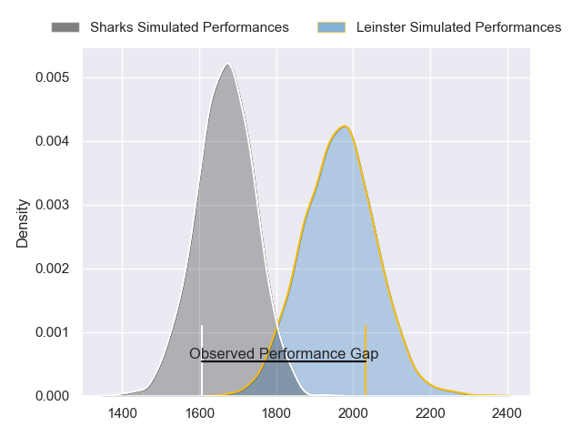
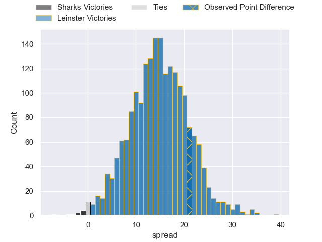
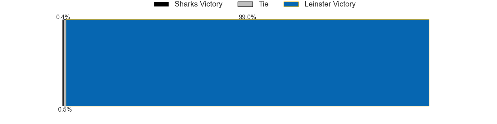
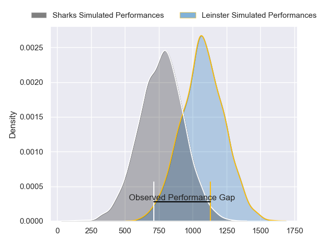
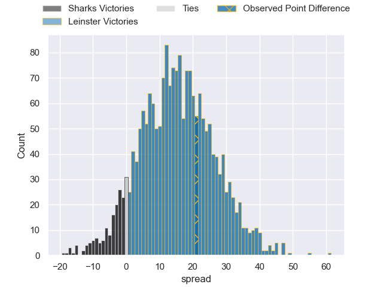
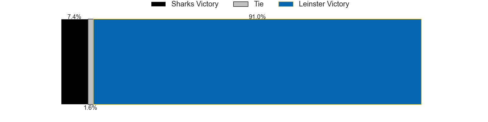
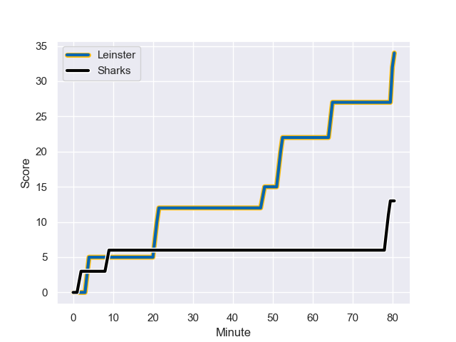
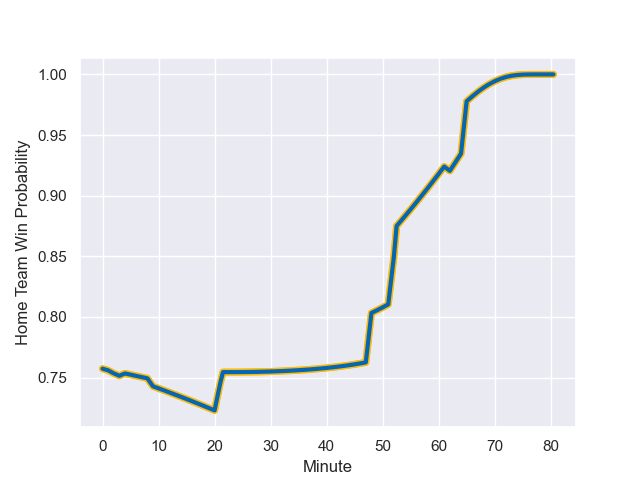

---  
layout: page  
title: Sharks at Leinster; 13-34  
date: 2023-10-28 18:00:00 -0500  
categories: "United Rugby Championship 2023" match review  
---
# Sharks at Leinster; 13-34

# Club Level Predictions

The first set of predictions treats a club as the smallest object, as the club develops its members, organizes a gameplan, and deploys its players as needed for each match. This club model has a prediction of 0.84, which translates to predicting Leinster to win by 14.8.

Each club has a rating and a rating deviation (similar to a Glicko rating), and expected performances can be generated. This allows for simulated matches and spreads like the ones below.
## Projected Performances - Club Model

## Projected Spreads - Club Model

## Projected Results - Club Model

# Player Level Predictions - Version 2

Treating teams instead as an entity made up of the currently active players, I have ratings for each player in an altogether different system. These can be combined to form team ratings once teamsheets are announced, weighting starters a bit higher than the reserves. After the match is played, players can be weighted by their minutes on the field, allowing for an accurate measure of the team's composition. With these compiled team ratings, we can make predictions, measure inaccuracy, and update the individual player ratings.
## Prediction with Player Minutes: Leinster by 12.6

Leinster by 8.2 on a neutral field
## Prediction without Player Minutes: Leinster by 12.9

Leinster by 8.5 on a neutral pitch

## Projected Performances - Player Model

## Projected Spreads - Player Model

## Projected Results - Player Model

## Scores over Time

## Win Probability over Time

There were 4 large changes in win probability in this match

|   Away Minutes | Away Player              |   Away elo |   Number |   Home elo | Home Player        |   Home Minutes |
|---------------:|:-------------------------|-----------:|---------:|-----------:|:-------------------|---------------:|
|             59 | Ntuthuko Mchunu          |      43.46 |        1 |      47.78 | Jack Boyle         |             59 |
|             59 | Kerron van Vuuren        |      33.41 |        2 |      45.36 | Lee Barron         |             66 |
|             59 | Hanro Jacobs             |      48.75 |        3 |      68.76 | Michael Ala'alatoa |             59 |
|             75 | Corne Rahl               |      40.08 |        4 |      85.6  | Ross Molony        |             80 |
|             80 | Emile van Heerden        |      41.74 |        5 |      55.27 | Jason Jenkins      |             56 |
|             80 | James Venter             |      54.45 |        6 |     130.04 | Rhys Ruddock       |             52 |
|             35 | Vincent Tshituka         |      71.27 |        7 |      63.94 | Scott Penny        |             80 |
|             80 | Phepsi Buthelezi         |      48.36 |        8 |      80.35 | Max Deegan         |             80 |
|             80 | Cameron Wright           |      22.9  |        9 |      49.9  | Cormac Foley       |             62 |
|             68 | Curwin Bosch             |      69.39 |       10 |      72.17 | Harry Byrne        |             62 |
|             52 | Marnus Potgieter         |      62.27 |       11 |      70.43 | Jordan Larmour     |             80 |
|             80 | Rohan Janse van Rensburg |      66.8  |       12 |      99.86 | Charlie Ngatai     |             52 |
|             80 | Francois Venter          |      56.97 |       13 |      61.27 | Jamie Osborne      |             80 |
|             80 | Werner Kok               |      56.83 |       14 |      50.99 | Tommy O'Brien      |             80 |
|             80 | Aphelele Fassi           |      81.1  |       15 |      56.1  | Ciaran Frawley     |             80 |
|             45 | George Cronje            |      38.29 |       16 |      58.36 | Will Connors       |             28 |
|             28 | Aphiwe Dyantyi           |      28.28 |       17 |      49.7  | Rob Russell        |             28 |
|             21 | Khwezi Mona              |      49.05 |       18 |      46.45 | Brian Deeny        |             24 |
|             21 | Dian Bleuler             |      49.1  |       19 |      46.65 | Paddy McCarthy     |             21 |
|             21 | Dylan Richardson         |      58.5  |       20 |      46.65 | Rory McGuire       |             21 |
|             12 | Boeta Chamberlain        |      49.81 |       21 |      38.7  | Sam Prendergast    |             18 |
|              5 | Hyron Andrews            |      41.37 |       22 |      42.48 | Ben Murphy         |             18 |
|            nan | nan                      |     nan    |       23 |      13.76 | Dylan Donnellan    |             14 |

