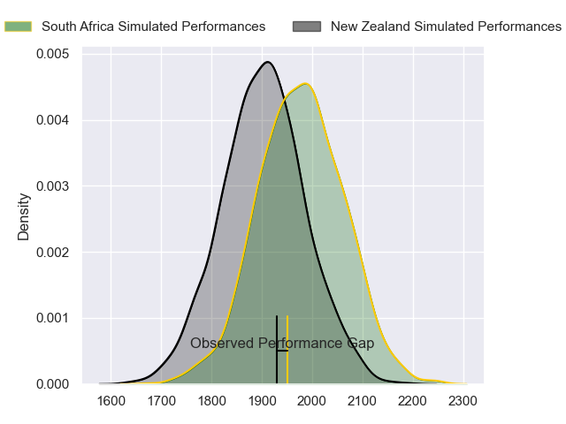
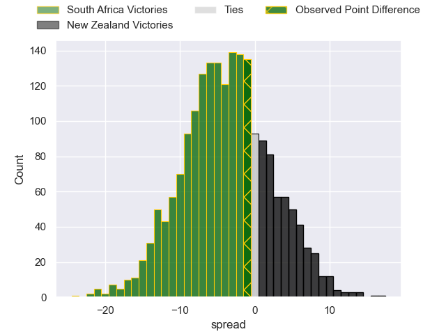
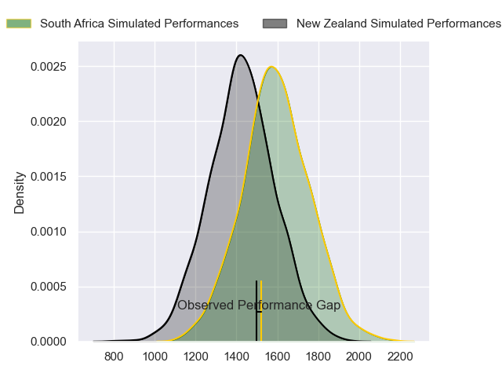
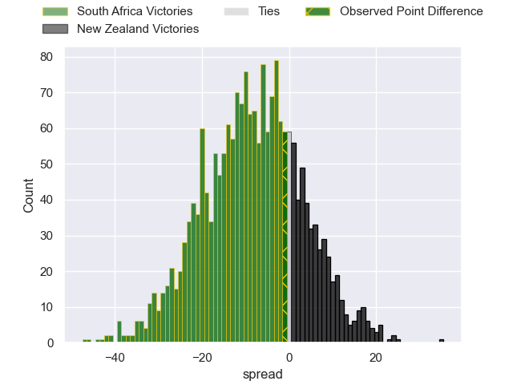
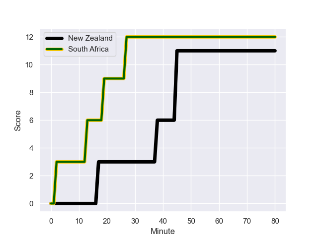
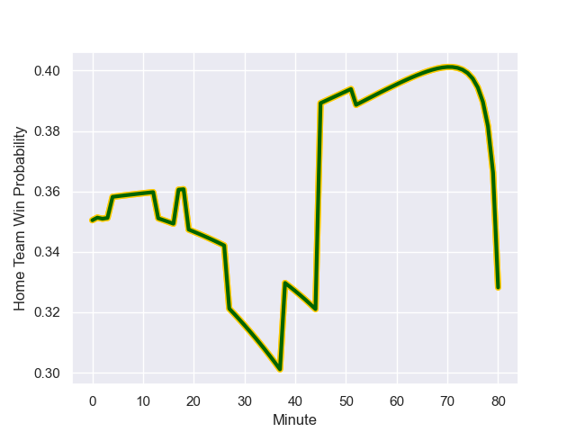

---  
layout: page  
title: South Africa at New Zealand; 12.0-11.0  
date: 2023-10-28 18:00:00 -0500  
categories: "Rugby World Cup 2023" match review  
---
# South Africa at New Zealand; 12.0-11.0

# Club Level Predictions

The first set of predictions treats a club as the smallest object, as the club develops its members, organizes a gameplan, and deploys its players as needed for each match. This club model has a prediction of 0.4, which translates to predicting South Africa to win by 3.6.

Each club has a rating and a rating deviation (similar to a Glicko rating), and expected performances can be generated. This allows for simulated matches and spreads like the ones below.
## Projected Performances - Club Model

## Projected Spreads - Club Model

## Projected Results - Club Model

# Player Level Predictions - Version 2

Treating teams instead as an entity made up of the currently active players, I have ratings for each player in an altogether different system. These can be combined to form team ratings once teamsheets are announced, weighting starters a bit higher than the reserves. After the match is played, players can be weighted by their minutes on the field, allowing for an accurate measure of the team's composition. With these compiled team ratings, we can make predictions, measure inaccuracy, and update the individual player ratings.
## Prediction with Player Minutes: South Africa by 6.8

South Africa by 6.8 on a neutral field
## Prediction without Player Minutes: South Africa by 7.7

South Africa by 7.7 on a neutral pitch

## Projected Performances - Player Model

## Projected Spreads - Player Model

## Projected Results - Player Model

## Scores over Time

## Win Probability over Time

There were 3 large changes in win probability in this match

|   Away Minutes | Away Player          |   Away elo |   Number |   Home elo | Home Player         |   Home Minutes |
|---------------:|:---------------------|-----------:|---------:|-----------:|:--------------------|---------------:|
|             52 | Steven Kitshoff      |      97.05 |        1 |      50.08 | Ethan de Groot      |             66 |
|              4 | Bongi Mbonambi       |     101.27 |        2 |     102.25 | Codie Taylor        |             66 |
|             66 | Frans Malherbe       |      85    |        3 |      68.53 | Tyrel Lomax         |             66 |
|             58 | Eben Etzebeth        |     111.8  |        4 |     138.31 | Brodie Retallick    |             71 |
|             52 | Franco Mostert       |     113.8  |        5 |      96.86 | Scott Barrett       |             80 |
|             73 | Siya Kolisi          |     114.5  |        6 |      58.27 | Shannon Frizell     |             55 |
|             80 | Pieter-Steph du Toit |      78.81 |        7 |     106.53 | Sam Cane            |             80 |
|             58 | Duane Vermeulen      |     126.17 |        8 |     101.86 | Ardie Savea         |             80 |
|             80 | Faf de Klerk         |     108.45 |        9 |     101.81 | Aaron Smith         |             66 |
|             80 | Handre Pollard       |     103.36 |       10 |     117.3  | Richie Mo'unga      |             75 |
|             80 | Cheslin Kolbe        |     136.37 |       11 |      94.68 | Mark Telea          |             80 |
|             80 | Damian de Allende    |      88.65 |       12 |      81.56 | Jordie Barrett      |             80 |
|             80 | Jesse Kriel          |     134.5  |       13 |      55.17 | Rieko Ioane         |             80 |
|             80 | Kurt-Lee Arendse     |     109.99 |       14 |      99.81 | Will Jordan         |             71 |
|             66 | Damian Willemse      |     111.93 |       15 |     142.76 | Beauden Barrett     |             80 |
|             76 | Deon Fourie          |      91.31 |       16 |      75.15 | Samisoni Taukei'aho |             14 |
|             28 | Ox Nche              |     107.73 |       17 |      62.1  | Tamaiti Williams    |             14 |
|             14 | Trevor Nyakane       |      57    |       18 |      84.36 | Nepo Laulala        |             14 |
|             22 | Jean Kleyn           |     107.57 |       19 |     140.24 | Samuel Whitelock    |             25 |
|             28 | RG Snyman            |     117.14 |       20 |     108.52 | Dalton Papalii      |              9 |
|             22 | Kwagga Smith         |      69.03 |       21 |      55.31 | Finlay Christie     |             14 |
|              7 | Jasper Wiese         |      79.18 |       22 |     104.53 | Damian McKenzie     |              5 |
|             14 | Willie le Roux       |     106.39 |       23 |      73.87 | Anton Lienert-Brown |              9 |

