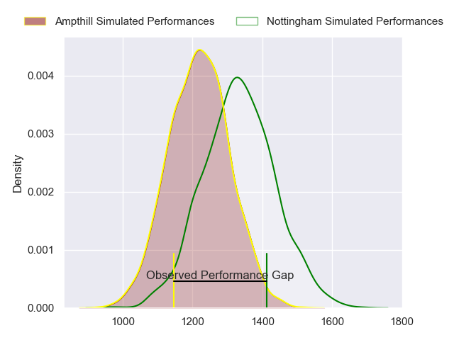
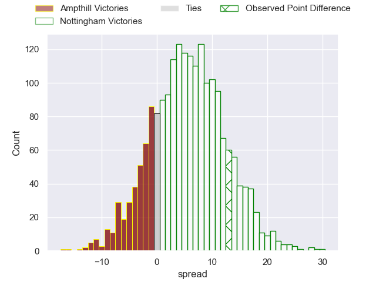
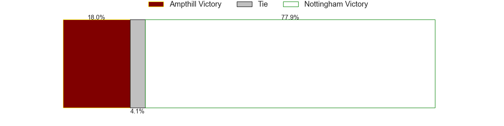
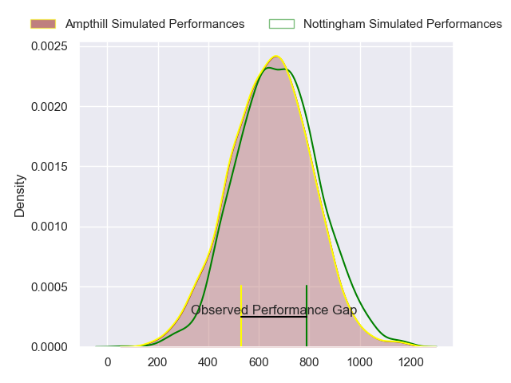
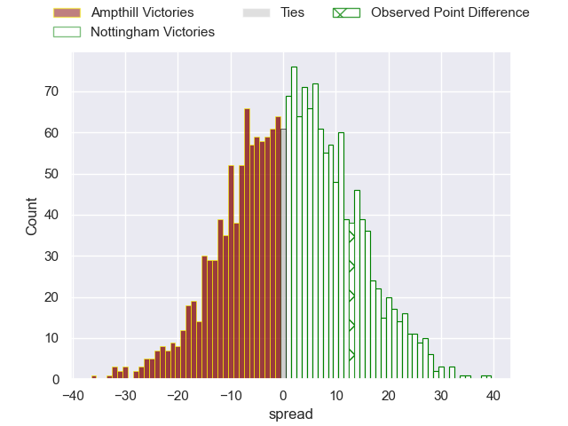
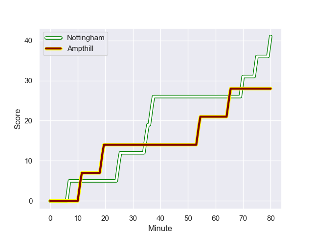
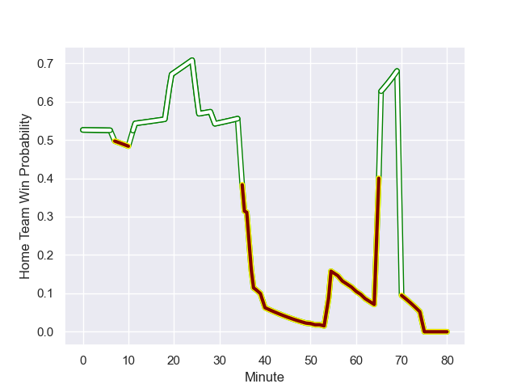

---  
layout: page  
title: Ampthill at Nottingham; 28.0-41.0  
date: 2023-10-28 18:00:00 -0500  
categories: "RFU Championship 2023" match review  
---
# Ampthill at Nottingham; 28.0-41.0

# Club Level Predictions

The first set of predictions treats a club as the smallest object, as the club develops its members, organizes a gameplan, and deploys its players as needed for each match. This club model has a prediction of 0.654, which translates to predicting Nottingham to win by 5.7.

Each club has a rating and a rating deviation (similar to a Glicko rating), and expected performances can be generated. This allows for simulated matches and spreads like the ones below.
## Projected Performances - Club Model

## Projected Spreads - Club Model

## Projected Results - Club Model

# Player Level Predictions - Version 2

Treating teams instead as an entity made up of the currently active players, I have ratings for each player in an altogether different system. These can be combined to form team ratings once teamsheets are announced, weighting starters a bit higher than the reserves. After the match is played, players can be weighted by their minutes on the field, allowing for an accurate measure of the team's composition. With these compiled team ratings, we can make predictions, measure inaccuracy, and update the individual player ratings.
## Prediction with Player Minutes: Nottingham by 1.1

Ampthill by 2.2 on a neutral field
## Prediction without Player Minutes: Nottingham by 0.6

Ampthill by 2.7 on a neutral pitch

## Projected Performances - Player Model

## Projected Spreads - Player Model

## Projected Results - Player Model

## Scores over Time

## Win Probability over Time

There were 18 large changes in win probability in this match

|   Away Minutes | Away Player                 |   Away elo |   Number |   Home elo | Home Player               |   Home Minutes |
|---------------:|:----------------------------|-----------:|---------:|-----------:|:--------------------------|---------------:|
|             40 | Jevaughn Warren             |      40.6  |        1 |      44.53 | Kai Owen                  |             57 |
|             80 | Benjamin Chapman            |      46.65 |        2 |      50.69 | Antonio TJ Harris         |             62 |
|             50 | Harvey Beaton               |      42.89 |        3 |      44.45 | Xavier Valentine          |             57 |
|             39 | Joe Peard                   |      46.65 |        4 |      37.97 | Come Clayver Joussain     |             80 |
|             65 | Kaden Pearce-Paul           |      46.65 |        5 |      40.04 | Thomas Manz               |             57 |
|             80 | Iestyn Rees                 |      40.37 |        6 |      12.36 | Scott Hall                |             80 |
|             80 | Josh Smart                  |      30.67 |        7 |      46.65 | James Cherry              |             80 |
|             80 | Morgan Strong               |      36.73 |        8 |      59.59 | George Cox                |             80 |
|             52 | Charlie Bracken             |      46.65 |        9 |      22.52 | Micheal Stronge           |             70 |
|             80 | Gwyn Parks                  |      45.17 |       10 |      19.86 | Morgan Bunting            |             65 |
|             80 | Tobias Elliott              |      46.65 |       11 |      30.04 | Harry Graham              |             29 |
|             80 | Fraser James Kevin Strachan |      72.9  |       12 |      46.65 | Joe Woodward              |             80 |
|             80 | Oli Morris                  |      30.46 |       13 |      28.7  | Marcus Alexander Ramage   |             80 |
|             60 | Josh Skelcey                |      31.21 |       14 |      31.88 | David Williams            |             80 |
|             70 | Tomas Bacon                 |      50.15 |       15 |      46.65 | Ellis Mee                 |             80 |
|             41 | Nathan Michelow             |      44.15 |       16 |      46.65 | Dafydd-Rhys Tiueti        |             51 |
|             40 | James Flynn                 |      -3.73 |       17 |      48.21 | Archie Van der Flier      |             23 |
|             30 | Luke Green                  |      52.73 |       18 |      40.22 | Aniseko Sio               |             23 |
|             28 | Peter White                 |      64.82 |       19 |      48.38 | Iosefa Danny Wayne Fiaola |             23 |
|             20 | Josh Barton                 |      26.04 |       20 |      57.6  | Harry Clayton             |             18 |
|             15 | Alex Wardell                |      44.43 |       21 |      61.48 | Sam Hollingsworth         |             15 |
|             10 | Ollie Dawkins               |      61.98 |       22 |      39.75 | Will Yarnell              |             10 |

