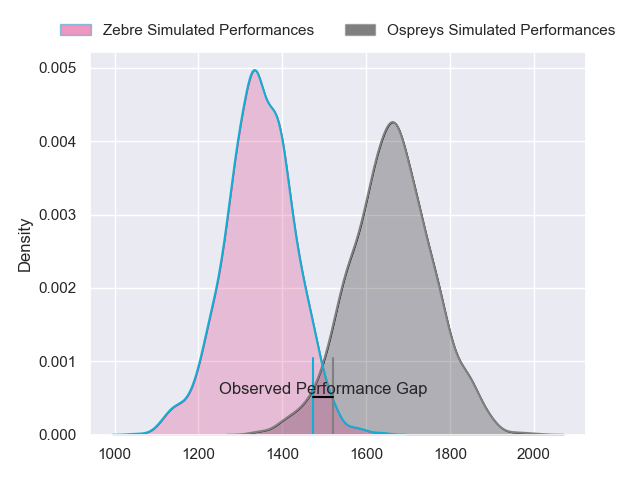
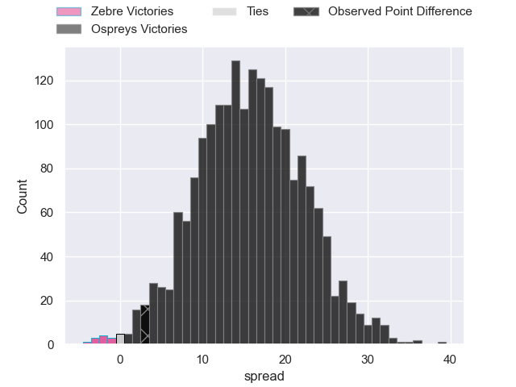
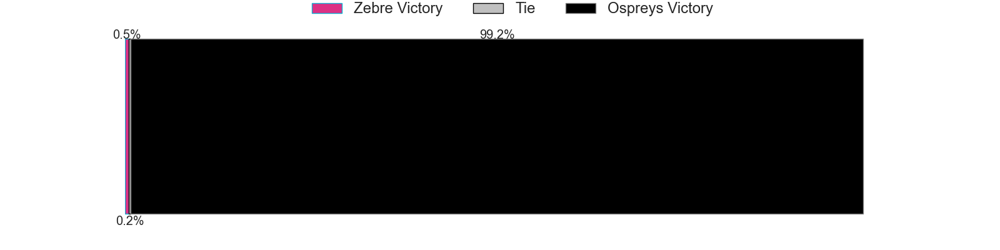
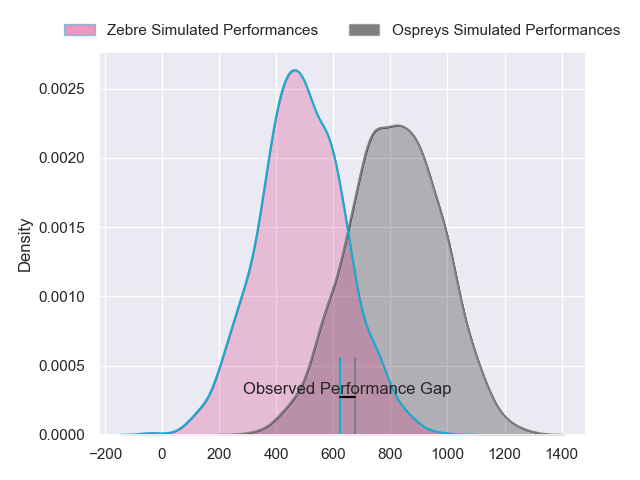
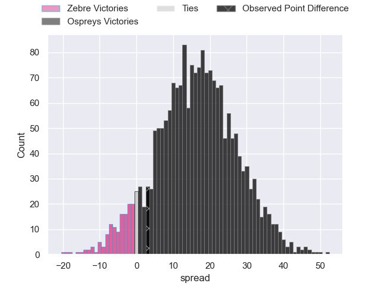
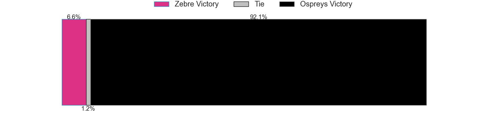
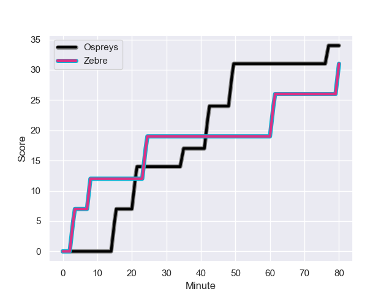
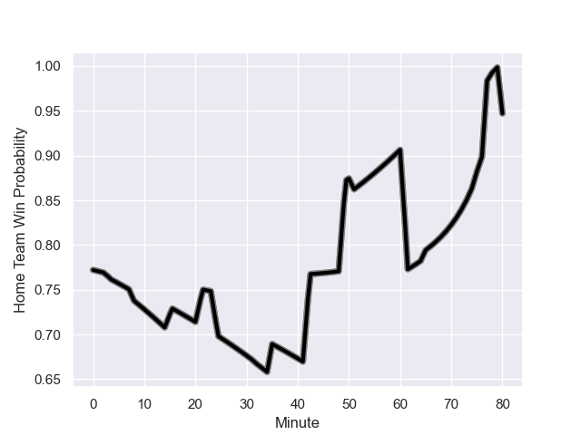

---  
layout: page  
title: Zebre at Ospreys; 31-34  
date: 2023-10-28 18:00:00 -0500  
categories: "United Rugby Championship 2023" match review  
---
# Zebre at Ospreys; 31-34

# Club Level Predictions

The first set of predictions treats a club as the smallest object, as the club develops its members, organizes a gameplan, and deploys its players as needed for each match. This club model has a prediction of 0.854, which translates to predicting Ospreys to win by 15.8.

Each club has a rating and a rating deviation (similar to a Glicko rating), and expected performances can be generated. This allows for simulated matches and spreads like the ones below.
## Projected Performances - Club Model

## Projected Spreads - Club Model

## Projected Results - Club Model

# Player Level Predictions - Version 2

Treating teams instead as an entity made up of the currently active players, I have ratings for each player in an altogether different system. These can be combined to form team ratings once teamsheets are announced, weighting starters a bit higher than the reserves. After the match is played, players can be weighted by their minutes on the field, allowing for an accurate measure of the team's composition. With these compiled team ratings, we can make predictions, measure inaccuracy, and update the individual player ratings.
## Prediction with Player Minutes: Ospreys by 13.4

Ospreys by 9.2 on a neutral field
## Prediction without Player Minutes: Ospreys by 13.4

Ospreys by 9.1 on a neutral pitch

## Projected Performances - Player Model

## Projected Spreads - Player Model

## Projected Results - Player Model

## Scores over Time

## Win Probability over Time

There were 11 large changes in win probability in this match

|   Away Minutes | Away Player             |   Away elo |   Number |   Home elo | Home Player            |   Home Minutes |
|---------------:|:------------------------|-----------:|---------:|-----------:|:-----------------------|---------------:|
|             42 | Paolo Buonfiglio        |      39.49 |        1 |      49.5  | Garyn Phillips         |             32 |
|             44 | Luca Bigi               |      40.73 |        2 |      22.49 | Ethan Lewis            |             62 |
|             47 | Juan Manuel Pitinari    |      32.79 |        3 |      32.6  | Tom Botha              |             53 |
|             65 | Dave Sisi               |       5.96 |        4 |      53.37 | Rhys Davies            |             80 |
|             80 | Andrea Zambonin         |      31.54 |        5 |      44.21 | Huw Sutton             |             57 |
|             80 | Guido Volpi             |      47.93 |        6 |      41.51 | James Ratti            |             80 |
|             80 | Giacomo Ferrari         |      39.44 |        7 |     117.16 | Justin Tipuric         |             80 |
|             55 | Giovanni Licata         |      34.3  |        8 |      -3.66 | Morgan Morris          |             62 |
|             51 | Gonzalo Jesus Garcia    |      21.13 |        9 |      29.95 | Reuben Morgan-Williams |             80 |
|             80 | Geronimo Prisciantelli  |      63.93 |       10 |      47.74 | Jack Walsh             |             80 |
|             80 | Simone Gesi             |       6.32 |       11 |      81.56 | Matt Protheroe         |             36 |
|             80 | Enrico Lucchin          |      41.71 |       12 |      81.16 | Owen Watkin            |             80 |
|             80 | Franco Smith            |      35.99 |       13 |      48.92 | Dominic Morris         |             80 |
|             51 | Pierre Bruno            |      25.09 |       14 |       0.31 | Luke Morgan            |             80 |
|             80 | Lorenzo Pani            |      20.39 |       15 |      51.46 | Max Nagy               |             47 |
|             38 | Luca Rizzoli            |      31.43 |       16 |      48.23 | Nicky Smith            |             48 |
|             36 | Marco Manfredi          |      13.71 |       17 |      53.9  | Keiran Williams        |             44 |
|             33 | Ion Neculai             |      27.25 |       18 |      67.97 | Owen Williams          |             33 |
|             29 | Scott Gregory           |      47.99 |       19 |      51.72 | Rhys Henry             |             27 |
|             29 | Alessandro Fusco        |      27.43 |       20 |      35.93 | James Fender           |             23 |
|             20 | Bautista Stavile Bravin |      41.03 |       21 |      46.65 | Lewis Lloyd            |             18 |
|             15 | Dylan De Leeuw          |      50.8  |       22 |      46.65 | Luke Davies            |             18 |
|              5 | Giovanni Montemauri     |       7.5  |       23 |     nan    | nan                    |            nan |

