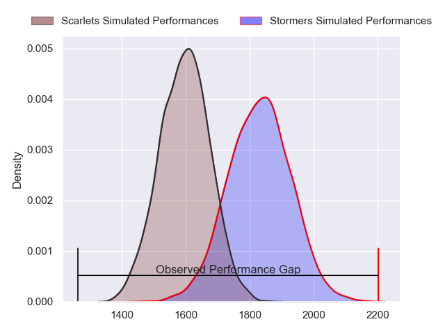
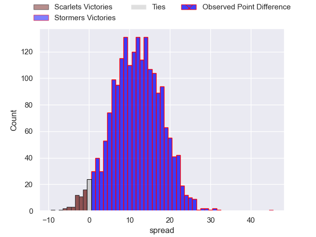
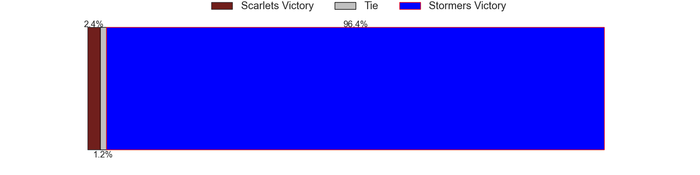
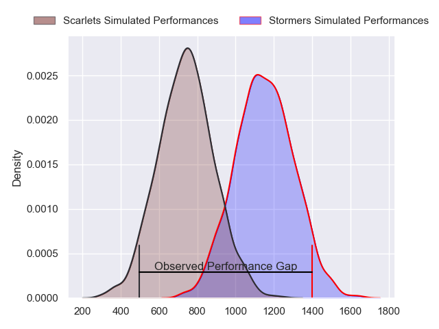
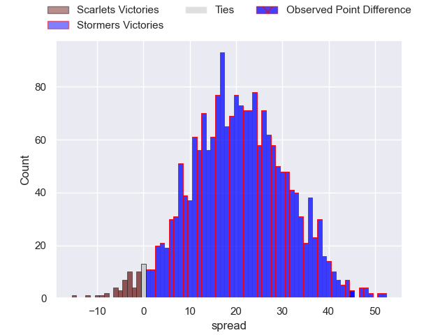
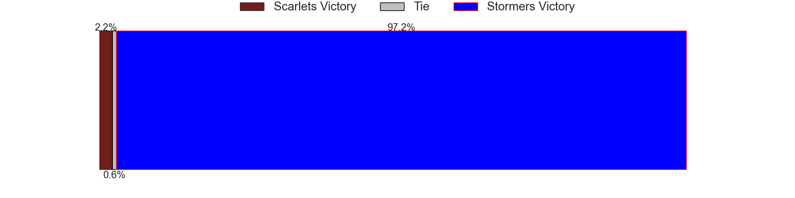
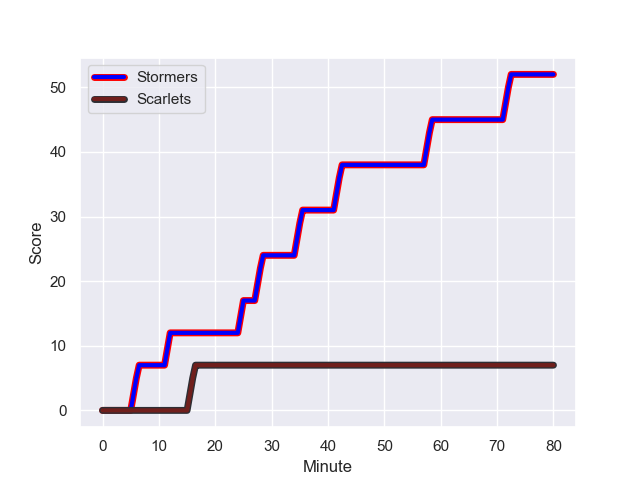
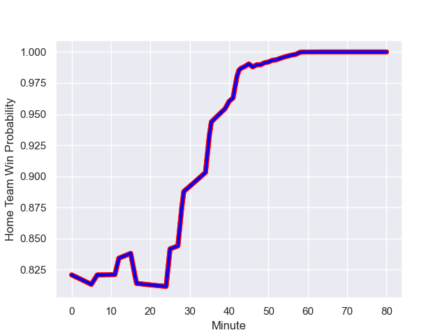

---  
layout: page  
title: Scarlets at Stormers; 7.0-52.0  
date: 2023-10-28 18:00:00 -0500  
categories: "United Rugby Championship 2023" match review  
---
# Scarlets at Stormers; 7.0-52.0

# Club Level Predictions

The first set of predictions treats a club as the smallest object, as the club develops its members, organizes a gameplan, and deploys its players as needed for each match. This club model has a prediction of 0.788, which translates to predicting Stormers to win by 11.7.

Each club has a rating and a rating deviation (similar to a Glicko rating), and expected performances can be generated. This allows for simulated matches and spreads like the ones below.
## Projected Performances - Club Model

## Projected Spreads - Club Model

## Projected Results - Club Model

# Player Level Predictions - Version 2

Treating teams instead as an entity made up of the currently active players, I have ratings for each player in an altogether different system. These can be combined to form team ratings once teamsheets are announced, weighting starters a bit higher than the reserves. After the match is played, players can be weighted by their minutes on the field, allowing for an accurate measure of the team's composition. With these compiled team ratings, we can make predictions, measure inaccuracy, and update the individual player ratings.
## Prediction with Player Minutes: Stormers by 16.7

Stormers by 12.8 on a neutral field
## Prediction without Player Minutes: Stormers by 14.5

Stormers by 10.6 on a neutral pitch

## Projected Performances - Player Model

## Projected Spreads - Player Model

## Projected Results - Player Model

## Scores over Time

## Win Probability over Time

There were 3 large changes in win probability in this match

|   Away Minutes | Away Player      |   Away elo |   Number |   Home elo | Home Player         |   Home Minutes |
|---------------:|:-----------------|-----------:|---------:|-----------:|:--------------------|---------------:|
|             50 | Kemsley Mathias  |      65.76 |        1 |      73.05 | Alistair Vermaak    |             46 |
|             80 | Shaun Evans      |      33.38 |        2 |      49.39 | Joseph Dweba        |             46 |
|             40 | Sam Wainwright   |      50.5  |        3 |      55.72 | Neethling Fouche    |             48 |
|             80 | Alex Craig       |      48.35 |        4 |      74.24 | Adre Smith          |             48 |
|             52 | Morgan Jones     |      16.28 |        5 |      49.83 | Ruben van Heerden   |             48 |
|             45 | Taine Plumtree   |      59.13 |        6 |      40.55 | Marcel Theunissen   |             80 |
|             30 | Dan Davis        |      66.73 |        7 |      92.18 | Hacjivah Dayimani   |             80 |
|             80 | Carwyn Tuipulotu |      50.44 |        8 |      70.23 | Evan Roos           |             50 |
|             43 | Kieran Hardy     |      60.94 |        9 |      66.48 | Paul de Wet         |             57 |
|             68 | Ioan Lloyd       |      34.49 |       10 |      87.16 | Clayton Blommetjies |             80 |
|             40 | Ryan Conbeer     |      50.71 |       11 |      73.61 | Leolin Zas          |             80 |
|             80 | Jonathan Davies  |      46.94 |       12 |      56.48 | Sacha Mngomezulu    |             80 |
|             80 | Joe Roberts      |      65.11 |       13 |      47.96 | Ruhan Nel           |             19 |
|             80 | Ioan Nicholas    |      51.23 |       14 |      80.43 | Ben Loader          |             80 |
|             80 | Johnny McNicholl |      74.06 |       15 |     110.22 | Warrick Gelant      |             80 |
|             50 | Ben Williams     |      47.3  |       16 |      99.57 | Courtnall Skosan    |             61 |
|             40 | Harri O'Connor   |      36.15 |       17 |      54.62 | Andre-Hugo Venter   |             34 |
|             37 | Archie Hughes    |      46.18 |       18 |      43.57 | Sti Sithole         |             34 |
|             40 | Eddie James      |      50.39 |       19 |      46.29 | Gary Porter         |             32 |
|             35 | Jac Price        |      28.08 |       20 |     123.47 | Brok Harris         |             32 |
|             30 | Wyn Jones        |      62.35 |       21 |      38.28 | Ben-Jason Dixon     |             32 |
|             28 | Isaac Young      |      46.65 |       22 |      20.73 | Nama Xaba           |             30 |
|             12 | Charlie Titcombe |      46.65 |       23 |      87.06 | Herschel Jantjies   |             23 |

