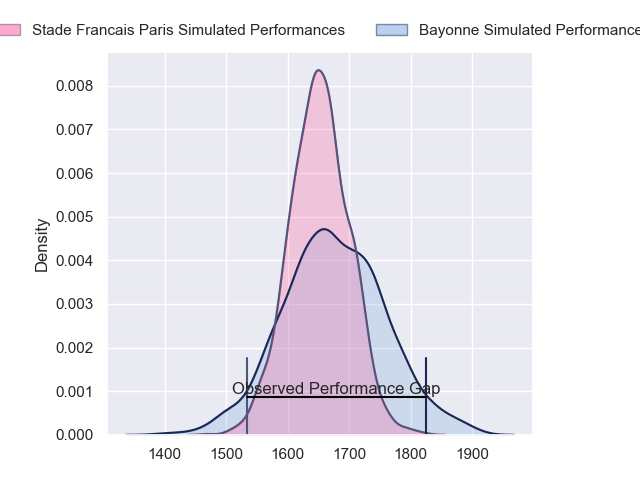
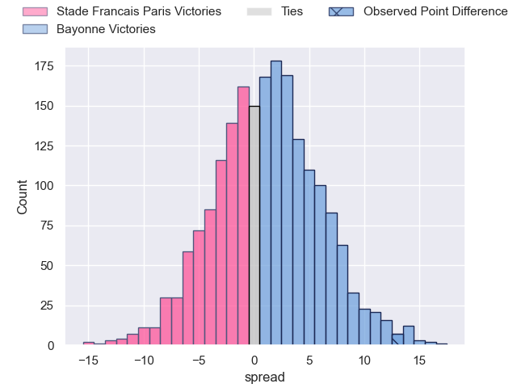
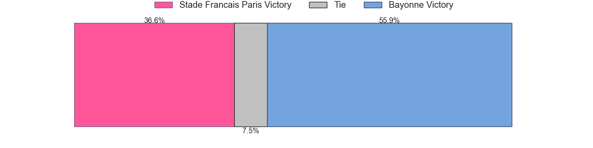
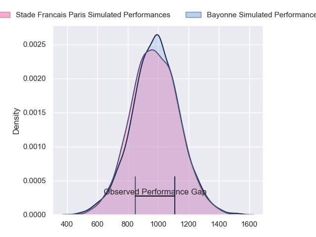
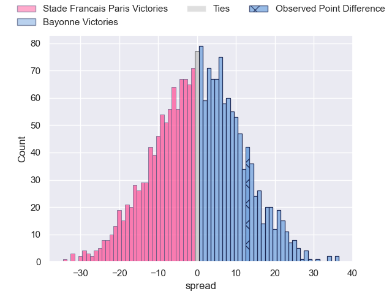
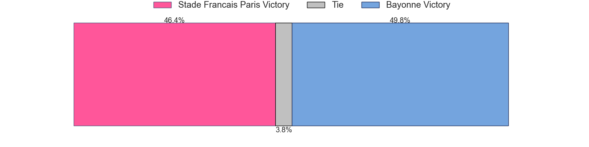
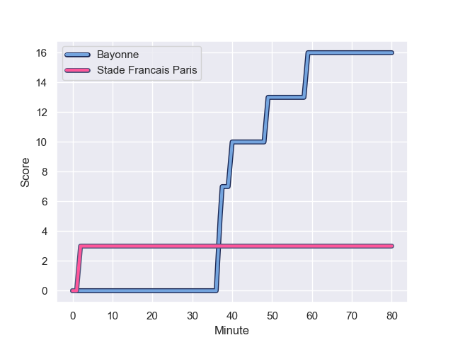
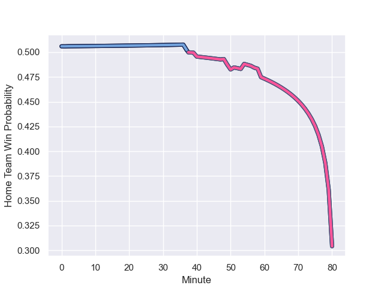

---  
layout: page  
title: Stade Francais Paris at Bayonne; 3.0-16.0  
date: 2023-10-29 18:00:00 -0500  
categories: "Top 14 Orange 2023" match review  
---
# Stade Francais Paris at Bayonne; 3.0-16.0

# Club Level Predictions

The first set of predictions treats a club as the smallest object, as the club develops its members, organizes a gameplan, and deploys its players as needed for each match. This club model has a prediction of 0.53, which translates to predicting Bayonne to win by 1.1.

Each club has a rating and a rating deviation (similar to a Glicko rating), and expected performances can be generated. This allows for simulated matches and spreads like the ones below.
## Projected Performances - Club Model

## Projected Spreads - Club Model

## Projected Results - Club Model

# Player Level Predictions - Version 2

Treating teams instead as an entity made up of the currently active players, I have ratings for each player in an altogether different system. These can be combined to form team ratings once teamsheets are announced, weighting starters a bit higher than the reserves. After the match is played, players can be weighted by their minutes on the field, allowing for an accurate measure of the team's composition. With these compiled team ratings, we can make predictions, measure inaccuracy, and update the individual player ratings.
## Prediction with Player Minutes: Bayonne by 0.3

Stade Francais Paris by 4.5 on a neutral field
## Prediction without Player Minutes: Stade Francais Paris by 2.4

Stade Francais Paris by 7.2 on a neutral pitch

## Projected Performances - Player Model

## Projected Spreads - Player Model

## Projected Results - Player Model

## Scores over Time

## Win Probability over Time

There were 2 large changes in win probability in this match

|   Away Minutes | Away Player             |   Away elo |   Number |   Home elo | Home Player             |   Home Minutes |
|---------------:|:------------------------|-----------:|---------:|-----------:|:------------------------|---------------:|
|             62 | Sergo Abramishvili      |      63.56 |        1 |      44.55 | Swan Cormenier          |             51 |
|             48 | Mickael Ivaldi          |      95.13 |        2 |      65.08 | Facundo Bosch           |             47 |
|             62 | Paul Alo-Emile          |      71.41 |        3 |      37.85 | Tevita Tatafu           |             51 |
|             80 | Paul Gabrillagues       |      74.77 |        4 |      80.29 | Arthur Iturria          |             80 |
|             54 | JJ van der Mescht       |      77.84 |        5 |      35.63 | Thomas Ceyte            |             57 |
|             80 | Mathieu Hirigoyen       |      38.22 |        6 |      79.55 | Remi Bourdeau           |             80 |
|             57 | Romain Briatte          |      45.44 |        7 |      63.77 | Baptiste Heguy          |             51 |
|             48 | Giovanni Habel-Kueffner |      88.69 |        8 |      70.76 | Uzair Cassiem           |             80 |
|             50 | Rory Kockott            |     115.39 |        9 |      64.41 | Maxime Machenaud        |             54 |
|              3 | Joris Segonds           |      67.97 |       10 |      92.01 | Camille Lopez           |             80 |
|             80 | Lester Etien            |      68.76 |       11 |      68.16 | Remy Baget              |             80 |
|             80 | Julien Delbouis         |      75.47 |       12 |      21.12 | Guillaume Martocq       |             57 |
|             80 | Jeremy Ward             |      91.14 |       13 |      68.57 | Peyo Muscarditz         |             80 |
|             80 | Peniasi Dakuwaqa        |      42.19 |       14 |      54.53 | Aurelien Callandret     |             80 |
|             80 | Kylan Hamdaoui          |      49.27 |       15 |      22.51 | Cheikh Tiberghien       |             80 |
|             77 | Leo Barre               |      63.17 |       16 |      23.86 | Vincent Giudicelli      |             33 |
|             26 | Baptiste Pesenti        |      72.99 |       17 |      23.88 | Pascal Cotet            |             29 |
|             32 | Lucas Peyresblanques    |      45.22 |       18 |      98.48 | Denis Marchois          |             29 |
|             32 | Ryan Chapuis            |      23.58 |       19 |      58.48 | Guillaume Rouet Piffard |             26 |
|             30 | Hugo Zabalza            |      36.66 |       20 |      72.94 | Sireli Maqala           |             23 |
|             23 | Pierre-Henri Azagoh     |      47.42 |       21 |       5.62 | Konstantin Mikautadze   |             23 |
|             18 | Moses Alo-Emile         |      59.11 |       22 |      51.82 | Quentin Bethune         |             29 |
|             18 | Vasil Kakovin           |      41.16 |       23 |     nan    | nan                     |            nan |

