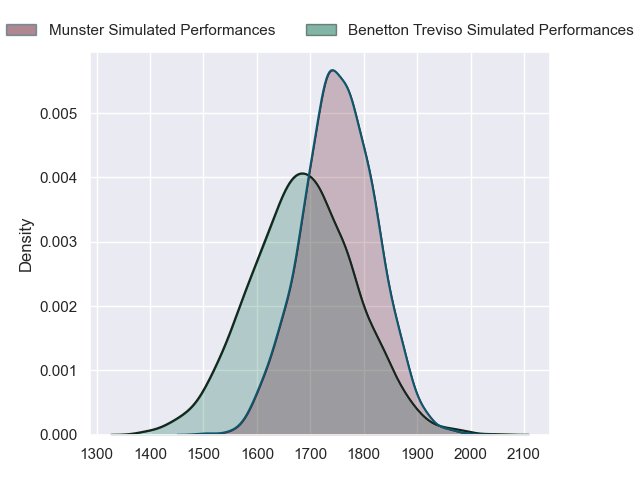
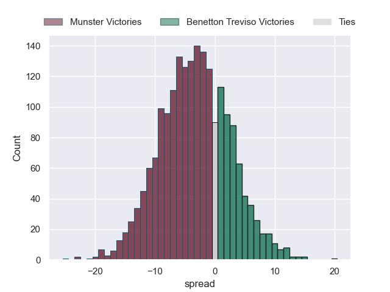
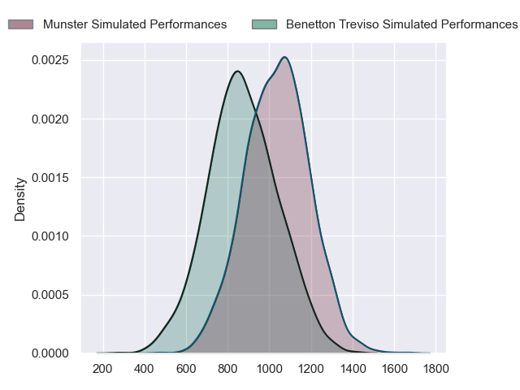
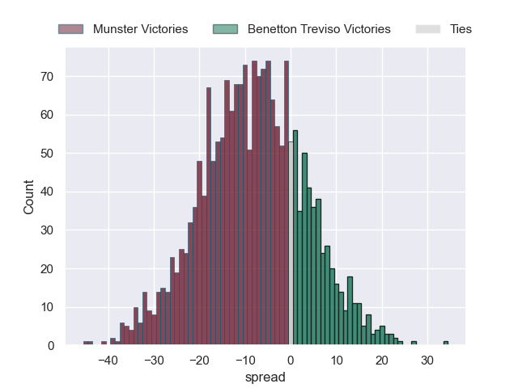
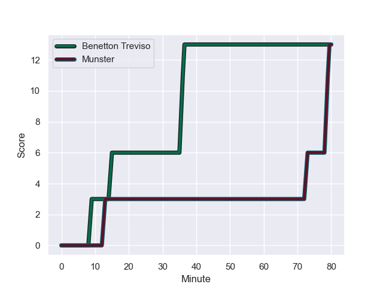
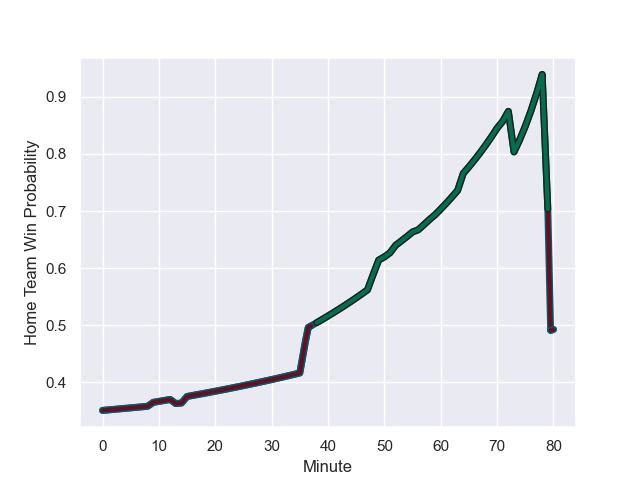

---  
layout: page  
title: Munster at Benetton Treviso; 13-13  
date: 2023-10-29 18:00:00 -0500  
categories: "United Rugby Championship 2023" match review  
---
# Munster at Benetton Treviso; 13-13

# Club Level Predictions

The first set of predictions treats a club as the smallest object, as the club develops its members, organizes a gameplan, and deploys its players as needed for each match. This club model has a prediction of 0.405, which translates to predicting Munster to win by 3.4.

Each club has a rating and a rating deviation (similar to a Glicko rating), and expected performances can be generated. This allows for simulated matches and spreads like the ones below.
## Projected Performances - Club Model

## Projected Spreads - Club Model

## Projected Results - Club Model

# Player Level Predictions - Version 2

Treating teams instead as an entity made up of the currently active players, I have ratings for each player in an altogether different system. These can be combined to form team ratings once teamsheets are announced, weighting starters a bit higher than the reserves. After the match is played, players can be weighted by their minutes on the field, allowing for an accurate measure of the team's composition. With these compiled team ratings, we can make predictions, measure inaccuracy, and update the individual player ratings.
## Prediction with Player Minutes: Munster by 6.8

Munster by 10.7 on a neutral field
## Prediction without Player Minutes: Munster by 7.2

Munster by 11.1 on a neutral pitch

## Projected Performances - Player Model

## Projected Spreads - Player Model

## Projected Results - Player Model

## Scores over Time

## Win Probability over Time

There were 10 large changes in win probability in this match

|   Away Minutes | Away Player      |   Away elo |   Number |   Home elo | Home Player         |   Home Minutes |
|---------------:|:-----------------|-----------:|---------:|-----------:|:--------------------|---------------:|
|             56 | Josh Wycherley   |      46.3  |        1 |      51.87 | Mirco Spagnolo      |             49 |
|             64 | Diarmuid Barron  |      80.56 |        2 |      54.82 | Gianmarco Lucchesi  |             49 |
|             48 | Stephen Archer   |     103.14 |        3 |      44.9  | Giosue Zilocchi     |             49 |
|             80 | Edwin Edogbo     |      48.44 |        4 |      54.28 | Edoardo Iachizzi    |             80 |
|             80 | Fineen Wycherley |      46.13 |        5 |      50.74 | Eli Snyman          |             80 |
|             80 | Jack O'Donoghue  |      78.65 |        6 |      45.09 | Alessandro Izekor   |             64 |
|             48 | John Hodnett     |      73.86 |        7 |      52.02 | Manuel Zuliani      |             71 |
|             80 | Gavin Coombes    |      77.35 |        8 |      73.52 | Toa Halafihi        |             80 |
|             50 | Ethan Coughlan   |      47.86 |        9 |      28.89 | Andy Uren           |             80 |
|             80 | Joey Carbery     |      55.6  |       10 |      67.89 | Jacob Umaga         |             59 |
|             80 | Calvin Nash      |      89.31 |       11 |      44.96 | Edoardo Padovani    |             80 |
|             48 | Rory Scannell    |     103.76 |       12 |      36.28 | Filippo Drago       |             80 |
|             80 | Antoine Frisch   |      70.49 |       13 |      72.19 | Malakai Fekitoa     |             80 |
|             52 | Shay McCarthy    |      46.65 |       14 |      21.08 | Ignacio Mendy       |             80 |
|             80 | Shane Daly       |      96.65 |       15 |      65.58 | Rhyno Smith         |             80 |
|             16 | John Ryan        |      82.84 |       16 |      37.66 | Federico Zani       |             31 |
|             32 | Alex Kendellen   |      57.51 |       17 |      94.95 | Giacomo Nicotera    |             31 |
|             32 | Alex Nankivell   |      98.84 |       18 |      60.06 | Tiziano Pasquali    |             31 |
|             30 | Paddy Patterson  |      51.18 |       19 |      64.51 | Tomas Albornoz      |             21 |
|             28 | Sean O'Brien     |      33.11 |       20 |      25.68 | Gideon Koegelenberg |             16 |
|             24 | Thomas Ahern     |      58.69 |       21 |      57.62 | Marco Zanon         |              9 |
|             16 | Scott Buckley    |      49.1  |       22 |     nan    | nan                 |            nan |
|             16 | Mark Donnelly    |      47.34 |       23 |     nan    | nan                 |            nan |

