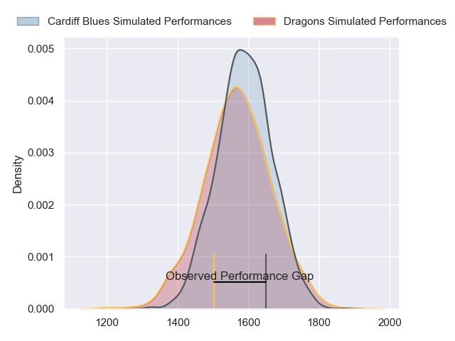
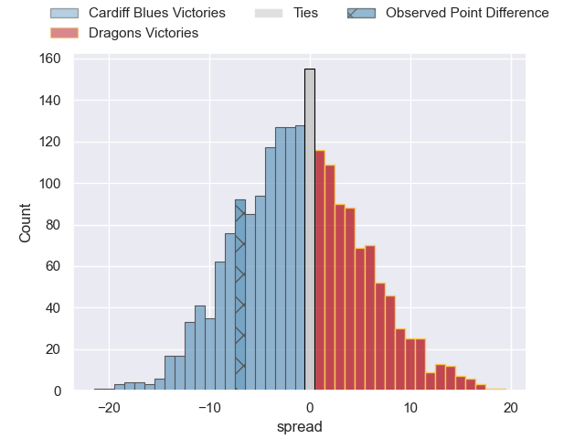
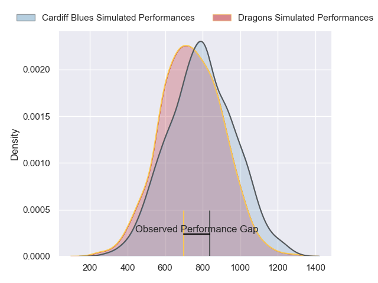
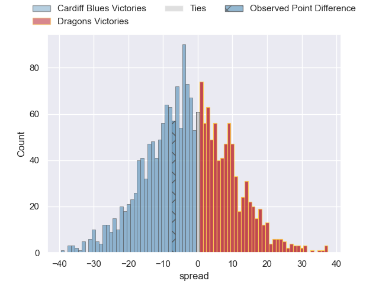
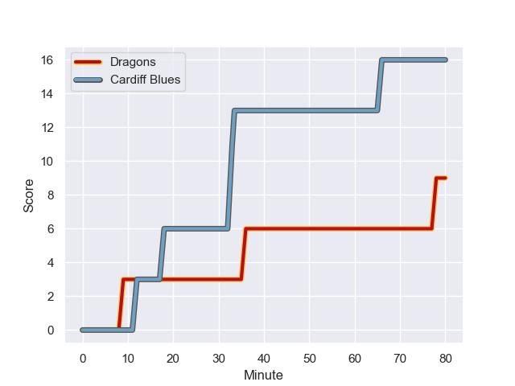
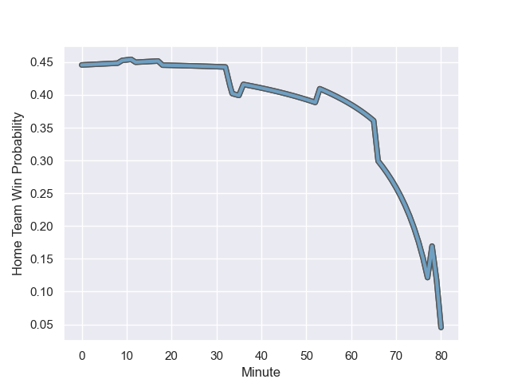

---  
layout: page  
title: Cardiff Blues at Dragons; 16.0-9.0  
date: 2023-10-29 18:00:00 -0500  
categories: "United Rugby Championship 2023" match review  
---
# Cardiff Blues at Dragons; 16.0-9.0

# Club Level Predictions

The first set of predictions treats a club as the smallest object, as the club develops its members, organizes a gameplan, and deploys its players as needed for each match. This club model has a prediction of 0.474, which translates to predicting Cardiff Blues to win by 0.9.

Each club has a rating and a rating deviation (similar to a Glicko rating), and expected performances can be generated. This allows for simulated matches and spreads like the ones below.
## Projected Performances - Club Model

## Projected Spreads - Club Model

## Projected Results - Club Model

# Player Level Predictions - Version 2

Treating teams instead as an entity made up of the currently active players, I have ratings for each player in an altogether different system. These can be combined to form team ratings once teamsheets are announced, weighting starters a bit higher than the reserves. After the match is played, players can be weighted by their minutes on the field, allowing for an accurate measure of the team's composition. With these compiled team ratings, we can make predictions, measure inaccuracy, and update the individual player ratings.
## Prediction with Player Minutes: Cardiff Blues by 2.4

Cardiff Blues by 6.7 on a neutral field
## Prediction without Player Minutes: Cardiff Blues by 3.6

Cardiff Blues by 7.8 on a neutral pitch

## Projected Performances - Player Model

## Projected Spreads - Player Model

## Projected Results - Player Model

## Scores over Time

## Win Probability over Time

There were 6 large changes in win probability in this match

|   Away Minutes | Away Player        |   Away elo |   Number |   Home elo | Home Player              |   Home Minutes |
|---------------:|:-------------------|-----------:|---------:|-----------:|:-------------------------|---------------:|
|             53 | Corey Domachowski  |      60.21 |        1 |      58.01 | Rodrigo Martinez Manzano |             80 |
|             78 | Liam Belcher       |      54.57 |        2 |      43.52 | Bradley Roberts          |             80 |
|             62 | Keiron Assiratti   |      42.1  |        3 |      28.65 | Lloyd Fairbrother        |             59 |
|             80 | Shane Lewis-Hughes |      21.06 |        4 |       3.19 | Matthew Screech          |             80 |
|             70 | Teddy Williams     |      56.35 |        5 |      38.13 | Ben Carter               |             80 |
|             80 | Ellis Jenkins      |      48.75 |        6 |      42.36 | George Nott              |             80 |
|             80 | Thomas Young       |      83.49 |        7 |      32.16 | Sean Lonsdale            |             18 |
|             80 | Seb Davies         |      41.46 |        8 |      -6.72 | Harrison Keddie          |             25 |
|             80 | Tomos Williams     |      76.49 |        9 |      33.04 | Dane Blacker             |             55 |
|             80 | Tinus de Beer      |      72.99 |       10 |      32.53 | Angus O'Brien            |             80 |
|             80 | Theo Cabango       |      47.68 |       11 |      67.52 | Ashton Hewitt            |             80 |
|             59 | Uilisi Halaholo    |      98.95 |       12 |      77.92 | Steffan Hughes           |             80 |
|             80 | Mason Grady        |      71.66 |       13 |      72.27 | Sio Tomkinson            |             66 |
|             80 | Aled Summerhill    |      14.49 |       14 |      17.94 | Jared Rosser             |             80 |
|             80 | Cam Winnett        |      31.89 |       15 |      56.69 | Jordan Williams          |             70 |
|             27 | Rhys Carré         |      34.79 |       16 |      35.83 | James Benjamin           |             62 |
|             21 | Ben Thomas         |      51.42 |       17 |      31.16 | Joseph Davies            |             55 |
|              2 | Efan Daniel        |      46.73 |       18 |      75.69 | Rhodri Williams          |             25 |
|             18 | Rhys Litterick     |      47.97 |       19 |      43.17 | Leon Brown               |             21 |
|             10 | Rory Thornton      |      22.73 |       20 |      37.97 | Jack Dixon               |             14 |
|            nan | nan                |     nan    |       21 |      44.54 | Will Reed                |             10 |

