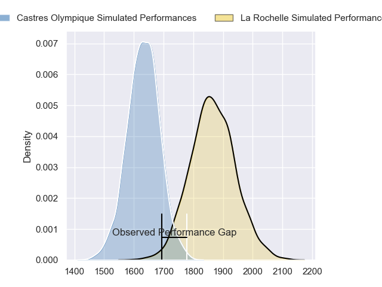
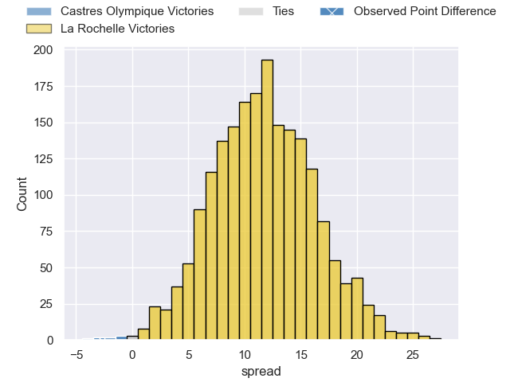
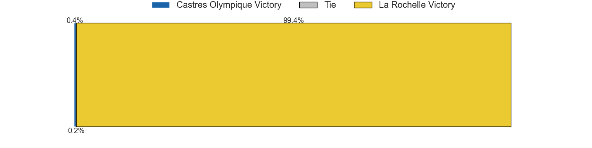
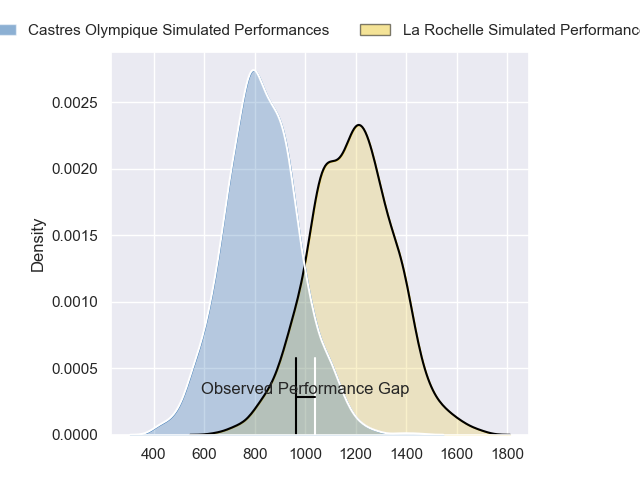
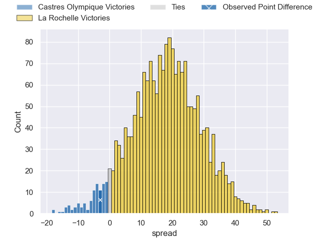
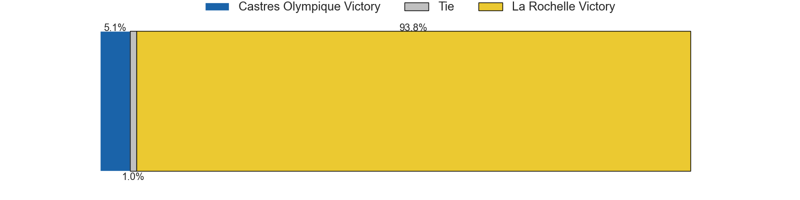
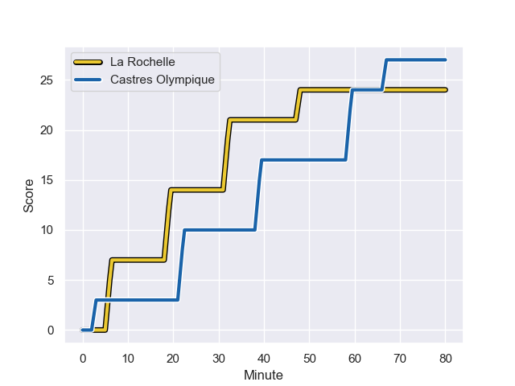
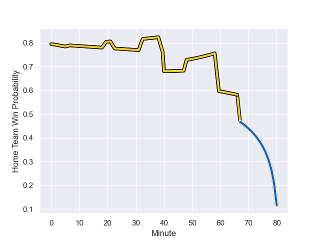

---  
layout: page  
title: Castres Olympique at La Rochelle; 27-24  
date: 2023-10-29 18:00:00 -0500  
categories: "Top 14 Orange 2023" match review  
---
# Castres Olympique at La Rochelle; 27-24

# Club Level Predictions

The first set of predictions treats a club as the smallest object, as the club develops its members, organizes a gameplan, and deploys its players as needed for each match. This club model has a prediction of 0.788, which translates to predicting La Rochelle to win by 11.6.

Each club has a rating and a rating deviation (similar to a Glicko rating), and expected performances can be generated. This allows for simulated matches and spreads like the ones below.
## Projected Performances - Club Model

## Projected Spreads - Club Model

## Projected Results - Club Model

# Player Level Predictions - Version 2

Treating teams instead as an entity made up of the currently active players, I have ratings for each player in an altogether different system. These can be combined to form team ratings once teamsheets are announced, weighting starters a bit higher than the reserves. After the match is played, players can be weighted by their minutes on the field, allowing for an accurate measure of the team's composition. With these compiled team ratings, we can make predictions, measure inaccuracy, and update the individual player ratings.
## Prediction with Player Minutes: La Rochelle by 14.9

La Rochelle by 10.1 on a neutral field
## Prediction without Player Minutes: La Rochelle by 14.9

La Rochelle by 10.2 on a neutral pitch

## Projected Performances - Player Model

## Projected Spreads - Player Model

## Projected Results - Player Model

## Scores over Time

## Win Probability over Time

There were 11 large changes in win probability in this match

|   Away Minutes | Away Player                |   Away elo |   Number |   Home elo | Home Player           |   Home Minutes |
|---------------:|:---------------------------|-----------:|---------:|-----------:|:----------------------|---------------:|
|             40 | Quentin Walcker            |      58.38 |        1 |      60.8  | Thierry Paiva         |             60 |
|             52 | Gaetan Barlot              |      75.47 |        2 |      54.9  | Quentin Lespiaucq     |             80 |
|             40 | Wilfrid Hounkpatin         |      57.2  |        3 |      25.27 | Georges-Henri Colombe |             40 |
|             67 | Gauthier Maravat           |       9.1  |        4 |      74.1  | Thomas Lavault        |             71 |
|             52 | Florent Vanverberghe       |      45.92 |        5 |      51.18 | Remi Picquette        |             80 |
|             80 | Mathieu Babillot           |      54.13 |        6 |      69.62 | Ultan Dillane         |             80 |
|             52 | Nick Champion de Crespigny |      49.52 |        7 |      40.45 | Judicael Cancoriet    |             80 |
|             80 | Tyler Ardron               |      84.32 |        8 |      66.16 | Yoan Tanga            |             80 |
|             52 | Jeremy Fernandez           |      12.59 |        9 |     119.54 | Tawera Kerr-Barlow    |             80 |
|             80 | Pierre Popelin             |      51.51 |       10 |      48.97 | Hugo Reus             |             68 |
|             80 | Nathanael Hulleu           |      68.99 |       11 |     105.2  | Dillyn Leyds          |             80 |
|             73 | Adrea Cocagi               |      57.83 |       12 |      73.04 | Jules Favre           |             80 |
|             80 | Adrien Seguret             |      30.29 |       13 |     105.25 | Jack Nowell           |             80 |
|             80 | Geoffrey Palis             |      84.21 |       14 |      95.66 | Teddy Thomas          |             80 |
|             80 | Julien Dumora              |      62.7  |       15 |     123.13 | Brice Dulin           |             40 |
|             40 | Antoine Tichit             |      73.32 |       16 |      44.58 | Karl Sorin            |             20 |
|             28 | Loris Zarantonello         |      41.73 |       17 |      39.72 | Aleksandre Kuntelia   |             40 |
|             40 | Levan Chilachava           |      55.8  |       18 |      44.59 | Thomas Ployet         |              9 |
|             13 | Abraham Papali'i           |      53.59 |       19 |      38.01 | Ihaia West            |             12 |
|             28 | Leone Nakarawa             |      76.73 |       20 |      45.31 | Nathan Bollengier     |             40 |
|             28 | Santiago Arata             |      50.83 |       21 |     nan    | nan                   |            nan |
|             28 | Baptiste Delaporte         |      50.28 |       22 |     nan    | nan                   |            nan |
|              7 | Louis Le Brun              |      47.86 |       23 |     nan    | nan                   |            nan |

