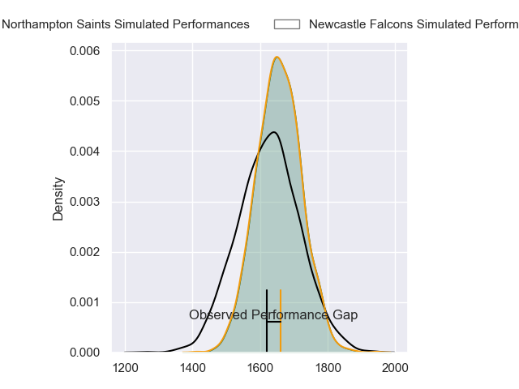
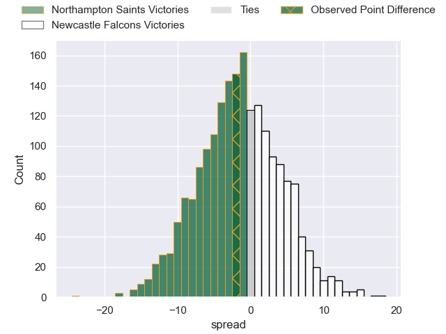
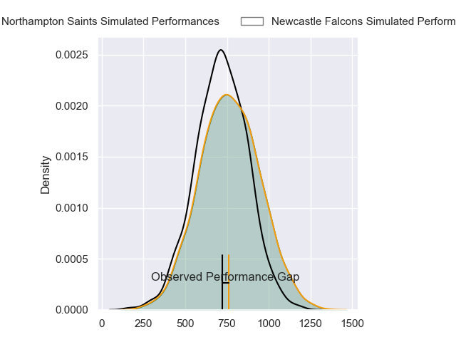
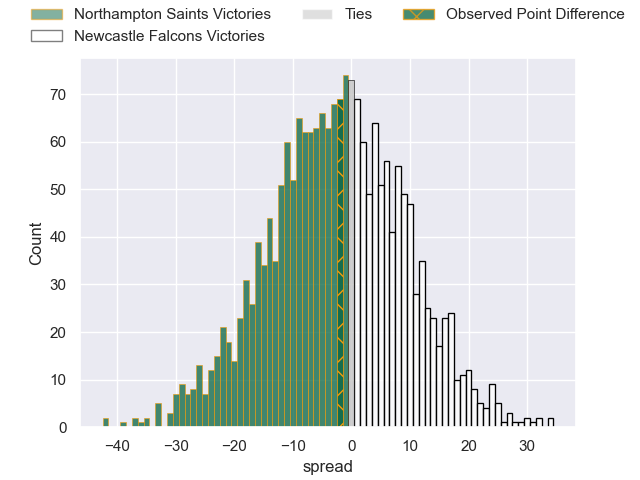
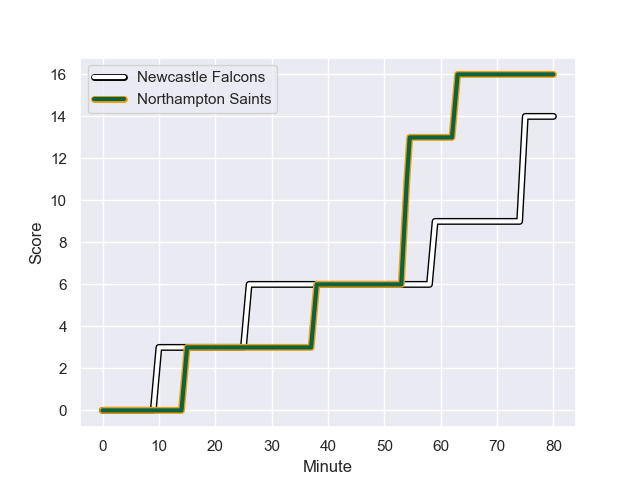
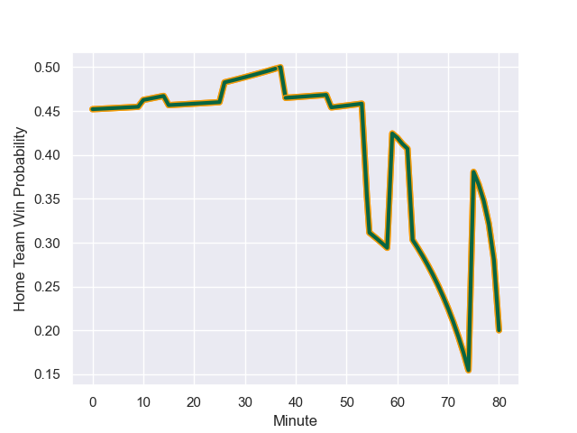

---  
layout: page  
title: Northampton Saints at Newcastle Falcons; 16-14  
date: 2023-10-29 18:00:00 -0500  
categories: "Gallagher Premiership 2023" match review  
---
# Northampton Saints at Newcastle Falcons; 16-14

# Club Level Predictions

The first set of predictions treats a club as the smallest object, as the club develops its members, organizes a gameplan, and deploys its players as needed for each match. This club model has a prediction of 0.457, which translates to predicting Northampton Saints to win by 1.5.

Each club has a rating and a rating deviation (similar to a Glicko rating), and expected performances can be generated. This allows for simulated matches and spreads like the ones below.
## Projected Performances - Club Model

## Projected Spreads - Club Model

## Projected Results - Club Model

# Player Level Predictions - Version 2

Treating teams instead as an entity made up of the currently active players, I have ratings for each player in an altogether different system. These can be combined to form team ratings once teamsheets are announced, weighting starters a bit higher than the reserves. After the match is played, players can be weighted by their minutes on the field, allowing for an accurate measure of the team's composition. With these compiled team ratings, we can make predictions, measure inaccuracy, and update the individual player ratings.
## Prediction with Player Minutes: Northampton Saints by 2.1

Northampton Saints by 6.7 on a neutral field
## Prediction without Player Minutes: Northampton Saints by 3.3

Northampton Saints by 7.9 on a neutral pitch

## Projected Performances - Player Model

## Projected Spreads - Player Model

## Projected Results - Player Model

## Scores over Time

## Win Probability over Time

There were 9 large changes in win probability in this match

|   Away Minutes | Away Player         |   Away elo |   Number |   Home elo | Home Player         |   Home Minutes |
|---------------:|:--------------------|-----------:|---------:|-----------:|:--------------------|---------------:|
|             47 | Ethan Waller        |      67.05 |        1 |      19.69 | Adam Brocklebank    |             59 |
|             69 | Curtis Langdon      |      59.83 |        2 |      25.4  | Jamie Blamire       |             59 |
|             63 | Trevor Davison      |      14.22 |        3 |      28.37 | Mark Tampin         |             54 |
|             59 | Chunya Munga        |      50.36 |        4 |      27.62 | Philip van der Walt |             63 |
|             80 | Alex Coles          |      22.22 |        5 |      18.88 | Sebastian de Chaves |             63 |
|             80 | Angus Scott-Young   |      44.52 |        6 |      47.51 | Sam Cross           |             61 |
|             80 | Tom Pearson         |      78.43 |        7 |      41.29 | Guy Pepper          |             80 |
|             80 | Sam Graham          |      85.41 |        8 |      37.95 | Callum Chick        |             80 |
|             80 | Tom James           |      16.06 |        9 |      -5.33 | Sam Stuart          |             68 |
|             80 | Fin Smith           |      49.24 |       10 |      34.1  | Brett Connon        |             80 |
|             80 | George Hendy        |      63.27 |       11 |      49.01 | Iwan Stephens       |             80 |
|             80 | Rory Hutchinson     |      68.76 |       12 |      55.59 | Rory Jennings       |             80 |
|             80 | Fraser Dingwall     |      52.56 |       13 |      77.59 | Tom Penny           |             80 |
|             80 | Tom Seabrook        |       4.18 |       14 |      73.23 | Adam Radwan         |             80 |
|             80 | George Furbank      |      63.64 |       15 |      37.33 | Elliott Obatoyinbo  |             51 |
|             33 | Alex Waller         |      96.02 |       16 |      39.53 | Phil Brantingham    |             21 |
|             11 | Tom Cruse           |      35.32 |       17 |      62.57 | Bryan Byrne         |             21 |
|             17 | Elliot Millar-Mills |      44.63 |       18 |      54.29 | Murray McCallum     |             26 |
|             21 | Alex Moon           |      81.83 |       19 |      28.71 | John Hawkins        |             17 |
|            nan | nan                 |     nan    |       20 |      38.83 | Kiran McDonald      |             17 |
|            nan | nan                 |     nan    |       21 |      43.06 | Freddie Lockwood    |             19 |
|            nan | nan                 |     nan    |       22 |      45.91 | Hugh O'Sullivan     |             12 |
|            nan | nan                 |     nan    |       23 |      31.13 | Matias Orlando      |             29 |

