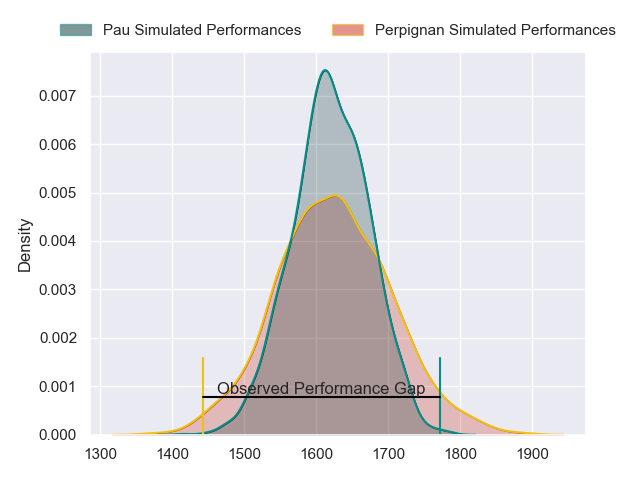
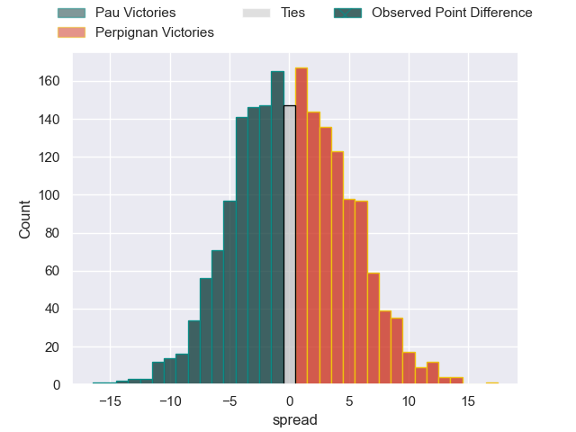
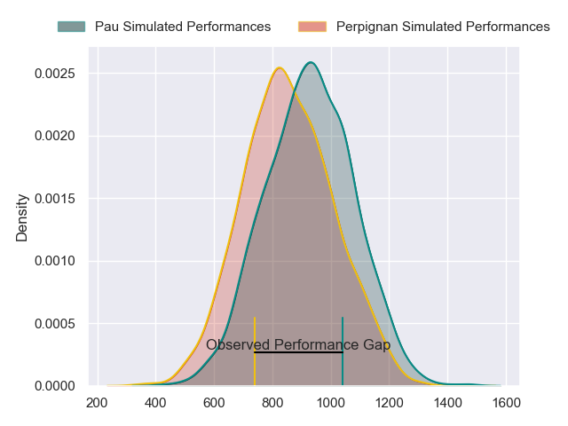
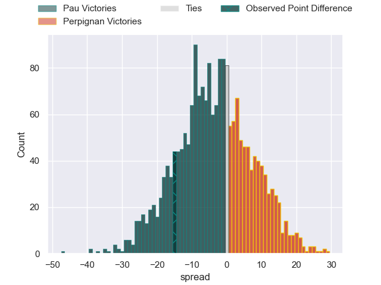
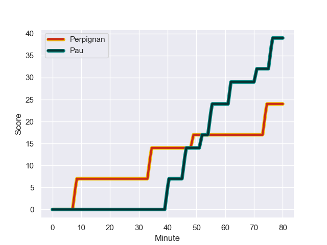
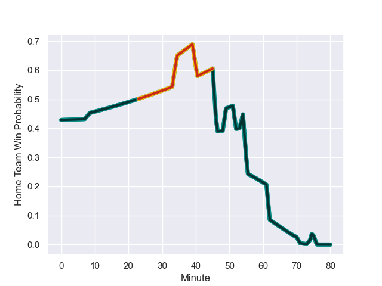

---  
layout: page  
title: Pau at Perpignan; 39.0-24.0  
date: 2023-10-29 18:00:00 -0500  
categories: "Top 14 Orange 2023" match review  
---
# Pau at Perpignan; 39.0-24.0

# Club Level Predictions

The first set of predictions treats a club as the smallest object, as the club develops its members, organizes a gameplan, and deploys its players as needed for each match. This club model has a prediction of 0.508, which translates to predicting Perpignan to win by 0.3.

Each club has a rating and a rating deviation (similar to a Glicko rating), and expected performances can be generated. This allows for simulated matches and spreads like the ones below.
## Projected Performances - Club Model

## Projected Spreads - Club Model

## Projected Results - Club Model

# Player Level Predictions - Version 2

Treating teams instead as an entity made up of the currently active players, I have ratings for each player in an altogether different system. These can be combined to form team ratings once teamsheets are announced, weighting starters a bit higher than the reserves. After the match is played, players can be weighted by their minutes on the field, allowing for an accurate measure of the team's composition. With these compiled team ratings, we can make predictions, measure inaccuracy, and update the individual player ratings.
## Prediction with Player Minutes: Pau by 3.1

Pau by 8.1 on a neutral field
## Prediction without Player Minutes: Pau by 2.8

Pau by 7.8 on a neutral pitch

## Projected Performances - Player Model

## Projected Spreads - Player Model

## Projected Results - Player Model

## Scores over Time

## Win Probability over Time

There were 13 large changes in win probability in this match

|   Away Minutes | Away Player              |   Away elo |   Number |   Home elo | Home Player         |   Home Minutes |
|---------------:|:-------------------------|-----------:|---------:|-----------:|:--------------------|---------------:|
|             52 | Hayden Thompson-Stringer |      72.75 |        1 |      56.42 | Sacha Lotrian       |             46 |
|             58 | Lucas Rey                |      42.96 |        2 |      58.43 | Seilala Lam         |             61 |
|             58 | Siate Tokolahi           |      73.28 |        3 |     101.19 | Arthur Joly         |             46 |
|             56 | Guillaume Ducat          |      32.11 |        4 |      48.78 | Tristan Labouteley  |             80 |
|             62 | Mickael Capelli          |      47.84 |        5 |      43.67 | Posolo Tuilagi      |             80 |
|             80 | Martin Puech             |      56.88 |        6 |      68.82 | Patrick Sobela      |             80 |
|             80 | Luke Whitelock           |     116.83 |        7 |      29.59 | Ewan Bertheau       |             54 |
|             52 | Sacha Zegueur            |      18.7  |        8 |      29.12 | Lucas Velarte       |             80 |
|             54 | Dan Robson               |     108.32 |        9 |      56.44 | Tom Ecochard        |             54 |
|             62 | Joe Simmonds             |      89.61 |       10 |      60.71 | Jake McIntyre       |             80 |
|             80 | Samuel Ezeala            |      20.85 |       11 |      41.54 | Ali Crossdale       |             80 |
|             80 | Nathan Decron            |      53.01 |       12 |      81.35 | Mathieu Acebes      |             80 |
|             80 | Emilien Gailleton        |      59.13 |       13 |     -22.63 | Edward Sawailau     |             54 |
|             80 | Clement Laporte          |     102.18 |       14 |      53.91 | Lucas Dubois        |             61 |
|             80 | Jack Maddocks            |      52.22 |       15 |      53.16 | Tommaso Allan       |             80 |
|             28 | Remi Seneca              |      62.34 |       16 |      18.18 | Giorgi Tetrashvili  |             34 |
|             22 | Youri Delhommel          |      33.67 |       17 |      30.72 | Victor Montgaillard |             19 |
|             22 | Nicolas Corato           |      30.9  |       18 |      48.11 | Pietro Ceccarelli   |             34 |
|             24 | Hugo Auradou             |      27.99 |       19 |      36.33 | Kelian Galletier    |             26 |
|             18 | Fabrice Metz             |      67.77 |       20 |      29.06 | Sadek Deghmache     |             26 |
|             28 | Reece Hewat              |      46.81 |       21 |      56.71 | Louis Dupichot      |             19 |
|             26 | Thibault Daubagna        |      87.09 |       22 |      35.71 | Tavite Veredamu     |             26 |
|             18 | Axel Desperes            |      45.75 |       23 |     nan    | nan                 |            nan |

