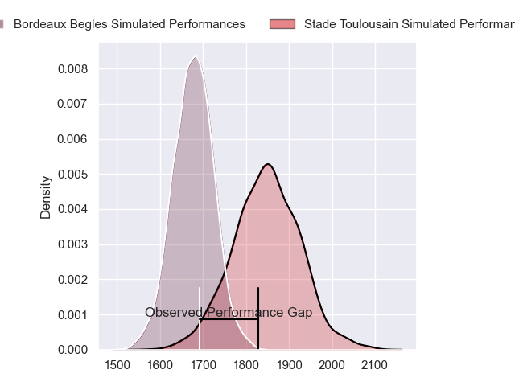
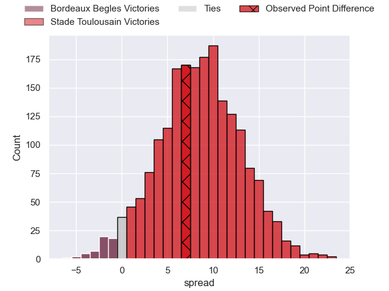
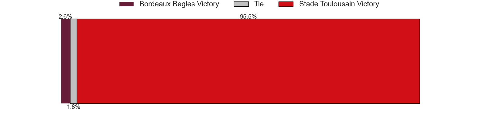
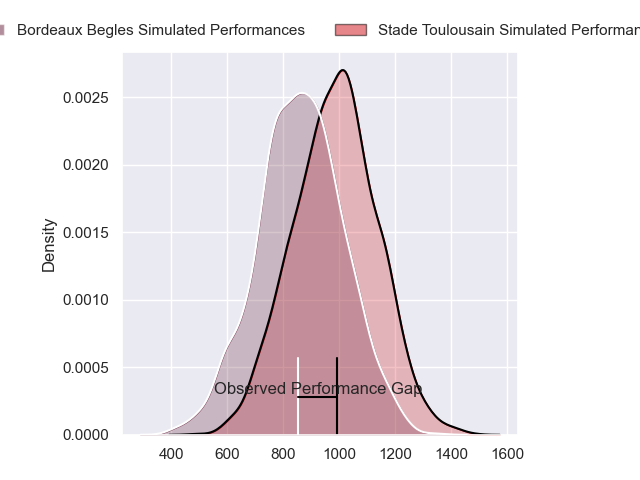
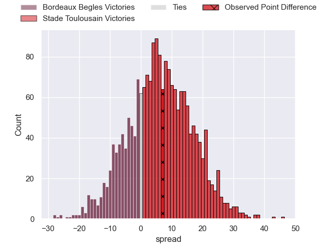
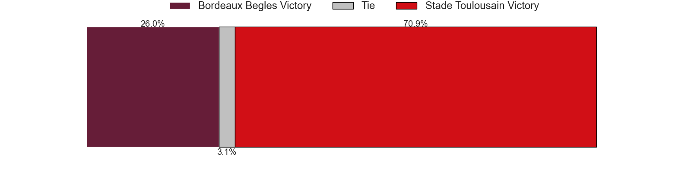
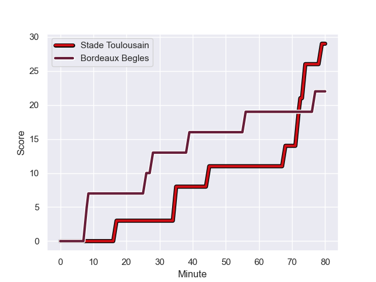
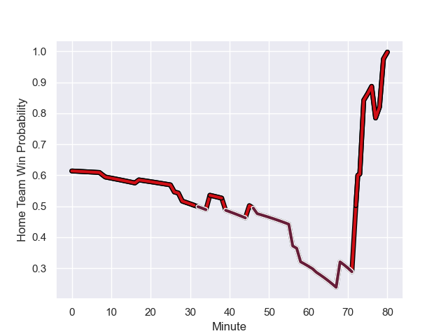

---  
layout: page  
title: Bordeaux Begles at Stade Toulousain; 22.0-29.0  
date: 2023-10-29 18:00:00 -0500  
categories: "Top 14 Orange 2023" match review  
---
# Bordeaux Begles at Stade Toulousain; 22.0-29.0

# Club Level Predictions

The first set of predictions treats a club as the smallest object, as the club develops its members, organizes a gameplan, and deploys its players as needed for each match. This club model has a prediction of 0.725, which translates to predicting Stade Toulousain to win by 8.5.

Each club has a rating and a rating deviation (similar to a Glicko rating), and expected performances can be generated. This allows for simulated matches and spreads like the ones below.
## Projected Performances - Club Model

## Projected Spreads - Club Model

## Projected Results - Club Model

# Player Level Predictions - Version 2

Treating teams instead as an entity made up of the currently active players, I have ratings for each player in an altogether different system. These can be combined to form team ratings once teamsheets are announced, weighting starters a bit higher than the reserves. After the match is played, players can be weighted by their minutes on the field, allowing for an accurate measure of the team's composition. With these compiled team ratings, we can make predictions, measure inaccuracy, and update the individual player ratings.
## Prediction with Player Minutes: Stade Toulousain by 5.1

Stade Toulousain by 0.2 on a neutral field
## Prediction without Player Minutes: Stade Toulousain by 5.7

Stade Toulousain by 0.8 on a neutral pitch

## Projected Performances - Player Model

## Projected Spreads - Player Model

## Projected Results - Player Model

## Scores over Time

## Win Probability over Time

There were 13 large changes in win probability in this match

|   Away Minutes | Away Player        |   Away elo |   Number |   Home elo | Home Player            |   Home Minutes |
|---------------:|:-------------------|-----------:|---------:|-----------:|:-----------------------|---------------:|
|             47 | Jefferson Poirot   |      55.54 |        1 |      41.97 | Rodrigue Neti          |             58 |
|             47 | Clement Maynadier  |      60.22 |        2 |      52.97 | Guillaume Cramont      |             46 |
|             47 | Carlu Sadie        |      34.71 |        3 |      62    | Owen Franks            |             62 |
|             47 | Kane Douglas       |      48.84 |        4 |      43.72 | Joshua Brennan         |             46 |
|             80 | Adam Coleman       |     119.32 |        5 |      65.13 | Piula Faasalele        |             80 |
|             80 | Pierre Bochaton    |      64.06 |        6 |      37.75 | Alban Placines         |             80 |
|             47 | Mahamadou Diaby    |      57.39 |        7 |      47.87 | Theo Ntamack           |             58 |
|             59 | Tevita Tatafu      |      61.62 |        8 |      85.76 | Alexandre Roumat       |             80 |
|             74 | Paul Abadie        |      17.26 |        9 |      42.09 | Paul Graou             |             80 |
|             74 | Mateo Garcia       |      43.64 |       10 |      17.97 | Billy Searle           |             62 |
|             80 | Pablo Uberti       |      23.91 |       11 |      52.53 | Edgar Retiere          |             80 |
|             80 | Ben Tapuai         |      36.91 |       12 |      99.2  | Sofiane Guitoune       |             46 |
|             80 | Nicolas Depoortere |      50.69 |       13 |      52.31 | Paul Costes            |             80 |
|             80 | Romain Buros       |      91.45 |       14 |      61.54 | Lucas Tauzin           |             46 |
|             80 | Nans Ducuing       |      66.14 |       15 |     104.53 | Matthis Lebel          |             80 |
|             33 | Lekso Kaulashvili  |      67.45 |       16 |      60.13 | David Ainu'u           |             22 |
|             33 | Maxime Lamothe     |      50.86 |       17 |      87.83 | Peato Mauvaka          |             34 |
|             33 | Sipili Falatea     |      49.81 |       18 |      49.39 | Joel Merkler           |             18 |
|             33 | Cyril Cazeaux      |      78.1  |       19 |      33.55 | Richie Arnold          |             34 |
|             21 | Marko Gazzotti     |      52.8  |       20 |      47.46 | Mathis Castro Ferreira |             22 |
|             33 | Pete Samu          |      81.35 |       21 |      12.34 | Baptiste Germain       |             18 |
|              6 | Theo Nanette       |      14.26 |       22 |      39.36 | Pita Ahki              |             34 |
|              6 | Zack Holmes        |      75.02 |       23 |      88.06 | Ange Capuozzo          |             34 |

