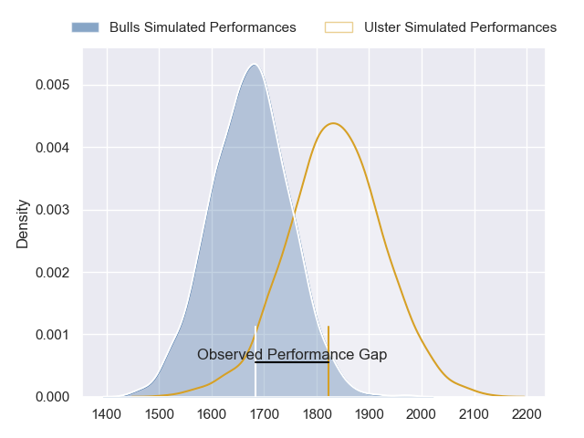
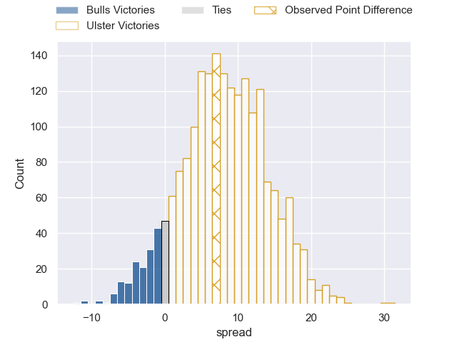
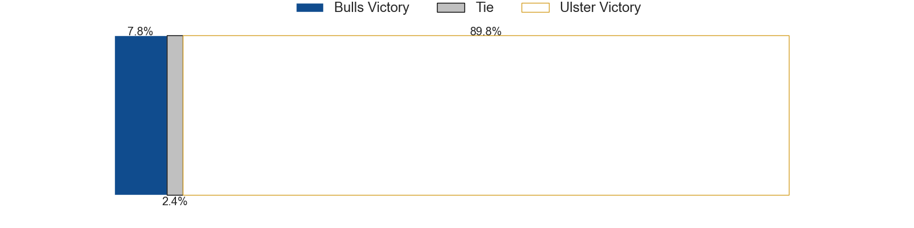
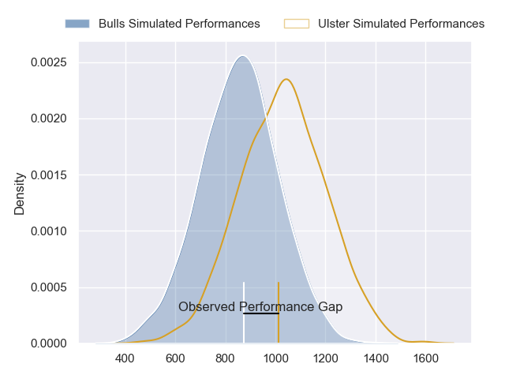
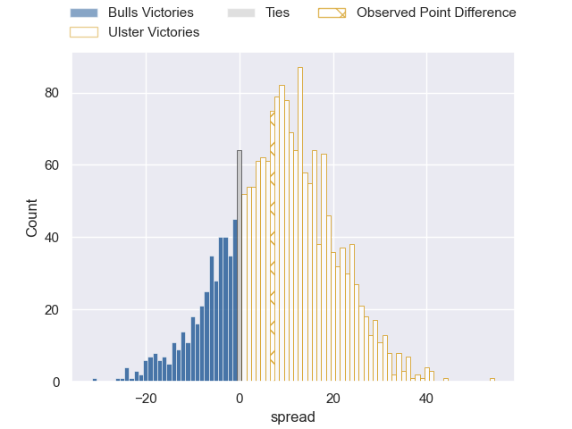
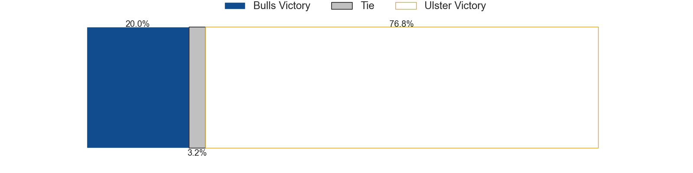
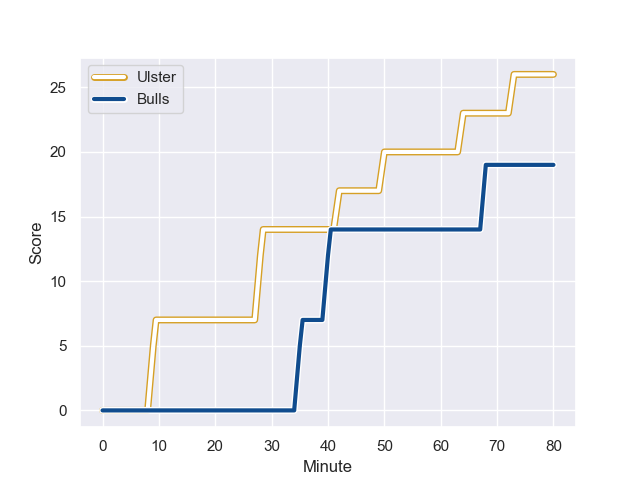
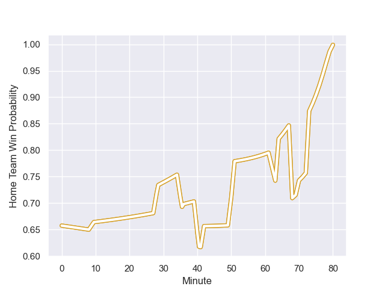

---  
layout: page  
title: Bulls at Ulster; 19.0-26.0  
date: 2023-10-29 18:00:00 -0500  
categories: "United Rugby Championship 2023" match review  
---
# Bulls at Ulster; 19.0-26.0

# Club Level Predictions

The first set of predictions treats a club as the smallest object, as the club develops its members, organizes a gameplan, and deploys its players as needed for each match. This club model has a prediction of 0.712, which translates to predicting Ulster to win by 8.1.

Each club has a rating and a rating deviation (similar to a Glicko rating), and expected performances can be generated. This allows for simulated matches and spreads like the ones below.
## Projected Performances - Club Model

## Projected Spreads - Club Model

## Projected Results - Club Model

# Player Level Predictions - Version 2

Treating teams instead as an entity made up of the currently active players, I have ratings for each player in an altogether different system. These can be combined to form team ratings once teamsheets are announced, weighting starters a bit higher than the reserves. After the match is played, players can be weighted by their minutes on the field, allowing for an accurate measure of the team's composition. With these compiled team ratings, we can make predictions, measure inaccuracy, and update the individual player ratings.
## Prediction with Player Minutes: Ulster by 7.2

Ulster by 3.0 on a neutral field
## Prediction without Player Minutes: Ulster by 7.7

Ulster by 3.5 on a neutral pitch

## Projected Performances - Player Model

## Projected Spreads - Player Model

## Projected Results - Player Model

## Scores over Time

## Win Probability over Time

There were 13 large changes in win probability in this match

|   Away Minutes | Away Player             |   Away elo |   Number |   Home elo | Home Player       |   Home Minutes |
|---------------:|:------------------------|-----------:|---------:|-----------:|:------------------|---------------:|
|             46 | Gerhard Steenekamp      |      57.04 |        1 |      52.05 | Andrew Warwick    |             63 |
|             51 | Johan Grobbelaar        |      84.2  |        2 |      40.95 | Tom Stewart       |             77 |
|             51 | Wilco Louw              |      96.97 |        3 |      50.14 | Tom O'Toole       |             80 |
|             74 | Ruan Vermaak            |      24.79 |        4 |      89.97 | Alan O'Connor     |             80 |
|             80 | Ruan Nortje             |      50.46 |        5 |      46.23 | Cormac Izuchukwu  |             36 |
|             80 | Marcell Coetzee         |      82.08 |        6 |     107.18 | Dave Ewers        |             40 |
|             80 | Elrigh Louw             |      56.5  |        7 |      57.93 | David McCann      |             80 |
|             51 | Cameron Hanekom         |      41.42 |        8 |      65.2  | Nick Timoney      |             80 |
|             69 | Embrose Papier          |      71.94 |        9 |      50.14 | Nathan Doak       |             80 |
|             80 | Johan Goosen            |      46.29 |       10 |      69.07 | Billy Burns       |             80 |
|             70 | Stravino Jacobs         |      35.37 |       11 |      64.41 | Jacob Stockdale   |             76 |
|             62 | Cornal Hendricks        |      14.24 |       12 |      49.05 | Jude Posthlewaite |             80 |
|             80 | David Kriel             |      53.18 |       13 |      63.18 | James Hume        |             80 |
|             80 | Sebastian de Klerk      |      87.35 |       14 |      51.27 | Robert Baloucoune |             80 |
|             80 | Devon Williams          |      43.25 |       15 |      86.82 | Will Addison      |             56 |
|             34 | Simphiwe Matanzima      |      51.77 |       16 |      54.96 | Harry Sheridan    |             44 |
|             29 | Mornay Smith            |      50.49 |       17 |      82.79 | Marcus Rea        |             40 |
|             29 | Akker van der Merwe     |      92.44 |       18 |      46.69 | Michael Lowry     |             24 |
|             29 | Nizaam Carr             |      75.78 |       19 |      49.04 | Callum Reid       |             17 |
|             18 | Stedman-Gee Rivett Gans |      49.67 |       20 |      84.84 | Stewart Moore     |              4 |
|             11 | Zak Burger              |      66.96 |       21 |      45.42 | John Andrew       |              3 |
|             10 | Chris Smith             |      50.29 |       22 |     nan    | nan               |            nan |
|              6 | Janko Swanepoel         |      54.98 |       23 |     nan    | nan               |            nan |

