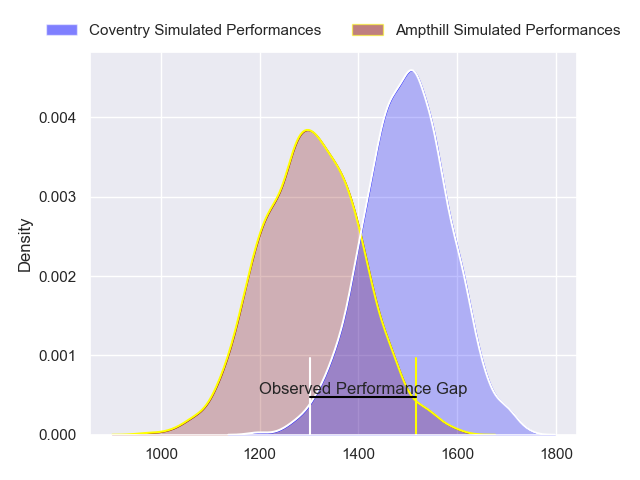
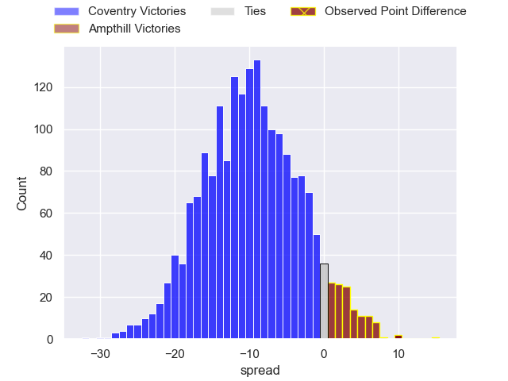
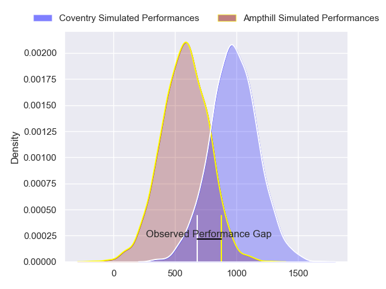
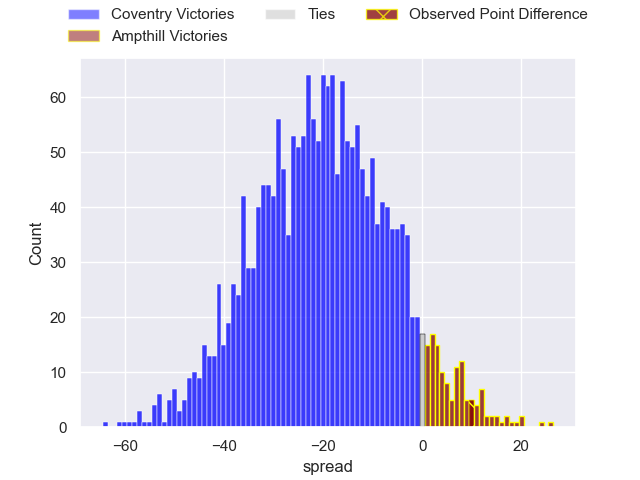
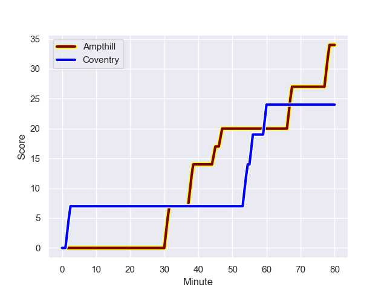
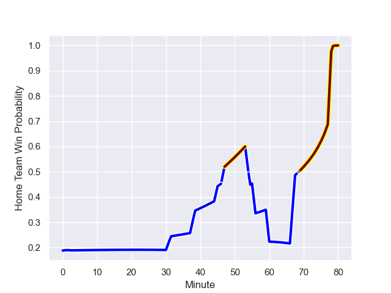

---  
layout: page  
title: Coventry at Ampthill; 24-34  
date: 2023-11-04 18:00:00 -0500  
categories: "RFU Championship 2023" match review  
---
# Coventry at Ampthill; 24-34

# Club Level Predictions

The first set of predictions treats a club as the smallest object, as the club develops its members, organizes a gameplan, and deploys its players as needed for each match. This club model has a prediction of 0.262, which translates to predicting Coventry to win by 9.3.

Each club has a rating and a rating deviation (similar to a Glicko rating), and expected performances can be generated. This allows for simulated matches and spreads like the ones below.
## Projected Performances - Club Model

## Projected Spreads - Club Model

## Projected Results - Club Model

# Player Level Predictions - Version 2

Treating teams instead as an entity made up of the currently active players, I have ratings for each player in an altogether different system. These can be combined to form team ratings once teamsheets are announced, weighting starters a bit higher than the reserves. After the match is played, players can be weighted by their minutes on the field, allowing for an accurate measure of the team's composition. With these compiled team ratings, we can make predictions, measure inaccuracy, and update the individual player ratings.
## Prediction with Player Minutes: Coventry by 16.6

Coventry by 19.8 on a neutral field
## Prediction without Player Minutes: Coventry by 16.6

Coventry by 19.8 on a neutral pitch

## Projected Performances - Player Model

## Projected Spreads - Player Model

## Projected Results - Player Model

## Scores over Time

## Win Probability over Time

There were 15 large changes in win probability in this match

|   Away Minutes | Away Player        |   Away elo |   Number |   Home elo | Home Player        |   Home Minutes |
|---------------:|:-------------------|-----------:|---------:|-----------:|:-------------------|---------------:|
|             80 | Arthur Cordwell    |      49.38 |        1 |      -6.03 | James Flynn        |             80 |
|             80 | Suva Ma'asi        |      59.49 |        2 |      31.48 | Samson Adejimi     |             80 |
|             80 | Adam Nicol         |      54.33 |        3 |      51    | Luke Green         |             80 |
|             80 | Rhys Anstey        |      51.02 |        4 |      35.33 | Iestyn Rees        |             80 |
|             80 | George Smith       |      51.19 |        5 |      42.53 | Kaden Pearce-Paul  |             80 |
|             80 | Obinna Nkwocha     |      48.44 |        6 |      27.37 | Ollie Stonham      |             80 |
|             80 | Tom Ball           |      81.81 |        7 |      45.56 | Izaiha Moore-Aiono |             80 |
|             80 | Matt Kvesic        |      41.41 |        8 |      31.69 | Morgan Strong      |             80 |
|             80 | Will Chudley       |     143.38 |        9 |      42.47 | Charlie Bracken    |             80 |
|             80 | Patrick Pellegrini |      87.82 |       10 |      40.14 | Gwyn Parks         |             80 |
|             80 | James Martin       |      81.2  |       11 |      32.93 | Alexandrer Harmes  |             80 |
|             80 | Lucas Titherington |      66.75 |       12 |      15.8  | Olly Hartley       |             80 |
|             80 | Will Wand          |      66.43 |       13 |      25.42 | Oli Morris         |             80 |
|             80 | Ryan Hutler        |      48.28 |       14 |      42.07 | Tobias Elliott     |             80 |
|             80 | Louis James        |      50.78 |       15 |      45.68 | Tomas Bacon        |             80 |

