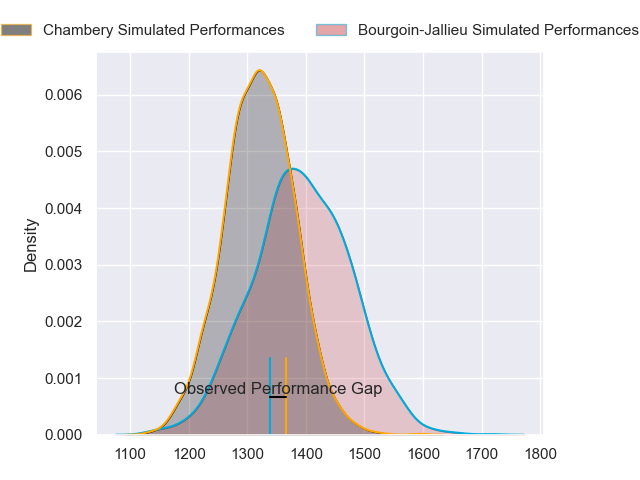
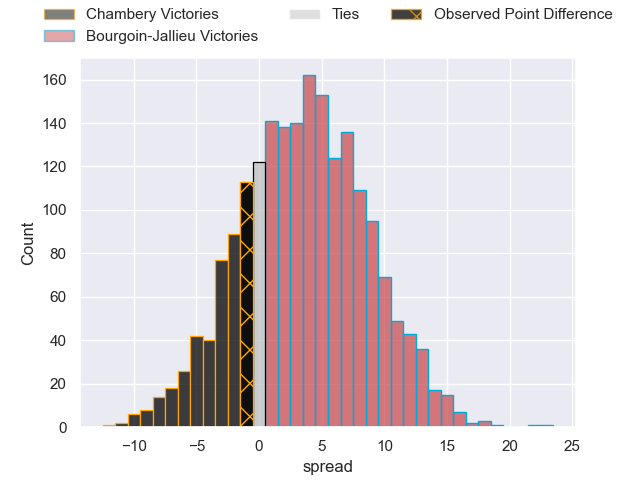
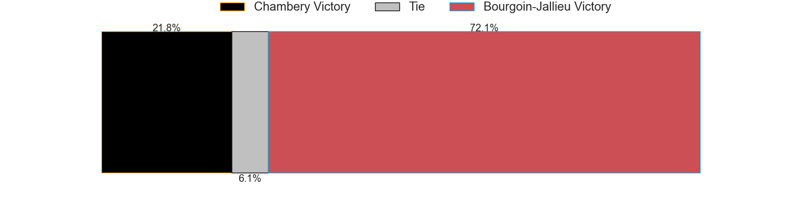
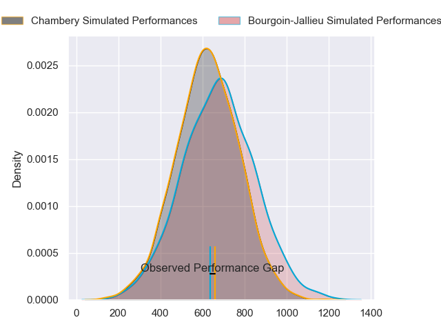
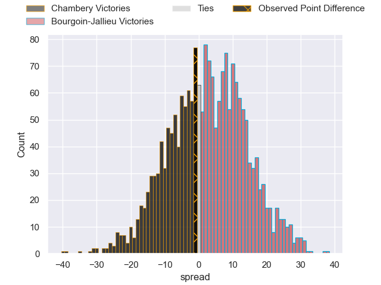
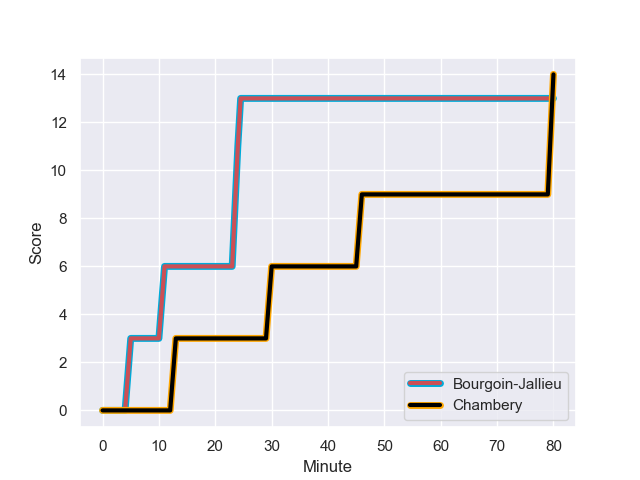
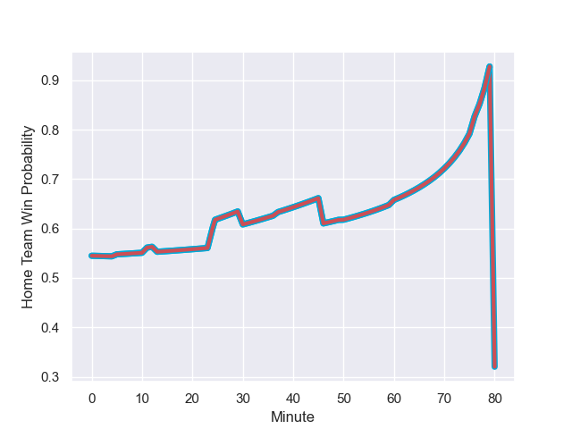

---  
layout: page  
title: Chambery at Bourgoin-Jallieu; 14-13  
date: 2023-11-04 18:00:00 -0500  
categories: "Nationale 2023" match review  
---
# Chambery at Bourgoin-Jallieu; 14-13

# Club Level Predictions

The first set of predictions treats a club as the smallest object, as the club develops its members, organizes a gameplan, and deploys its players as needed for each match. This club model has a prediction of 0.605, which translates to predicting Bourgoin-Jallieu to win by 3.8.

Each club has a rating and a rating deviation (similar to a Glicko rating), and expected performances can be generated. This allows for simulated matches and spreads like the ones below.
## Projected Performances - Club Model

## Projected Spreads - Club Model

## Projected Results - Club Model

# Player Level Predictions - Version 2

Treating teams instead as an entity made up of the currently active players, I have ratings for each player in an altogether different system. These can be combined to form team ratings once teamsheets are announced, weighting starters a bit higher than the reserves. After the match is played, players can be weighted by their minutes on the field, allowing for an accurate measure of the team's composition. With these compiled team ratings, we can make predictions, measure inaccuracy, and update the individual player ratings.
## Prediction with Player Minutes: Bourgoin-Jallieu by 2.0

Chambery by 2.4 on a neutral field
## Prediction without Player Minutes: Bourgoin-Jallieu by 2.3

Chambery by 2.1 on a neutral pitch

## Projected Performances - Player Model

## Projected Spreads - Player Model

## Projected Results - Player Model

## Scores over Time

## Win Probability over Time

There were 8 large changes in win probability in this match

|   Away Minutes | Away Player                  |   Away elo |   Number |   Home elo | Home Player              |   Home Minutes |
|---------------:|:-----------------------------|-----------:|---------:|-----------:|:-------------------------|---------------:|
|             52 | Enzo Segui                   |      44.9  |        1 |      36.6  | Zhorzhi (Jorji) Saldadze |             59 |
|             60 | Gauthier Brute de Remur      |      47.93 |        2 |      57.34 | Killian Tripier          |             63 |
|             76 | Giorgi Pertaia               |      47.74 |        3 |      40.35 | Osman Dimen              |             71 |
|             53 | Fabien Witz                  |      40.87 |        4 |      41.07 | Robin Gascou             |             50 |
|             80 | Taniela Matakaiongo          |      43.48 |        5 |     -12.81 | Morgan Eames             |             80 |
|             60 | Ahmed Tidiane Kane           |      49.59 |        6 |      44.14 | Kevin Chaudouard         |             80 |
|             53 | Thomas Coignat               |      42.22 |        7 |      38.25 | Theophile Cotte          |             76 |
|             80 | Tui Uru                      |      51.71 |        8 |      40.81 | Poutasi Luafutu          |             71 |
|             76 | Thibault Dufau               |      29.8  |        9 |      60.42 | Jeremy Gondrand          |             80 |
|             37 | Jean-Luc Alewyn Cilliers     |      37.94 |       10 |      50.77 | Nicolas Vuillemin        |             80 |
|             80 | Arthur Nennig                |      50.74 |       11 |      21.54 | Quentin Lefort           |             80 |
|             80 | Mickael Blanc                |      28.09 |       12 |      54.54 | Pieter Morton            |             80 |
|             80 | Emmanuel Vaitulukina         |      44.23 |       13 |      33.75 | Christopher Bosch        |             80 |
|             80 | Paul Baptiste Florent Altier |      25.71 |       14 |      41.02 | Paul-Hugo Champ          |             66 |
|             80 | Thomas Hecquet               |      44.34 |       15 |      22.73 | Remi Bouet               |             80 |
|             28 | Nugzar Somkhishvili          |      53.22 |       16 |      40.55 | Romain Favaretto         |             21 |
|             20 | Julien Primault              |      44.64 |       17 |      24    | Mohamed Khribache        |             17 |
|              4 | Nail Audoire                 |      46.41 |       18 |      44.78 | Maxime Calliet           |              9 |
|             27 | Steevy Cerqueira             |      38.69 |       19 |      36.94 | Kemueli Lavetanakoroi    |             30 |
|             20 | Steyl Barnard                |      45.73 |       20 |      64.13 | Kevin Rivoire            |              9 |
|             27 | Colin Lebian                 |      34.17 |       21 |      43.5  | Matteo Broeders          |              4 |
|              4 | Hugo Deschaux                |      34.45 |       22 |      32.02 | Aviata Silago            |             14 |
|             43 | Victor Pisano                |      31.34 |       23 |     nan    | nan                      |            nan |

