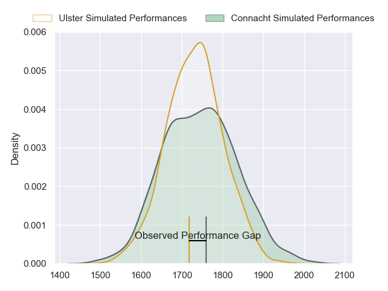
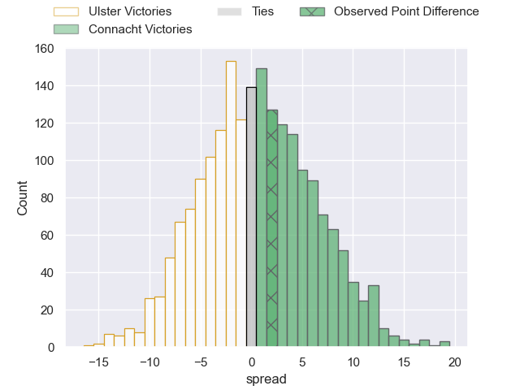
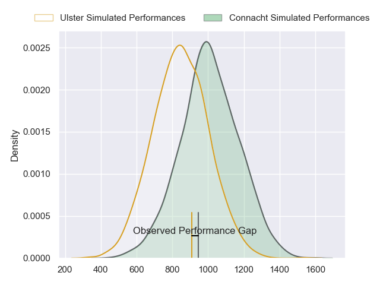
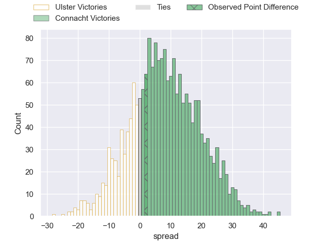
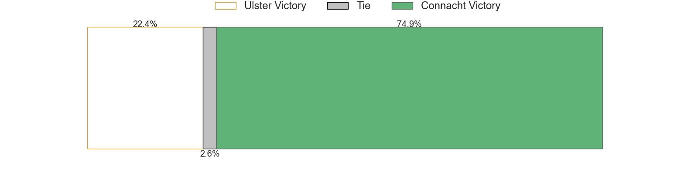
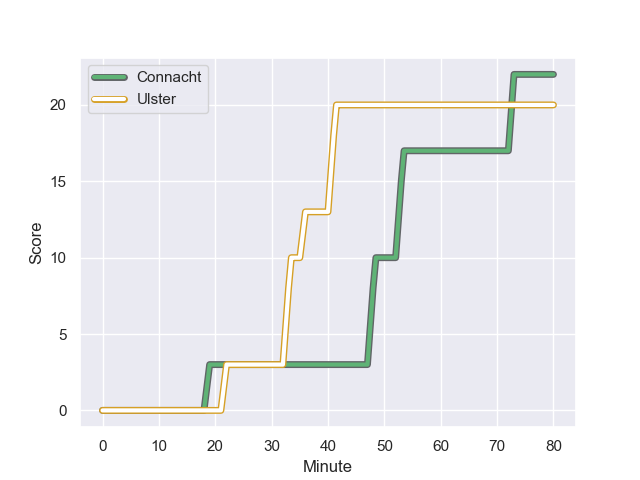
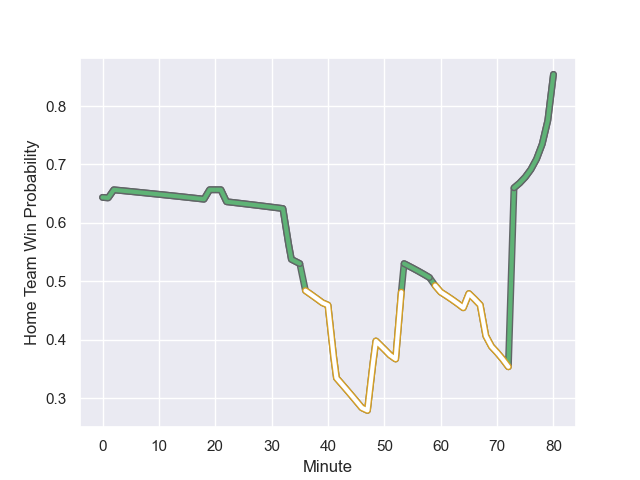

---  
layout: page  
title: Ulster at Connacht; 20-22  
date: 2023-11-04 18:00:00 -0500  
categories: "United Rugby Championship 2023" match review  
---
# Ulster at Connacht; 20-22

# Club Level Predictions

The first set of predictions treats a club as the smallest object, as the club develops its members, organizes a gameplan, and deploys its players as needed for each match. This club model has a prediction of 0.513, which translates to predicting Connacht to win by 0.5.

Each club has a rating and a rating deviation (similar to a Glicko rating), and expected performances can be generated. This allows for simulated matches and spreads like the ones below.
## Projected Performances - Club Model

## Projected Spreads - Club Model

## Projected Results - Club Model

# Player Level Predictions - Version 2

Treating teams instead as an entity made up of the currently active players, I have ratings for each player in an altogether different system. These can be combined to form team ratings once teamsheets are announced, weighting starters a bit higher than the reserves. After the match is played, players can be weighted by their minutes on the field, allowing for an accurate measure of the team's composition. With these compiled team ratings, we can make predictions, measure inaccuracy, and update the individual player ratings.
## Prediction with Player Minutes: Connacht by 6.6

Connacht by 2.5 on a neutral field
## Prediction without Player Minutes: Connacht by 6.1

Connacht by 2.0 on a neutral pitch

## Projected Performances - Player Model

## Projected Spreads - Player Model

## Projected Results - Player Model

## Scores over Time

## Win Probability over Time

There were 14 large changes in win probability in this match

|   Away Minutes | Away Player     |   Away elo |   Number |   Home elo | Home Player             |   Home Minutes |
|---------------:|:----------------|-----------:|---------:|-----------:|:------------------------|---------------:|
|             52 | Eric O'Sullivan |      56.68 |        1 |      68.82 | Denis Buckley           |             60 |
|             80 | John Andrew     |      45.29 |        2 |      56.17 | Dylan Tierney-Martin    |             69 |
|             59 | James French    |      48.04 |        3 |      60.45 | Jack Aungier            |             60 |
|             80 | Alan O'Connor   |      90.05 |        4 |      50.27 | Oisin Dowling           |             40 |
|             80 | Harry Sheridan  |      55    |        5 |      99.16 | Joe Joyce               |             80 |
|             65 | Matthew Rea     |      52.36 |        6 |      49.43 | Shamus Hurley-Langton   |              2 |
|              2 | Reuben Crothers |      46.65 |        7 |      64.51 | Conor Oliver            |             80 |
|             80 | Nick Timoney    |      64.28 |        8 |      47.73 | Cian Prendergast        |             80 |
|             59 | David Shanahan  |      35.55 |        9 |      52.11 | Caolin Blade            |             60 |
|             59 | Jake Flannery   |      47.07 |       10 |      82.91 | Jack Carty              |             80 |
|             80 | Ben Moxham      |      55.43 |       11 |      59.26 | Diarmuid Kilgallen      |             80 |
|             80 | Stewart Moore   |      83.55 |       12 |      51.8  | Cathal Forde            |             80 |
|             47 | James Hume      |      60.68 |       13 |      49.9  | Tom Farrell             |             72 |
|             80 | Aaron Sexton    |      50.97 |       14 |      43.57 | Byron Ralston           |             80 |
|             80 | Ethan McIlroy   |      54.11 |       15 |      65.96 | Tiernan O'Halloran      |             68 |
|             78 | David McCann    |      55.43 |       16 |      75    | Jarrad Butler           |             78 |
|             28 | Andrew Warwick  |      50.52 |       17 |      54.86 | Darragh Murray          |             40 |
|             33 | Ben Carson      |      46.65 |       18 |      35.52 | Jordan Duggan           |             20 |
|             21 | Greg McGrath    |      30.23 |       19 |      41.29 | Dominic Robertson-McCoy |             20 |
|             21 | Nathan Doak     |      47.77 |       20 |      48.5  | Colm Reilly             |             20 |
|             21 | Billy Burns     |      68.33 |       21 |      32.48 | Andrew Smith            |             12 |
|             15 | Joe Hopes       |      46.65 |       22 |      44.97 | Tadgh McElroy           |             11 |
|            nan | nan             |     nan    |       23 |      58.73 | David Hawkshaw          |              8 |

