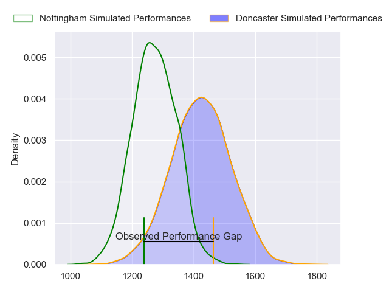
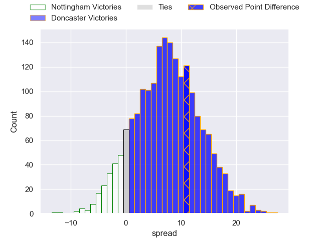
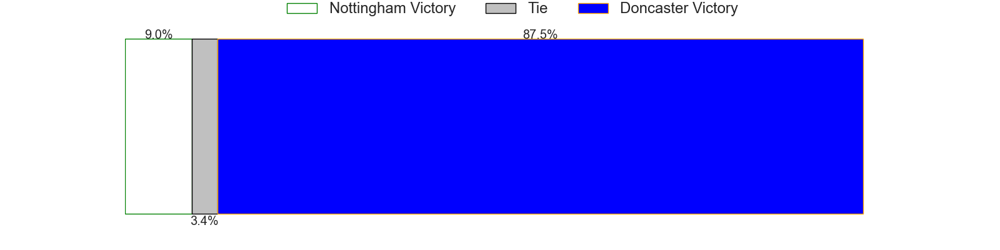
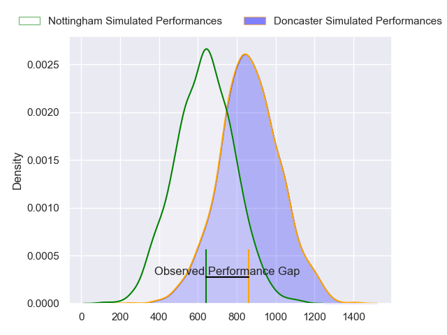
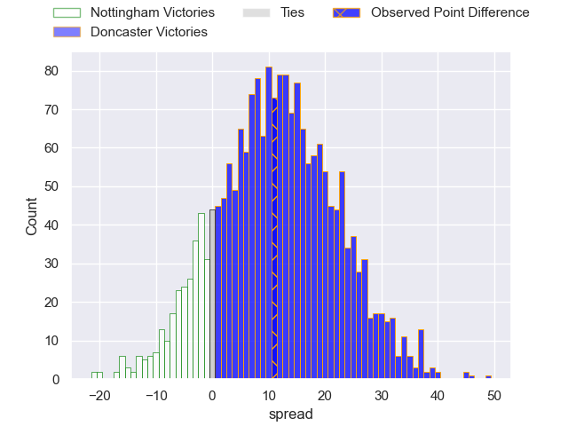
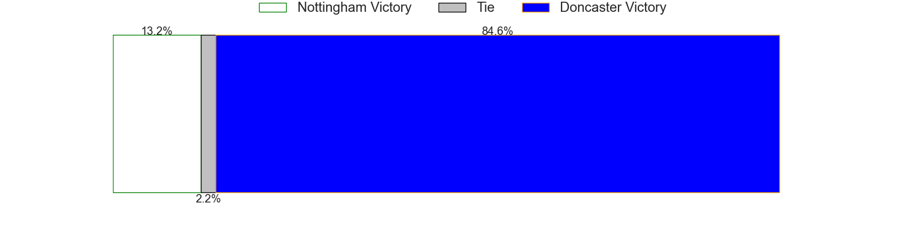
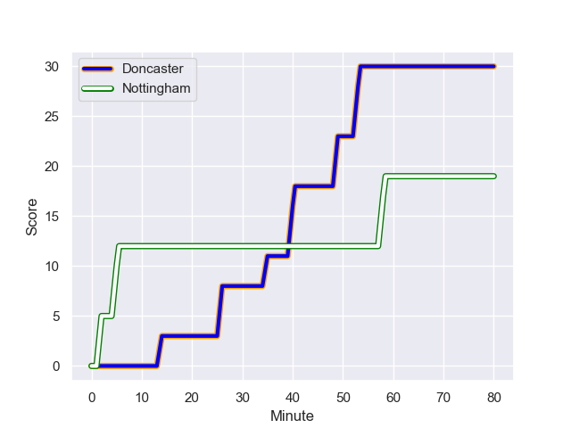
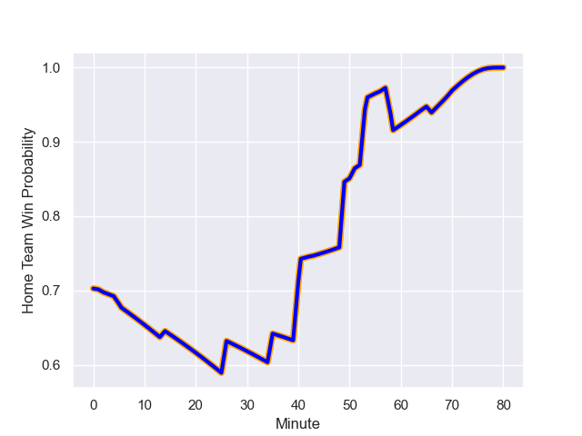

---  
layout: page  
title: Nottingham at Doncaster; 19-30  
date: 2023-11-04 18:00:00 -0500  
categories: "RFU Championship 2023" match review  
---
# Nottingham at Doncaster; 19-30

# Club Level Predictions

The first set of predictions treats a club as the smallest object, as the club develops its members, organizes a gameplan, and deploys its players as needed for each match. This club model has a prediction of 0.699, which translates to predicting Doncaster to win by 7.5.

Each club has a rating and a rating deviation (similar to a Glicko rating), and expected performances can be generated. This allows for simulated matches and spreads like the ones below.
## Projected Performances - Club Model

## Projected Spreads - Club Model

## Projected Results - Club Model

# Player Level Predictions - Version 2

Treating teams instead as an entity made up of the currently active players, I have ratings for each player in an altogether different system. These can be combined to form team ratings once teamsheets are announced, weighting starters a bit higher than the reserves. After the match is played, players can be weighted by their minutes on the field, allowing for an accurate measure of the team's composition. With these compiled team ratings, we can make predictions, measure inaccuracy, and update the individual player ratings.
## Prediction with Player Minutes: Doncaster by 9.4

Doncaster by 6.1 on a neutral field
## Prediction without Player Minutes: Doncaster by 8.3

Doncaster by 4.9 on a neutral pitch

## Projected Performances - Player Model

## Projected Spreads - Player Model

## Projected Results - Player Model

## Scores over Time

## Win Probability over Time

There were 7 large changes in win probability in this match

|   Away Minutes | Away Player             |   Away elo |   Number |   Home elo | Home Player            |   Home Minutes |
|---------------:|:------------------------|-----------:|---------:|-----------:|:-----------------------|---------------:|
|             57 | Kai Owen                |      51.25 |        1 |      36.03 | Conor Davidson         |             70 |
|             43 | Jack Dickinson          |      43.7  |        2 |      42.62 | Tom Doughty            |             69 |
|             56 | Jake Bridges            |      37.54 |        3 |      42.89 | Corrie Barrett         |             53 |
|             80 | Sebastien Ferreira      |     -15.71 |        4 |      27.07 | Ehize Ehizode          |             80 |
|             65 | Come Clayver Joussain   |      47.93 |        5 |      75.41 | Evan Mintern           |             80 |
|             56 | George Cox              |      66    |        6 |      43.85 | Fyn Brown              |             80 |
|             80 | Jacob Wright            |      46.76 |        7 |      49.09 | Rhys Tait              |             56 |
|             80 | Richard Clift           |      50.24 |        8 |      37.74 | Harry Wilson           |             51 |
|             57 | Micheal Stronge         |      31.65 |        9 |      66.89 | Alex Dolly             |             77 |
|             57 | Morgan Bunting          |      27.97 |       10 |      36.62 | Sam Olver              |             80 |
|             57 | Jordan Olowofela        |      59.64 |       11 |      50.3  | George Simpson         |             43 |
|             80 | Joe Woodward            |      56.61 |       12 |      33.54 | Connor Edwards         |             80 |
|             80 | Marcus Alexander Ramage |      38.4  |       13 |      61.94 | Joe Margetts           |             66 |
|             80 | David Williams          |      41.83 |       14 |      74.4  | Harry Davey            |             80 |
|             80 | Ellis Mee               |      56.61 |       15 |      78.29 | Alexander AJ Cant      |             80 |
|             37 | Harry Clayton           |      62.09 |       16 |      67.94 | Billy McBryde          |             37 |
|             24 | Sam Green               |      46.65 |       17 |      61.48 | Jack Digby             |             29 |
|             24 | Ethan Priest            |      46.65 |       18 |      93.45 | Lewis Thiede           |             27 |
|             23 | Sam Hollingsworth       |      63.37 |       19 |      35.71 | Sebastian Nagle-Taylor |             24 |
|             23 | Will Yarnell            |      40.32 |       20 |      44.77 | Joe Bedlow             |             14 |
|             23 | Jack Stapley            |      -5.93 |       21 |      56.46 | Cameron Terry          |             11 |
|             15 | Thomas Manz             |      44.34 |       22 |      55.23 | Harrison Courtney      |             10 |
|             23 | Archie Van der Flier    |      51.51 |       23 |       7.88 | Ollie Fox              |              3 |

