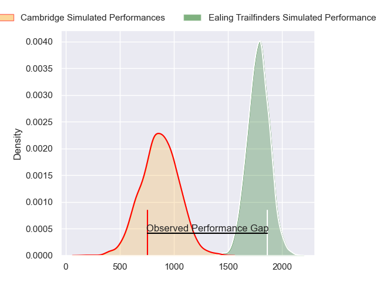
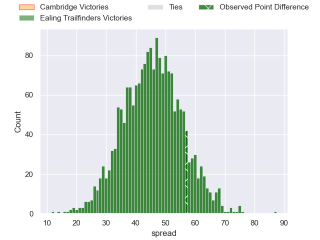
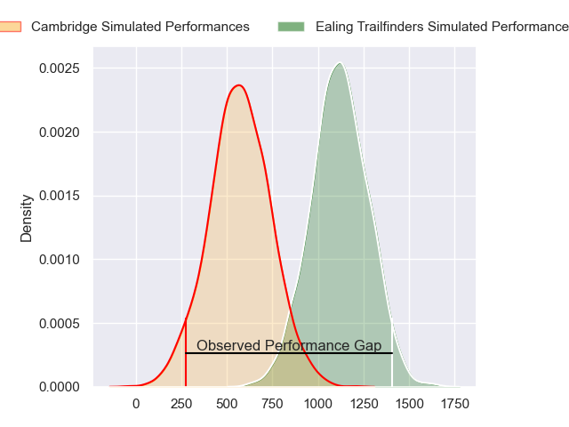
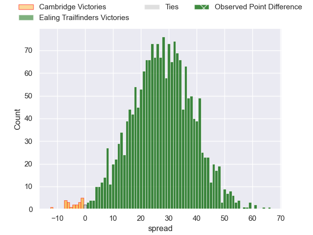
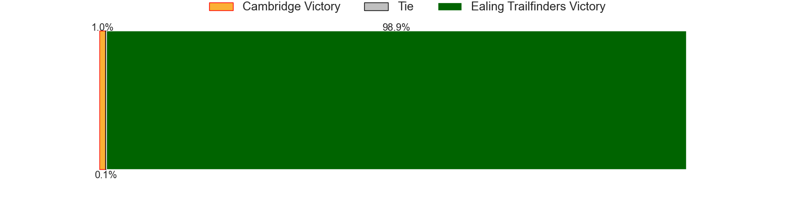
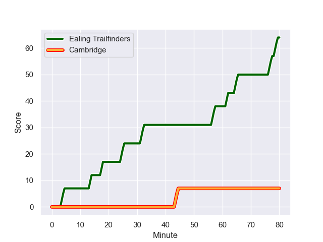
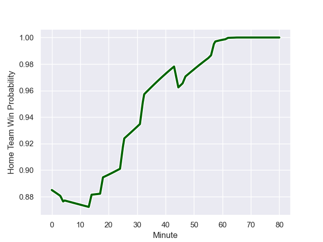

---  
layout: page  
title: Cambridge at Ealing Trailfinders; 7-64  
date: 2023-11-04 18:00:00 -0500  
categories: "RFU Championship 2023" match review  
---
# Cambridge at Ealing Trailfinders; 7-64

# Club Level Predictions

The first set of predictions treats a club as the smallest object, as the club develops its members, organizes a gameplan, and deploys its players as needed for each match. This club model has a prediction of 0.99, which translates to predicting Ealing Trailfinders to win by 45.6.

Each club has a rating and a rating deviation (similar to a Glicko rating), and expected performances can be generated. This allows for simulated matches and spreads like the ones below.
## Projected Performances - Club Model

## Projected Spreads - Club Model

## Projected Results - Club Model

# Player Level Predictions - Version 2

Treating teams instead as an entity made up of the currently active players, I have ratings for each player in an altogether different system. These can be combined to form team ratings once teamsheets are announced, weighting starters a bit higher than the reserves. After the match is played, players can be weighted by their minutes on the field, allowing for an accurate measure of the team's composition. With these compiled team ratings, we can make predictions, measure inaccuracy, and update the individual player ratings.
## Prediction with Player Minutes: Ealing Trailfinders by 22.6

Ealing Trailfinders by 19.3 on a neutral field
## Prediction without Player Minutes: Ealing Trailfinders by 22.6

Ealing Trailfinders by 19.2 on a neutral pitch

## Projected Performances - Player Model

## Projected Spreads - Player Model

## Projected Results - Player Model

## Scores over Time

## Win Probability over Time

|   Away Minutes | Away Player       |   Away elo |   Number |   Home elo | Home Player          |   Home Minutes |
|---------------:|:------------------|-----------:|---------:|-----------:|:---------------------|---------------:|
|             64 | Jake Elwood       |      38.15 |        1 |      65    | Kyle John Whyte      |             47 |
|             69 | Morgan Veness     |      36.75 |        2 |      49.33 | Matthew Cornish      |             56 |
|             80 | Billy Walker      |      37.07 |        3 |      44.09 | Jimmy Roots          |             47 |
|             80 | Kieran Frost      |      41.12 |        4 |      82.12 | Bobby de Wee         |             80 |
|             80 | Geordie Irvine    |      45.57 |        5 |      45.83 | Andrew Davidson      |             62 |
|             80 | Benjamin Hoppe    |      41.82 |        6 |      37.74 | Callum Chick         |             80 |
|             60 | Ben Adams         |      14.73 |        7 |      56.11 | Ollie Newman         |              4 |
|             55 | Anthony Maka      |      44.58 |        8 |     121.9  | Ryan Smid            |             56 |
|             51 | Kieran Duffin     |      42.25 |        9 |      75.79 | Lloyd Williams       |             62 |
|             80 | Jamie Benson      |      33.15 |       10 |     116.17 | Craig Willis         |             80 |
|             80 | Josef Green       |      43.89 |       11 |      95.96 | Tom Collins          |             80 |
|             80 | Tom Hoppe         |      46.65 |       12 |      76.16 | Billy Twelvetrees    |             80 |
|             55 | Sam Hanks         |      16.83 |       13 |      46.65 | Dan O'Brien          |             56 |
|             80 | Matt Williams     |      36.24 |       14 |      74.01 | Luke Daniels         |             80 |
|             80 | Elias Caven       |      38    |       15 |      64.74 | Max Bodilly          |             80 |
|             25 | Jared Cardew      |      29.48 |       16 |      43.21 | Richard Hardwick     |             76 |
|             29 | Toby Dabell       |      40.56 |       17 |      77.47 | Biyi Alo             |             33 |
|             25 | Steffan James     |      40.61 |       18 |      34.02 | Will Goodrick-Clarke |             33 |
|             20 | Matthew Dawson    |      46.81 |       19 |      53.32 | Mike Willemse        |             24 |
|             11 | William Priestley |      45.68 |       20 |      86.05 | Simon Uzokwe         |             24 |
|             16 | Huw Owen          |      55.73 |       21 |      74.83 | Pat Howard           |             24 |
|            nan | nan               |     nan    |       22 |      73.74 | Craig Hampson        |             18 |
|            nan | nan               |     nan    |       23 |      42.61 | Simon Linsell        |             18 |

