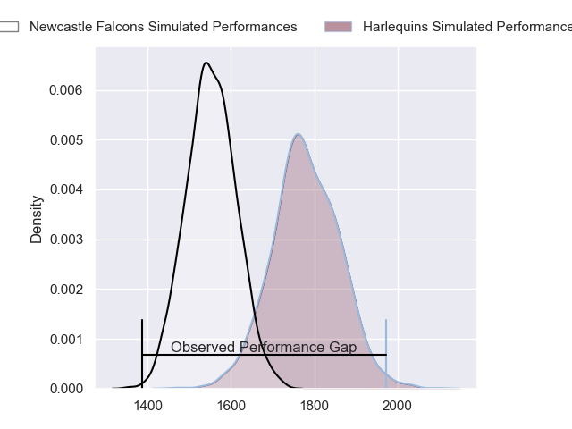
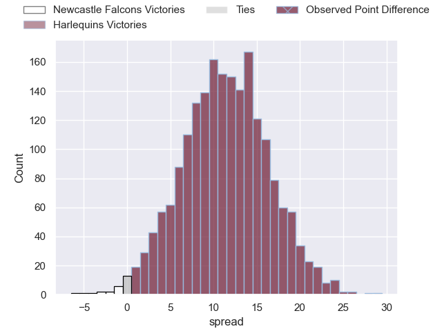
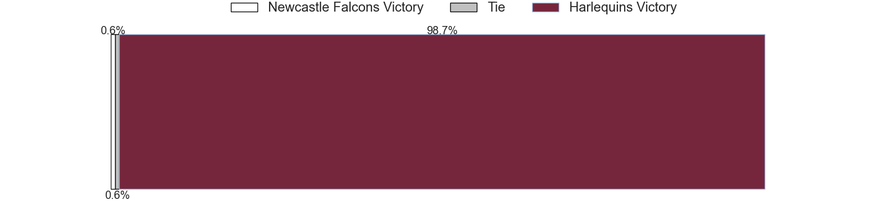
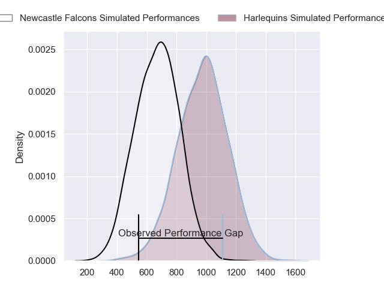
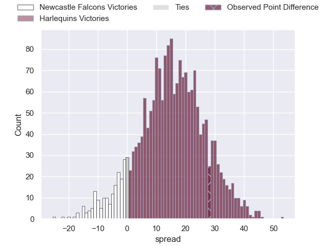
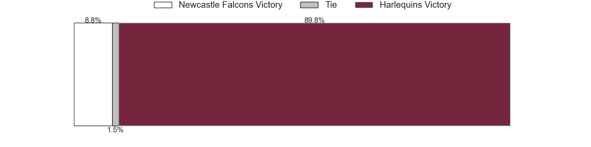
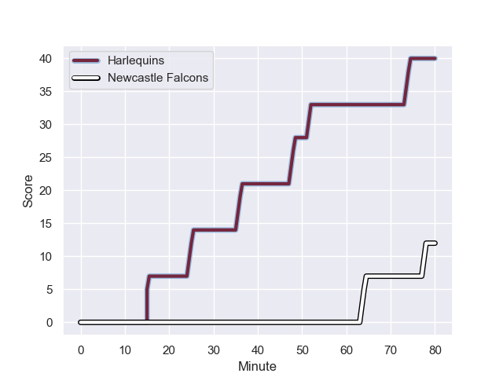
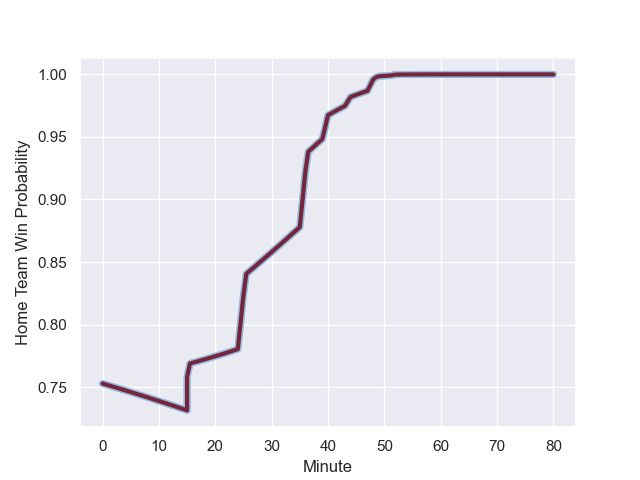

---  
layout: page  
title: Newcastle Falcons at Harlequins; 12-40  
date: 2023-11-04 18:00:00 -0500  
categories: "Gallagher Premiership 2023" match review  
---
# Newcastle Falcons at Harlequins; 12-40

# Club Level Predictions

The first set of predictions treats a club as the smallest object, as the club develops its members, organizes a gameplan, and deploys its players as needed for each match. This club model has a prediction of 0.785, which translates to predicting Harlequins to win by 11.4.

Each club has a rating and a rating deviation (similar to a Glicko rating), and expected performances can be generated. This allows for simulated matches and spreads like the ones below.
## Projected Performances - Club Model

## Projected Spreads - Club Model

## Projected Results - Club Model

# Player Level Predictions - Version 2

Treating teams instead as an entity made up of the currently active players, I have ratings for each player in an altogether different system. These can be combined to form team ratings once teamsheets are announced, weighting starters a bit higher than the reserves. After the match is played, players can be weighted by their minutes on the field, allowing for an accurate measure of the team's composition. With these compiled team ratings, we can make predictions, measure inaccuracy, and update the individual player ratings.
## Prediction with Player Minutes: Harlequins by 12.2

Harlequins by 7.5 on a neutral field
## Prediction without Player Minutes: Harlequins by 10.8

Harlequins by 6.1 on a neutral pitch

## Projected Performances - Player Model

## Projected Spreads - Player Model

## Projected Results - Player Model

## Scores over Time

## Win Probability over Time

There were 3 large changes in win probability in this match

|   Away Minutes | Away Player        |   Away elo |   Number |   Home elo | Home Player               |   Home Minutes |
|---------------:|:-------------------|-----------:|---------:|-----------:|:--------------------------|---------------:|
|             54 | Adam Brocklebank   |      20.81 |        1 |      32.52 | Fin Baxter                |             55 |
|             44 | Bryan Byrne        |      62.58 |        2 |      45.17 | Sam Riley                 |             67 |
|             44 | Mark Tampin        |      28.79 |        3 |      73.13 | Will Collier              |             55 |
|             80 | Pedro Rubiolo      |      50    |        4 |     101.85 | Joe Launchbury            |             70 |
|             54 | Kiran McDonald     |      39.02 |        5 |      13.48 | George Hammond            |             80 |
|             67 | Sam Cross          |      48.14 |        6 |      74.54 | Dino Lamb                 |             80 |
|             80 | Guy Pepper         |      43.01 |        7 |      48.89 | Will Evans                |             80 |
|             80 | Callum Chick       |      37.74 |        8 |      66.74 | Alex Dombrandt            |             75 |
|             49 | Hugh O'Sullivan    |      47    |        9 |      34.41 | Will Porter               |             75 |
|             80 | Rory Jennings      |      55.53 |       10 |      82.26 | Jarrod Evans              |             55 |
|             80 | Mateo Carreras     |      59.81 |       11 |      62.05 | Louis Lynagh              |             80 |
|             70 | Matias Orlando     |      34.14 |       12 |      59.37 | Lennox Anyanwu            |             68 |
|             40 | Matias Moroni      |     112.9  |       13 |      49.89 | Oscar Beard               |             80 |
|             80 | Adam Radwan        |      74.96 |       14 |      62.97 | Tyrone Green              |             80 |
|             80 | Elliott Obatoyinbo |      37.79 |       15 |      34.15 | Nick David                |             80 |
|             26 | Phil Brantingham   |      40.13 |       16 |      98.57 | Joe Marler                |             25 |
|             36 | Jamie Blamire      |      32.14 |       17 |      52.28 | Nathan Jibulu             |             13 |
|             36 | Eduardo Bello      |      15.64 |       18 |      81.7  | Dillon Lewis              |             25 |
|             26 | John Hawkins       |      28.72 |       19 |      77.75 | James Chisholm            |             10 |
|             13 | Josh Bainbridge    |      39.44 |       20 |      51.65 | Chandler Cunningham-South |              5 |
|             31 | Sam Stuart         |      -4.7  |       21 |      40.41 | Max Green                 |              5 |
|             10 | Brett Connon       |      35.83 |       22 |      75.3  | Marcus Smith              |             25 |
|             40 | Zach Kerr          |      38.26 |       23 |      41.83 | Bryn Bradley              |             12 |

