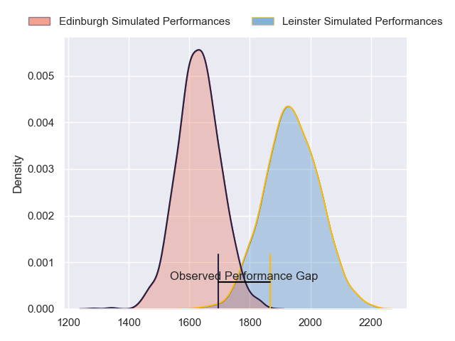
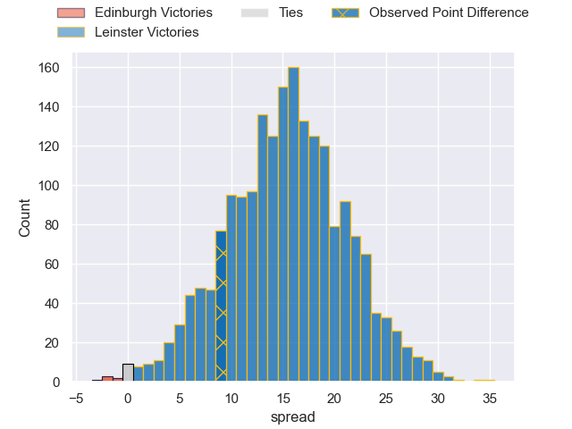
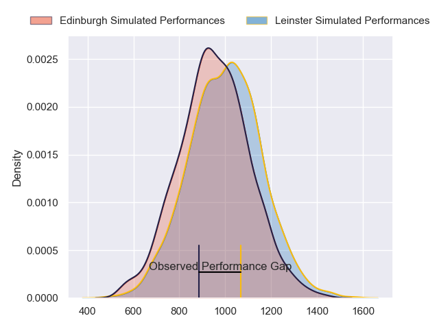
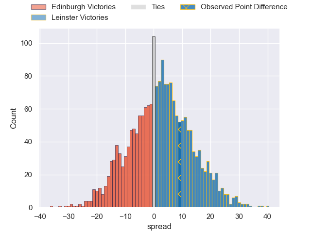
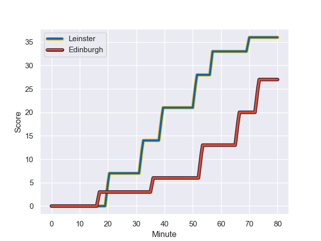
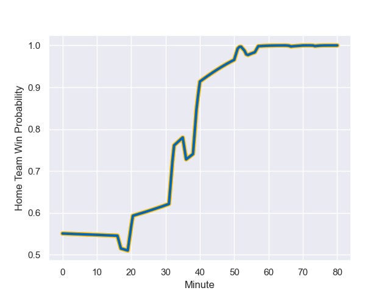

---  
layout: page  
title: Edinburgh at Leinster; 27-36  
date: 2023-11-04 18:00:00 -0500  
categories: "United Rugby Championship 2023" match review  
---
# Edinburgh at Leinster; 27-36

# Club Level Predictions

The first set of predictions treats a club as the smallest object, as the club develops its members, organizes a gameplan, and deploys its players as needed for each match. This club model has a prediction of 0.847, which translates to predicting Leinster to win by 15.2.

Each club has a rating and a rating deviation (similar to a Glicko rating), and expected performances can be generated. This allows for simulated matches and spreads like the ones below.
## Projected Performances - Club Model

## Projected Spreads - Club Model

## Projected Results - Club Model

# Player Level Predictions - Version 2

Treating teams instead as an entity made up of the currently active players, I have ratings for each player in an altogether different system. These can be combined to form team ratings once teamsheets are announced, weighting starters a bit higher than the reserves. After the match is played, players can be weighted by their minutes on the field, allowing for an accurate measure of the team's composition. With these compiled team ratings, we can make predictions, measure inaccuracy, and update the individual player ratings.
## Prediction with Player Minutes: Leinster by 2.2

Edinburgh by 2.1 on a neutral field
## Prediction without Player Minutes: Leinster by 2.4

Edinburgh by 2.0 on a neutral pitch

## Projected Performances - Player Model

## Projected Spreads - Player Model

## Projected Results - Player Model

## Scores over Time

## Win Probability over Time

There were 10 large changes in win probability in this match

|   Away Minutes | Away Player         |   Away elo |   Number |   Home elo | Home Player        |   Home Minutes |
|---------------:|:--------------------|-----------:|---------:|-----------:|:-------------------|---------------:|
|             54 | Pierre Schoeman     |      49.68 |        1 |      46.48 | Jack Boyle         |             59 |
|             54 | Dave Cherry         |      46.55 |        2 |      43.96 | Lee Barron         |             66 |
|             54 | WP Nel              |      95.69 |        3 |      72.92 | Michael Ala'alatoa |             59 |
|             80 | Glen Young          |      11.89 |        4 |      83.11 | Ross Molony        |             80 |
|             80 | Grant Gilchrist     |      99.22 |        5 |      53.89 | Jason Jenkins      |             61 |
|             80 | Thomas Dodd         |      81.47 |        6 |      77.87 | Max Deegan         |             54 |
|             40 | Hamish Watson       |      51.24 |        7 |      61.87 | Scott Penny        |             80 |
|             40 | Luke Crosbie        |      74.61 |        8 |      34.65 | James Culhane      |             80 |
|             80 | Charlie Shiel       |      45.47 |        9 |      49.89 | Cormac Foley       |             54 |
|             80 | Ben Healy           |      52.18 |       10 |      69.17 | Harry Byrne        |             54 |
|             80 | Duhan van der Merwe |      73.12 |       11 |      67.94 | Jordan Larmour     |             80 |
|             71 | Matt Currie         |      51.15 |       12 |      96.58 | Charlie Ngatai     |             54 |
|             53 | Mark Bennett        |      62.16 |       13 |      63.57 | Jamie Osborne      |             80 |
|             80 | Wes Goosen          |      72.02 |       14 |      48.5  | Tommy O'Brien      |             80 |
|             80 | Blair Kinghorn      |     134.67 |       15 |      53.61 | Ciaran Frawley     |             80 |
|             40 | Connor Boyle        |      35.95 |       16 |     129.73 | Rhys Ruddock       |             26 |
|             40 | Marshall Sykes      |      40.21 |       17 |      43    | Ben Murphy         |             26 |
|             26 | Javan Sebastian     |      43.64 |       18 |      38.38 | Sam Prendergast    |             26 |
|             27 | James Lang          |      60.23 |       19 |      45.46 | Paddy McCarthy     |             21 |
|             26 | Boan Venter         |      35.14 |       20 |      45.46 | Rory McGuire       |             21 |
|             26 | Ewan Ashman         |      41.57 |       21 |      45.35 | Brian Deeny        |             19 |
|              9 | Chris Dean          |      34.32 |       22 |      14.16 | Dylan Donnellan    |             14 |
|            nan | nan                 |     nan    |       23 |      50.51 | Rob Russell        |             26 |

