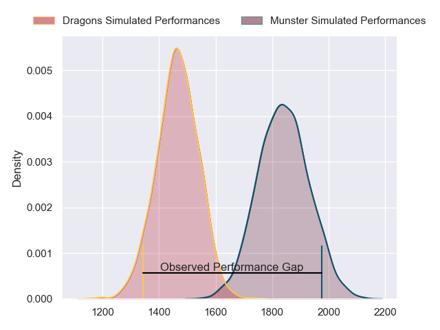
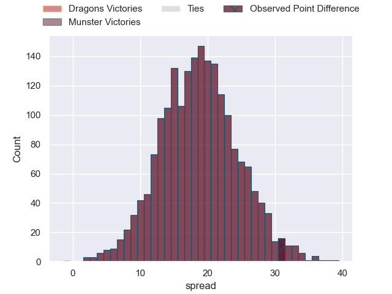
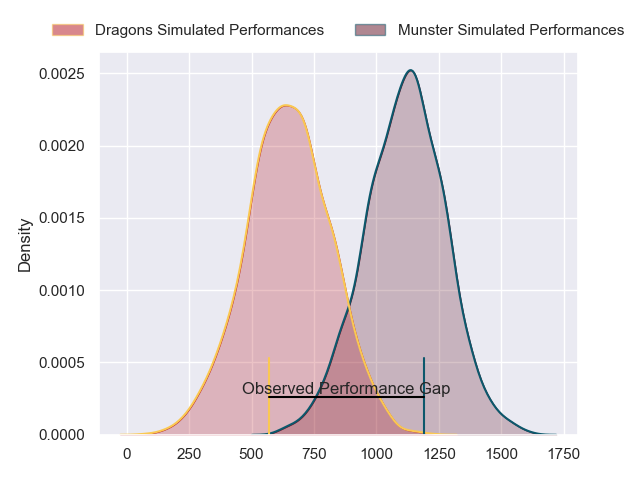
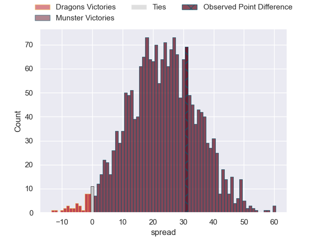
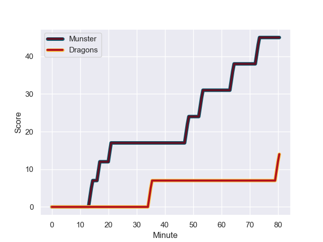
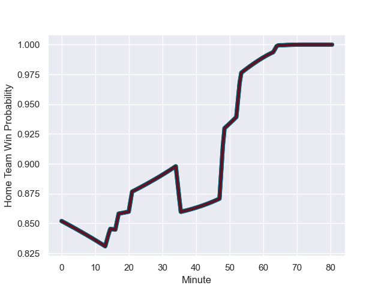

---  
layout: page  
title: Dragons at Munster; 14-45  
date: 2023-11-04 18:00:00 -0500  
categories: "United Rugby Championship 2023" match review  
---
# Dragons at Munster; 14-45

# Club Level Predictions

The first set of predictions treats a club as the smallest object, as the club develops its members, organizes a gameplan, and deploys its players as needed for each match. This club model has a prediction of 0.89, which translates to predicting Munster to win by 18.7.

Each club has a rating and a rating deviation (similar to a Glicko rating), and expected performances can be generated. This allows for simulated matches and spreads like the ones below.
## Projected Performances - Club Model

## Projected Spreads - Club Model

## Projected Results - Club Model

# Player Level Predictions - Version 2

Treating teams instead as an entity made up of the currently active players, I have ratings for each player in an altogether different system. These can be combined to form team ratings once teamsheets are announced, weighting starters a bit higher than the reserves. After the match is played, players can be weighted by their minutes on the field, allowing for an accurate measure of the team's composition. With these compiled team ratings, we can make predictions, measure inaccuracy, and update the individual player ratings.
## Prediction with Player Minutes: Munster by 19.4

Munster by 15.1 on a neutral field
## Prediction without Player Minutes: Munster by 19.9

Munster by 15.6 on a neutral pitch

## Projected Performances - Player Model

## Projected Spreads - Player Model

## Projected Results - Player Model

## Scores over Time

## Win Probability over Time

There were 3 large changes in win probability in this match

|   Away Minutes | Away Player     |   Away elo |   Number |   Home elo | Home Player     |   Home Minutes |
|---------------:|:----------------|-----------:|---------:|-----------:|:----------------|---------------:|
|             66 | Rhodri Jones    |      24.77 |        1 |      46.68 | Kieran Ryan     |             70 |
|             66 | Bradley Roberts |      40.28 |        2 |      78.63 | Diarmuid Barron |             63 |
|             63 | Luke Yendle     |      51.71 |        3 |      82.36 | John Ryan       |             70 |
|             80 | Joseph Davies   |      29.64 |        4 |      45.94 | Edwin Edogbo    |             54 |
|             63 | George Nott     |      39.37 |        5 |      57.96 | Thomas Ahern    |             80 |
|             80 | Ryan Woodman    |      46.17 |        6 |      76.24 | Jack O'Donoghue |             68 |
|             72 | James Benjamin  |      34.32 |        7 |      56.7  | Alex Kendellen  |             80 |
|             80 | Taine Basham    |      37.04 |        8 |      74.9  | Gavin Coombes   |             80 |
|             80 | Rhodri Williams |      74.05 |        9 |      68.98 | Craig Casey     |             54 |
|             80 | Will Reed       |      44.06 |       10 |      46.65 | Tony Butler     |             66 |
|             80 | Ashton Hewitt   |      65.58 |       11 |      86.61 | Calvin Nash     |             80 |
|             63 | Jack Dixon      |      37.25 |       12 |     102.35 | Rory Scannell   |             80 |
|             80 | Steffan Hughes  |      74.68 |       13 |      85.63 | Alex Nankivell  |             80 |
|             54 | Corey Baldwin   |      11.65 |       14 |      32.16 | Sean O'Brien    |             80 |
|              2 | Angus O'Brien   |      29.29 |       15 |      94.24 | Shane Daly      |             65 |
|             78 | Dane Blacker    |      31.42 |       16 |      50.16 | Paddy Patterson |             26 |
|             26 | Jared Rosser    |      14.69 |       17 |      46.69 | Brian Gleeson   |             26 |
|             17 | Aneurin Owen    |      50.95 |       18 |      48.61 | Scott Buckley   |             17 |
|             17 | Barny Langton   |      46.65 |       19 |      56.86 | Jack Crowley    |             14 |
|             17 | Nathan Evans    |      46.65 |       20 |     101.73 | Stephen Archer  |             10 |
|              8 | George Young    |      46.72 |       21 |      46.79 | Mark Donnelly   |             10 |
|             14 | Brodie Coghlan  |      42.65 |       22 |      46.96 | Ruadhan Quinn   |             12 |
|             14 | Aki Seiuli      |      30.96 |       23 |      46.65 | Ben O'Connor    |             15 |

