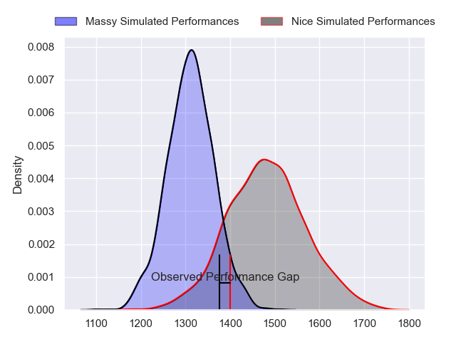
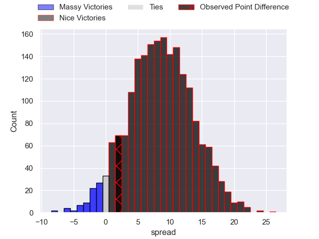
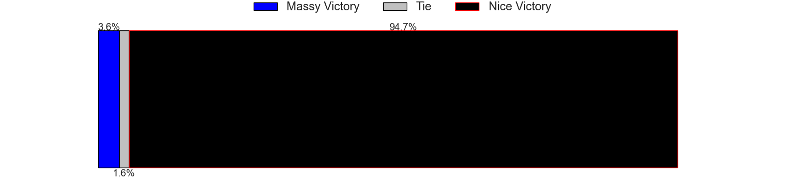
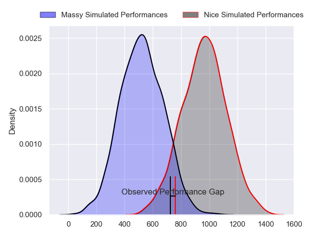
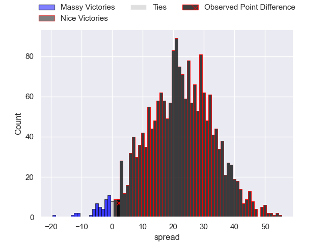
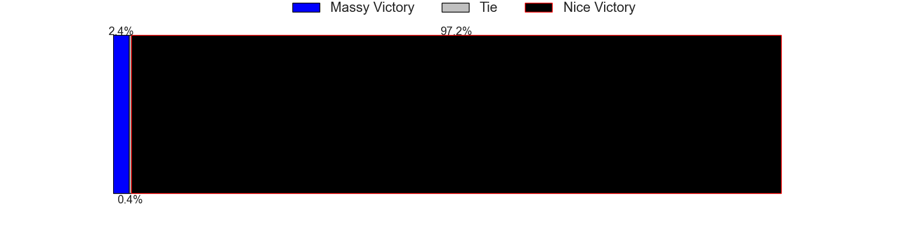
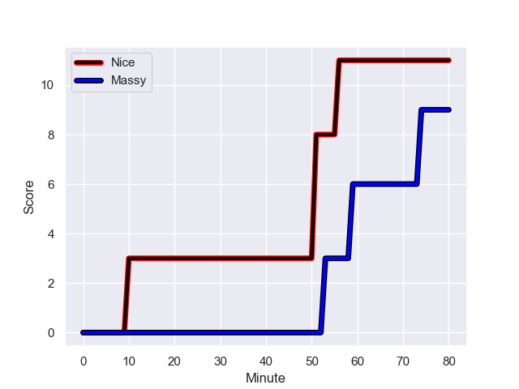
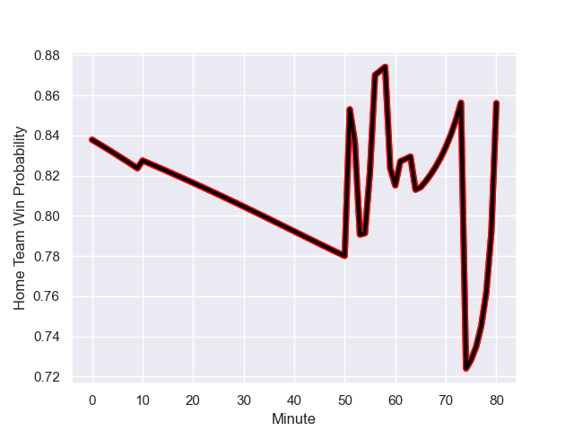

---  
layout: page  
title: Massy at Nice; 9-11  
date: 2023-11-04 18:00:00 -0500  
categories: "Nationale 2023" match review  
---
# Massy at Nice; 9-11

# Club Level Predictions

The first set of predictions treats a club as the smallest object, as the club develops its members, organizes a gameplan, and deploys its players as needed for each match. This club model has a prediction of 0.722, which translates to predicting Nice to win by 8.4.

Each club has a rating and a rating deviation (similar to a Glicko rating), and expected performances can be generated. This allows for simulated matches and spreads like the ones below.
## Projected Performances - Club Model

## Projected Spreads - Club Model

## Projected Results - Club Model

# Player Level Predictions - Version 2

Treating teams instead as an entity made up of the currently active players, I have ratings for each player in an altogether different system. These can be combined to form team ratings once teamsheets are announced, weighting starters a bit higher than the reserves. After the match is played, players can be weighted by their minutes on the field, allowing for an accurate measure of the team's composition. With these compiled team ratings, we can make predictions, measure inaccuracy, and update the individual player ratings.
## Prediction with Player Minutes: Nice by 18.0

Nice by 14.8 on a neutral field
## Prediction without Player Minutes: Nice by 17.3

Nice by 14.0 on a neutral pitch

## Projected Performances - Player Model

## Projected Spreads - Player Model

## Projected Results - Player Model

## Scores over Time

## Win Probability over Time

There were 8 large changes in win probability in this match

|   Away Minutes | Away Player              |   Away elo |   Number |   Home elo | Home Player              |   Home Minutes |
|---------------:|:-------------------------|-----------:|---------:|-----------:|:-------------------------|---------------:|
|             60 | Robin Poipy              |      42.31 |        1 |      65.37 | Sunia Vola               |             60 |
|             53 | Pierre Trassoudaine      |      65.5  |        2 |      61.85 | Sione Anga'aelangi       |             60 |
|             61 | Tijde Visser             |      37.96 |        3 |      36.56 | Luvuyo Pupuma            |             65 |
|             80 | Koen Bloemen             |      12.23 |        4 |       6.92 | Thibault Rey             |             52 |
|             53 | Andrei Mahu              |      -0.58 |        5 |     122.03 | Tom Murday               |             52 |
|             80 | Tony Tissot              |      35.81 |        6 |      66.13 | Arthur Vignolles         |             80 |
|             55 | Alexandre Loubiere       |      46.83 |        7 |      19.07 | Bastien Berenguel        |             64 |
|             80 | Samuel Nollet            |      17.17 |        8 |      60.07 | Ramiha Tarrel Tia Smiler |             80 |
|             53 | Benjamin Prier           |      27.53 |        9 |      53.43 | Corentin Penc'hoat       |             65 |
|             80 | Hugo Verdu               |      12.24 |       10 |      65.91 | Mathis Viard             |             74 |
|             80 | Martin Carre             |      51.48 |       11 |      76.28 | Andrzej Charlat          |             80 |
|             60 | Victorien Jacomme        |      48.38 |       12 |      57.39 | Romain Riguet            |             80 |
|             80 | Arthur Seigneuret        |      43.41 |       13 |      61.22 | Nathan Courtade          |             80 |
|             80 | Alex Preira              |      58.43 |       14 |      56.16 | Simon Delas              |             80 |
|             55 | Tom Deleuze              |      27.8  |       15 |      79.28 | David Odiete             |             80 |
|             20 | Fernandez Correa         |       0.71 |       16 |      34.54 | Jules Martinez           |             20 |
|             27 | Pierre-Alexandre Duclieu |      41.49 |       17 |      45.4  | Pierre Strippoli         |             20 |
|             19 | Nolan Pienaar            |      48.24 |       18 |      51.87 | Nicolas Ciancio          |             15 |
|             27 | Saba Pesvianidze         |      54.27 |       19 |      66.71 | Yann Tivoli              |             28 |
|             25 | Clément Vidoni           |      42.25 |       20 |      67.51 | Adrien Vigne             |             28 |
|             27 | Lucas Rubio              |      18.45 |       21 |      60.88 | Martin Freytes           |             16 |
|             25 | Giorgi Gogoladze         |      34.16 |       22 |      24.04 | Matéo Jeune-Joly         |             15 |
|             20 | Tom Cusson               |      32.06 |       23 |      21.71 | Baptiste Lafond          |              6 |

