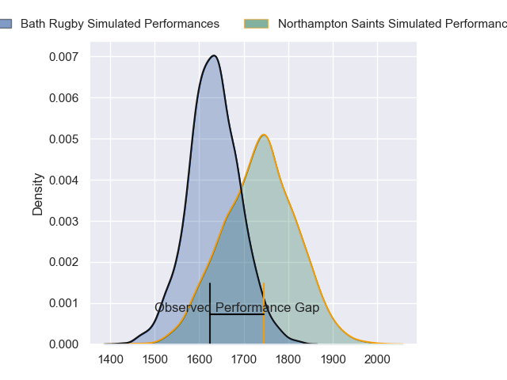
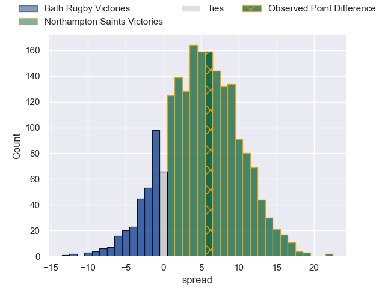
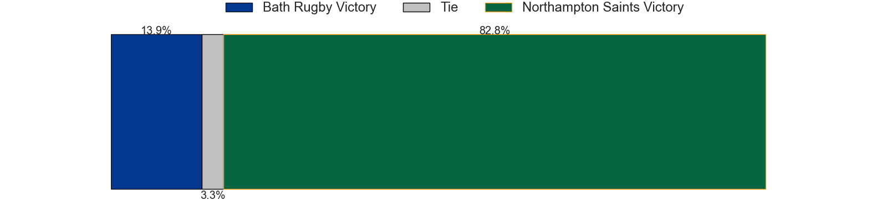
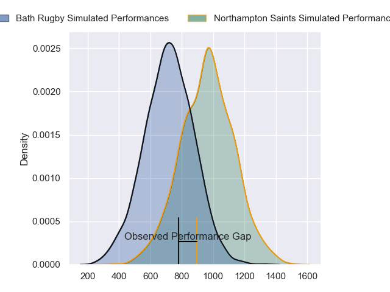
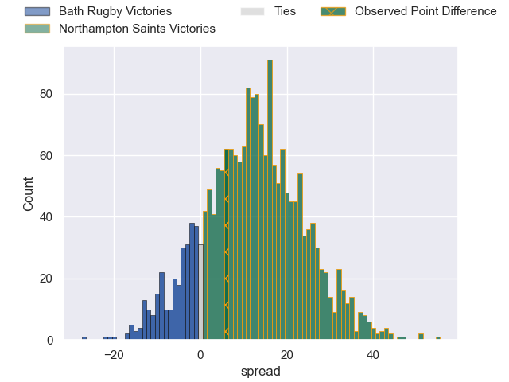
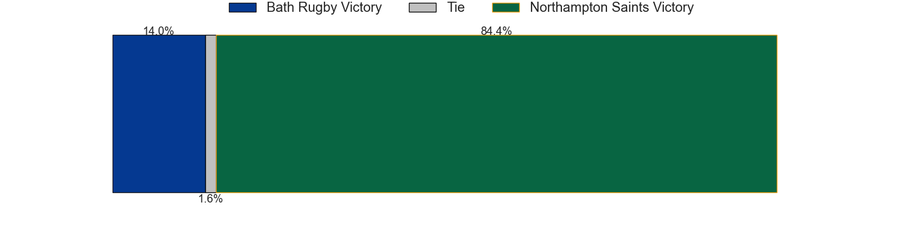
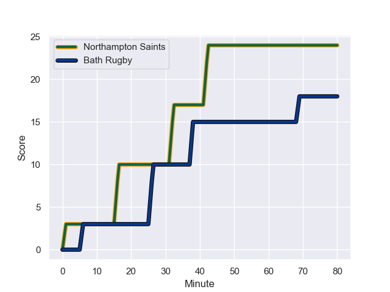
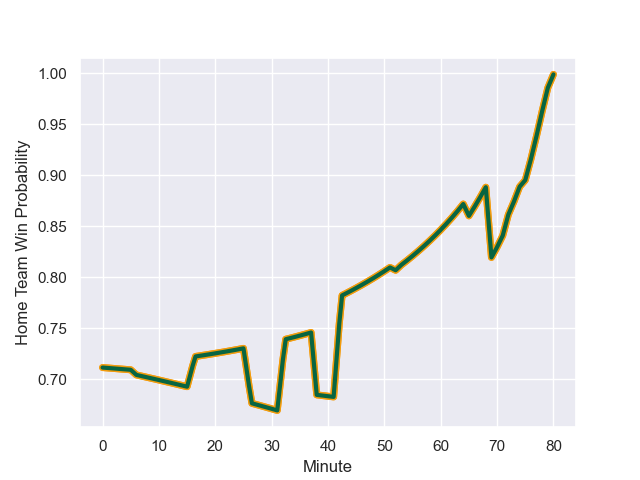

---  
layout: page  
title: Bath Rugby at Northampton Saints; 18-24  
date: 2023-11-04 18:00:00 -0500  
categories: "Gallagher Premiership 2023" match review  
---
# Bath Rugby at Northampton Saints; 18-24

# Club Level Predictions

The first set of predictions treats a club as the smallest object, as the club develops its members, organizes a gameplan, and deploys its players as needed for each match. This club model has a prediction of 0.636, which translates to predicting Northampton Saints to win by 4.9.

Each club has a rating and a rating deviation (similar to a Glicko rating), and expected performances can be generated. This allows for simulated matches and spreads like the ones below.
## Projected Performances - Club Model

## Projected Spreads - Club Model

## Projected Results - Club Model

# Player Level Predictions - Version 2

Treating teams instead as an entity made up of the currently active players, I have ratings for each player in an altogether different system. These can be combined to form team ratings once teamsheets are announced, weighting starters a bit higher than the reserves. After the match is played, players can be weighted by their minutes on the field, allowing for an accurate measure of the team's composition. With these compiled team ratings, we can make predictions, measure inaccuracy, and update the individual player ratings.
## Prediction with Player Minutes: Northampton Saints by 9.9

Northampton Saints by 5.1 on a neutral field
## Prediction without Player Minutes: Northampton Saints by 9.7

Northampton Saints by 4.9 on a neutral pitch

## Projected Performances - Player Model

## Projected Spreads - Player Model

## Projected Results - Player Model

## Scores over Time

## Win Probability over Time

There were 6 large changes in win probability in this match

|   Away Minutes | Away Player         |   Away elo |   Number |   Home elo | Home Player         |   Home Minutes |
|---------------:|:--------------------|-----------:|---------:|-----------:|:--------------------|---------------:|
|             58 | Beno Obano          |      47.08 |        1 |      94.78 | Alex Waller         |             52 |
|             52 | Niall Annett        |      41.41 |        2 |      57.72 | Curtis Langdon      |             69 |
|             58 | Thomas du Toit      |      75.73 |        3 |      43.41 | Elliot Millar-Mills |             52 |
|             52 | Josh McNally        |      73.21 |        4 |      79.66 | Alex Moon           |             80 |
|             80 | Fergus Lee-Warner   |      26.48 |        5 |      18.88 | Alex Coles          |             80 |
|             80 | Miles Reid          |      79.71 |        6 |      41.18 | Angus Scott-Young   |             80 |
|             80 | Sam Underhill       |      60.04 |        7 |      82.26 | Tom Pearson         |             75 |
|             53 | Jaco Coetzee        |      45.44 |        8 |      58.96 | Lewis Ludlam        |             65 |
|             52 | Louis Schreuder     |      58.61 |        9 |      13.27 | Tom James           |             80 |
|             80 | Orlando Bailey      |      35.56 |       10 |      45.9  | Fin Smith           |             72 |
|             72 | Will Muir           |       3.7  |       11 |      63.44 | George Hendy        |             80 |
|             80 | Cameron Redpath     |      56.48 |       12 |      65.43 | Rory Hutchinson     |             80 |
|             75 | Max Ojomoh          |      41.51 |       13 |      52.61 | Fraser Dingwall     |             80 |
|             80 | Ruaridh McConnochie |      60.16 |       14 |      70.67 | Tommy Freeman       |             80 |
|             80 | Tom de Glanville    |      30.09 |       15 |      63.56 | George Furbank      |             80 |
|             22 | Juan Schoeman       |      43.73 |       16 |      64.92 | Ethan Waller        |             28 |
|             28 | Tom Dunn            |      81.27 |       17 |      91.81 | Paul Hill           |             11 |
|             22 | Will Stuart         |      28.13 |       18 |      35.31 | Tom Cruse           |             28 |
|             28 | Charlie Ewels       |      27.49 |       19 |      49.16 | Chunya Munga        |              5 |
|             27 | Alfie Barbeary      |      42.79 |       20 |      82.2  | Sam Graham          |             15 |
|             28 | Ben Spencer         |      43.58 |       21 |       0.71 | Tom Seabrook        |              8 |
|              8 | Josh Noonan         |      46.65 |       22 |     nan    | nan                 |            nan |
|              5 | Louie Hennessey     |      46.65 |       23 |     nan    | nan                 |            nan |

