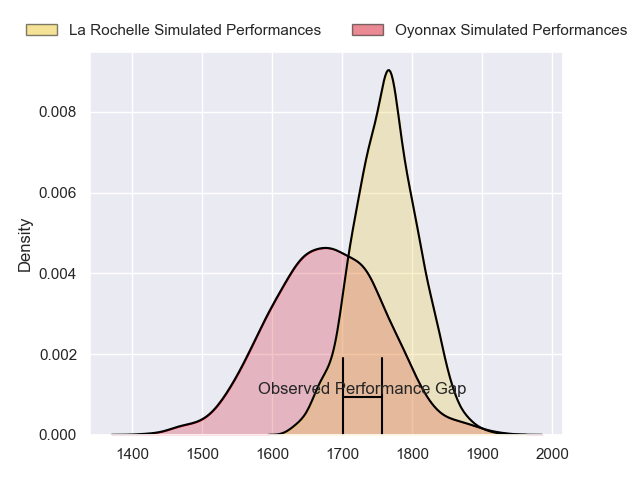
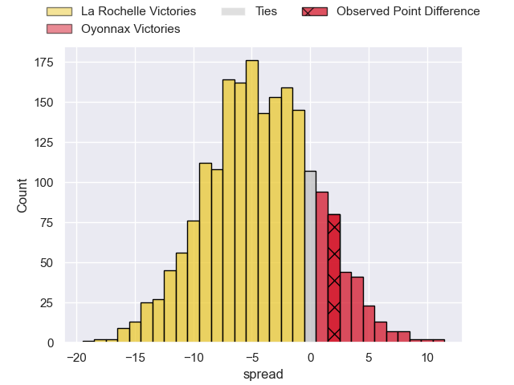
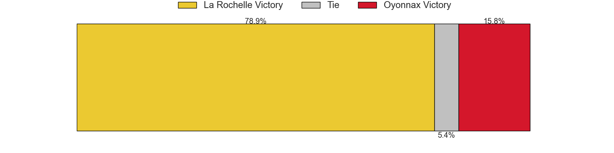
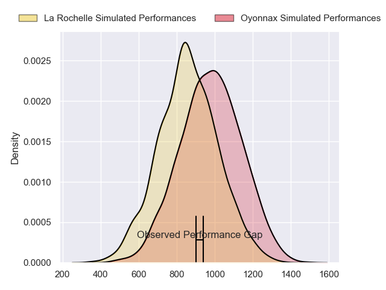
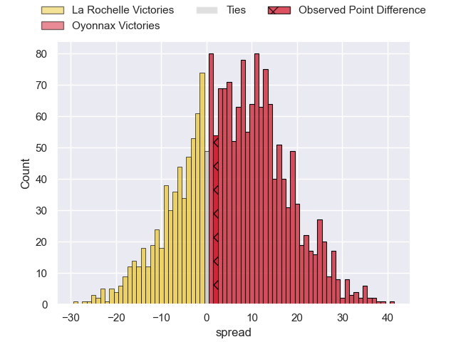
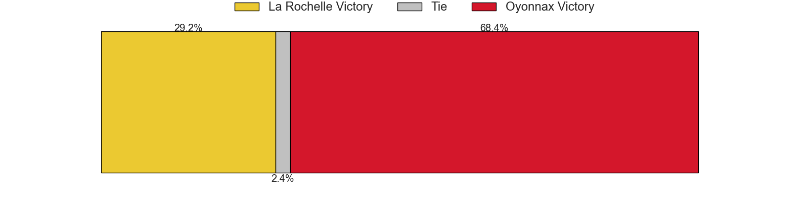
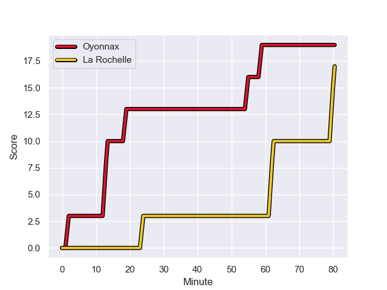
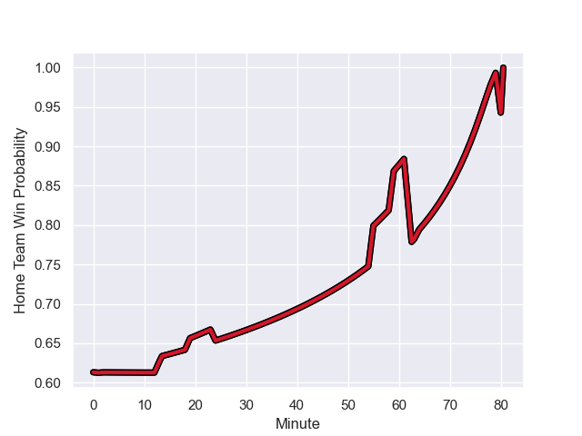

---  
layout: page  
title: La Rochelle at Oyonnax; 17-19  
date: 2023-11-04 18:00:00 -0500  
categories: "Top 14 Orange 2023" match review  
---
# La Rochelle at Oyonnax; 17-19

# Club Level Predictions

The first set of predictions treats a club as the smallest object, as the club develops its members, organizes a gameplan, and deploys its players as needed for each match. This club model has a prediction of 0.382, which translates to predicting La Rochelle to win by 4.2.

Each club has a rating and a rating deviation (similar to a Glicko rating), and expected performances can be generated. This allows for simulated matches and spreads like the ones below.
## Projected Performances - Club Model

## Projected Spreads - Club Model

## Projected Results - Club Model

# Player Level Predictions - Version 2

Treating teams instead as an entity made up of the currently active players, I have ratings for each player in an altogether different system. These can be combined to form team ratings once teamsheets are announced, weighting starters a bit higher than the reserves. After the match is played, players can be weighted by their minutes on the field, allowing for an accurate measure of the team's composition. With these compiled team ratings, we can make predictions, measure inaccuracy, and update the individual player ratings.
## Prediction with Player Minutes: Oyonnax by 5.1

Oyonnax by 0.3 on a neutral field
## Prediction without Player Minutes: Oyonnax by 5.1

Oyonnax by 0.4 on a neutral pitch

## Projected Performances - Player Model

## Projected Spreads - Player Model

## Projected Results - Player Model

## Scores over Time

## Win Probability over Time

There were 6 large changes in win probability in this match

|   Away Minutes | Away Player           |   Away elo |   Number |   Home elo | Home Player        |   Home Minutes |
|---------------:|:----------------------|-----------:|---------:|-----------:|:-------------------|---------------:|
|             52 | Thierry Paiva         |      55.77 |        1 |      58.66 | Tommy Raynaud      |             64 |
|             26 | Sacha Idoumi          |      50.72 |        2 |      37.41 | Teddy Durand       |             72 |
|             52 | Georges-Henri Colombe |      21.89 |        3 |      36.35 | Christopher Vaotoa |             67 |
|             75 | Thomas Ployet         |      43.82 |        4 |      95.13 | Phoenix Battye     |             64 |
|             75 | Remi Picquette        |      44.53 |        5 |      52.35 | Hugo Fabregue      |             67 |
|             80 | Ultan Dillane         |      62.97 |        6 |      38.92 | Wandrille Picault  |             52 |
|             80 | Judicael Cancoriet    |      33.8  |        7 |      50.98 | Loïc Credoz        |             80 |
|             80 | Yoan Tanga            |      60.37 |        8 |      61.65 | Rory Grice         |             80 |
|             52 | Teddy Iribaren        |      64.93 |        9 |      84.91 | Jonathan Ruru      |             65 |
|             52 | Ihaia West            |      36.99 |       10 |      84.12 | Domingo Miotti     |             80 |
|             52 | Thomas Berjon         |      64.65 |       11 |      59.62 | Daniel Ikpefan     |             80 |
|             80 | Jules Favre           |      66.39 |       12 |      69.1  | Theo Millet        |             80 |
|             80 | Jack Nowell           |      98.6  |       13 |      28.45 | Chris Farrell      |             80 |
|             80 | Teddy Thomas          |      89    |       14 |      84.56 | Darren Sweetnam    |             80 |
|             80 | Nathan Bollengier     |      41.92 |       15 |      39.64 | Justin Bouraux     |             75 |
|             54 | Quentin Lespiaucq     |      48.22 |       16 |      45.64 | Kevin Lebreton     |             28 |
|             28 | Joel Sclavi           |      62.43 |       17 |      24.98 | Victor Lebas       |             16 |
|             28 | Tawera Kerr-Barlow    |     113.02 |       18 |      48.22 | Antoine Abraham    |             16 |
|              5 | Simon Huchet          |      46.65 |       19 |      75.39 | Charlie Cassang    |             15 |
|              5 | Noé Della Schiava     |      44.89 |       20 |      37.2  | Steve Mafi         |             13 |
|             28 | Hugo Reus             |      43.2  |       21 |      39.11 | Ali Oz             |             13 |
|             28 | Hoani Bosmorin        |      40.5  |       22 |      15.15 | Pedro Bettencourt  |              5 |
|             28 | Aleksandre Kuntelia   |      36.36 |       23 |      16.54 | Manu Leiataua      |              8 |

