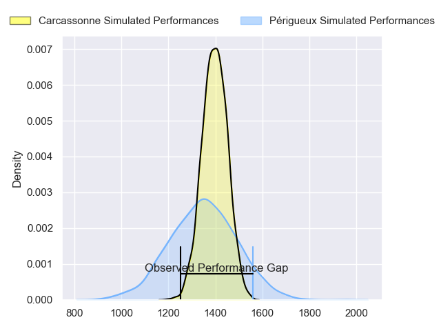
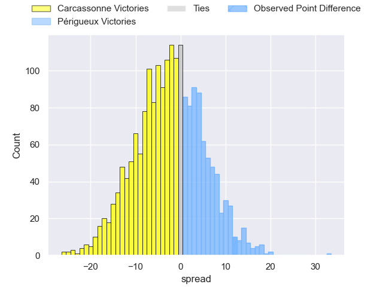
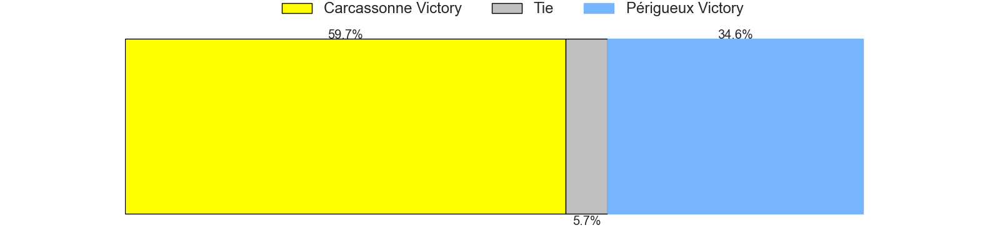
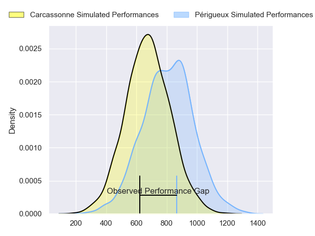
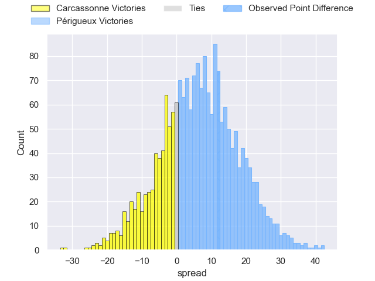
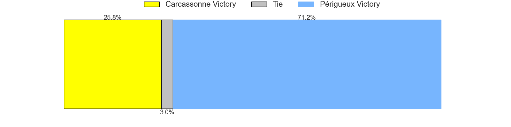
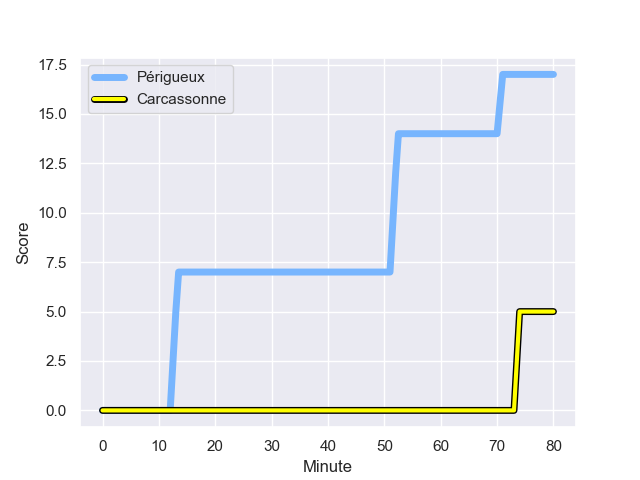
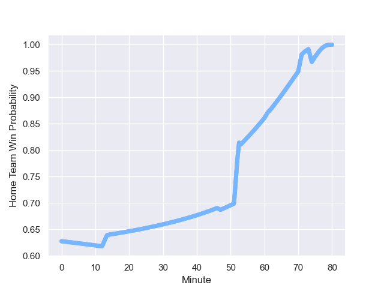

---  
layout: page  
title: Carcassonne at Périgueux; 5-17  
date: 2023-11-04 18:00:00 -0500  
categories: "Nationale 2023" match review  
---
# Carcassonne at Périgueux; 5-17

# Club Level Predictions

The first set of predictions treats a club as the smallest object, as the club develops its members, organizes a gameplan, and deploys its players as needed for each match. This club model has a prediction of 0.435, which translates to predicting Carcassonne to win by 2.3.

Each club has a rating and a rating deviation (similar to a Glicko rating), and expected performances can be generated. This allows for simulated matches and spreads like the ones below.
## Projected Performances - Club Model

## Projected Spreads - Club Model

## Projected Results - Club Model

# Player Level Predictions - Version 2

Treating teams instead as an entity made up of the currently active players, I have ratings for each player in an altogether different system. These can be combined to form team ratings once teamsheets are announced, weighting starters a bit higher than the reserves. After the match is played, players can be weighted by their minutes on the field, allowing for an accurate measure of the team's composition. With these compiled team ratings, we can make predictions, measure inaccuracy, and update the individual player ratings.
## Prediction with Player Minutes: Périgueux by 5.7

Périgueux by 2.6 on a neutral field
## Prediction without Player Minutes: Périgueux by 6.4

Périgueux by 3.2 on a neutral pitch

## Projected Performances - Player Model

## Projected Spreads - Player Model

## Projected Results - Player Model

## Scores over Time

## Win Probability over Time

There were 3 large changes in win probability in this match

|   Away Minutes | Away Player         |   Away elo |   Number |   Home elo | Home Player       |   Home Minutes |
|---------------:|:--------------------|-----------:|---------:|-----------:|:------------------|---------------:|
|             47 | Florent Lorenzon    |      42.41 |        1 |      52.5  | Thomas Vidal      |             62 |
|             47 | Luka Petriashvili   |      51.36 |        2 |      54.91 | Louis Martin      |             62 |
|             58 | Vakhtangi Akhobadze |      22.67 |        3 |      34.82 | Kalaveti Tawake   |             62 |
|             80 | Romain Manchia      |      25.09 |        4 |      34.19 | Jaco Willemse     |             80 |
|             47 | Marius Iftimiciuc   |      24.71 |        5 |      45.62 | Damien Lavergne   |             61 |
|             80 | Gary Graham         |      69.99 |        6 |      32.2  | Richard Fourcade  |             61 |
|             61 | Etienne Herjean     |      42.21 |        7 |      43.73 | Karl Lambert      |             74 |
|             53 | Romain Guyot        |      43.72 |        8 |      72.38 | Afaesetiti Amosa  |             80 |
|             53 | Martin Landajo      |      -1.92 |        9 |      11.43 | Nicolas Faltrept  |             72 |
|             53 | Damien Añon         |      43.33 |       10 |      52.35 | Greg Hutley       |             74 |
|             80 | Clement Egiziano    |      60.04 |       11 |      61.85 | Axel Muller       |             80 |
|             80 | Jordan Puletua      |      21.99 |       12 |      67.03 | Fred Hickes       |             80 |
|             80 | Mathys Barka        |      51.74 |       13 |      59.87 | Cyril Couturier   |             80 |
|             80 | Léo Darrelatour     |      78.59 |       14 |      47.61 | Vincent Fouillade |             80 |
|             80 | Maxime Gianet       |      63.02 |       15 |      60.73 | Rory Scholes      |             80 |
|             33 | Andrei Ursache      |      55.63 |       16 |      44.45 | Emilien Borges    |             18 |
|             33 | Raphael Carbou      |      50.54 |       17 |      54.01 | Lucas Marijon     |             18 |
|             22 | Nikoloz Narmania    |      51.79 |       18 |      48.25 | Anthony Pelmard   |             18 |
|             33 | Clément Fontaine    |      31.51 |       19 |      43.32 | Enzo Hardy        |              8 |
|             27 | Carl Fearns         |      52.35 |       20 |      31.63 | Marius Vialle     |             19 |
|             19 | Valentin Sese       |      47.2  |       21 |      53.82 | Nicolas Labattut  |              6 |
|             27 | Gaetan Pichon       |      27.21 |       22 |      38.63 | Yann Caillat      |              6 |
|             27 | Gabin Michet        |      57.37 |       23 |      48.98 | Pierre Rousserie  |             19 |

