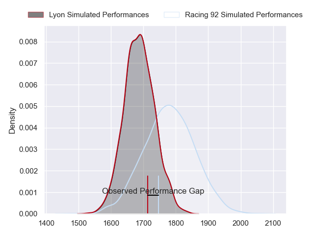
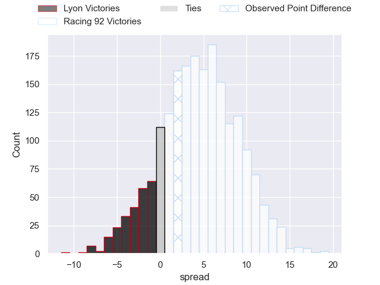
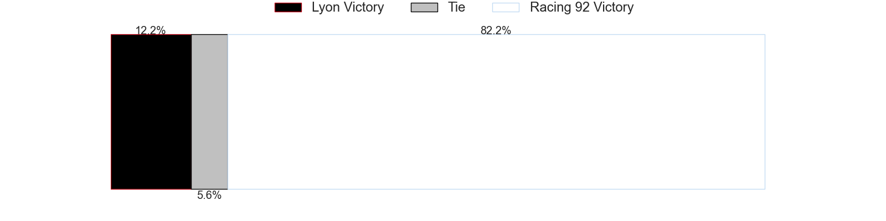
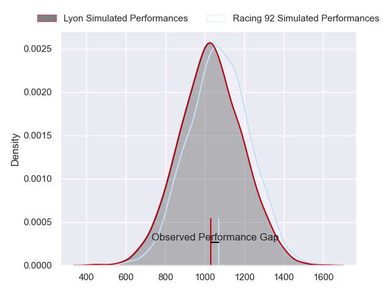
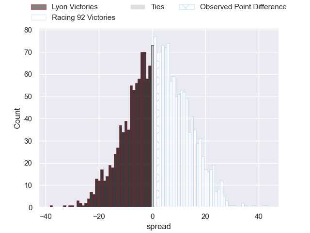
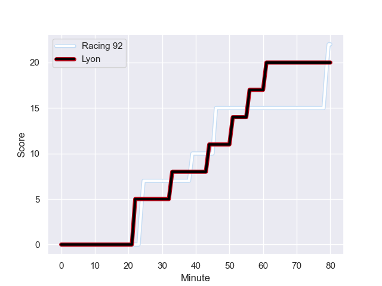
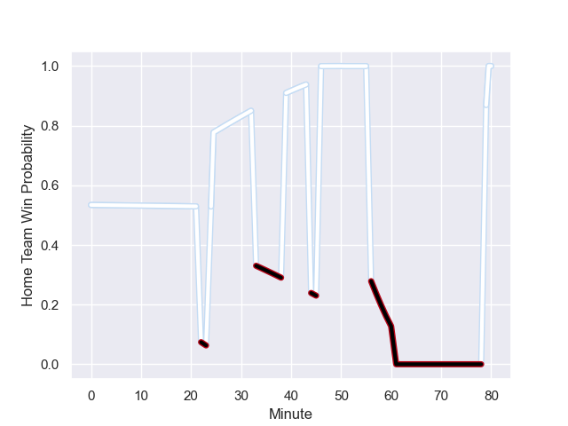

---  
layout: page  
title: Lyon at Racing 92; 20-22  
date: 2023-11-04 18:00:00 -0500  
categories: "Top 14 Orange 2023" match review  
---
# Lyon at Racing 92; 20-22

# Club Level Predictions

The first set of predictions treats a club as the smallest object, as the club develops its members, organizes a gameplan, and deploys its players as needed for each match. This club model has a prediction of 0.627, which translates to predicting Racing 92 to win by 4.6.

Each club has a rating and a rating deviation (similar to a Glicko rating), and expected performances can be generated. This allows for simulated matches and spreads like the ones below.
## Projected Performances - Club Model

## Projected Spreads - Club Model

## Projected Results - Club Model

# Player Level Predictions - Version 2

Treating teams instead as an entity made up of the currently active players, I have ratings for each player in an altogether different system. These can be combined to form team ratings once teamsheets are announced, weighting starters a bit higher than the reserves. After the match is played, players can be weighted by their minutes on the field, allowing for an accurate measure of the team's composition. With these compiled team ratings, we can make predictions, measure inaccuracy, and update the individual player ratings.
## Prediction with Player Minutes: Racing 92 by 1.5

Lyon by 3.2 on a neutral field
## Prediction without Player Minutes: Racing 92 by 1.6

Lyon by 3.2 on a neutral pitch

## Projected Performances - Player Model

## Projected Spreads - Player Model

## Projected Results - Player Model

## Scores over Time

## Win Probability over Time

There were 15 large changes in win probability in this match

|   Away Minutes | Away Player        |   Away elo |   Number |   Home elo | Home Player         |   Home Minutes |
|---------------:|:-------------------|-----------:|---------:|-----------:|:--------------------|---------------:|
|             64 | Jerome Rey         |      32.03 |        1 |      41.38 | Hassane Kolingar    |             51 |
|             66 | Liam Coltman       |      62.31 |        2 |      89.13 | Camille Chat        |             77 |
|             64 | Demba Bamba        |      86.77 |        3 |      61.84 | Thomas Laclayat     |             51 |
|             80 | Felix Lambey       |      70.5  |        4 |      77.61 | Baptiste Chouzenoux |             80 |
|             51 | Romain Taofifenua  |      52.19 |        5 |      41.01 | Fabien Sanconnie    |             51 |
|             80 | Dylan Cretin       |      65.58 |        6 |     103.42 | Wenceslas Lauret    |             80 |
|             56 | Beka Saghinadze    |      80.58 |        7 |      38.15 | Ibrahim Diallo      |             80 |
|             80 | Arno Botha         |      73.49 |        8 |      58.94 | Jordan Joseph       |             51 |
|             66 | Baptiste Couilloud |      93.02 |        9 |      57.87 | Clovis Le bail      |             51 |
|             80 | Paddy Jackson      |      84.31 |       10 |      75.03 | Antoine Gibert      |             80 |
|             80 | Vincent Rattez     |     105.79 |       11 |      89.06 | Christian Wade      |             80 |
|             80 | Thibault Regard    |      83.83 |       12 |      41.54 | Francis Saili       |             80 |
|             80 | Josiah Maraku      |      24.2  |       13 |      49.9  | Inia Tabuavou       |             51 |
|             56 | Xavier Mignot      |      59.58 |       14 |      43.33 | Donovan Taofifenua  |             80 |
|             80 | Davit Niniashvili  |      76.98 |       15 |      70.32 | Tristan Tedder      |             56 |
|             29 | Mickael Guillard   |      53.62 |       16 |      64.47 | Nolann Le Garrec    |             29 |
|             24 | Theo William       |      32.56 |       17 |      48.37 | Guram Gogichashvili |             29 |
|             24 | Monty Ioane        |     100.06 |       18 |      56.96 | Cedate Gomes Sa     |             29 |
|             16 | Vivien Devisme     |      58.5  |       19 |      65.14 | Cameron Woki        |             29 |
|             16 | Hamza Kaabeche     |      25.84 |       20 |     105.35 | Gael Fickou         |             29 |
|             14 | Martin Page-Relo   |      60.7  |       21 |      38.93 | Will Rowlands       |             29 |
|             14 | Guillaume Marchand |      39.21 |       22 |      40.4  | Martin Méliande     |             24 |
|            nan | nan                |     nan    |       23 |      98.51 | Eddy Ben Arous      |              3 |

