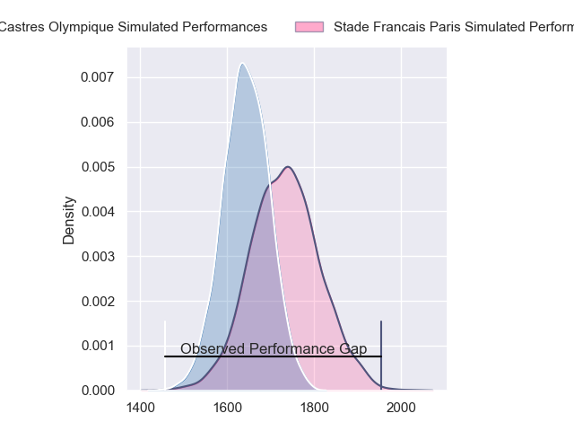
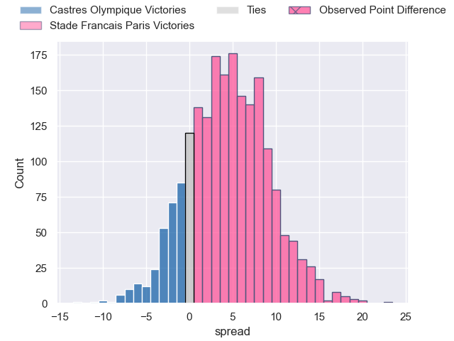
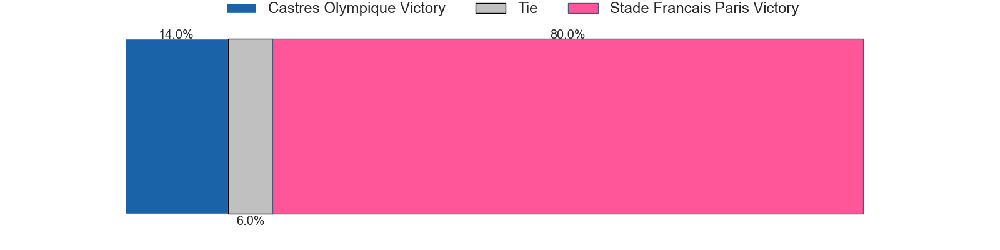
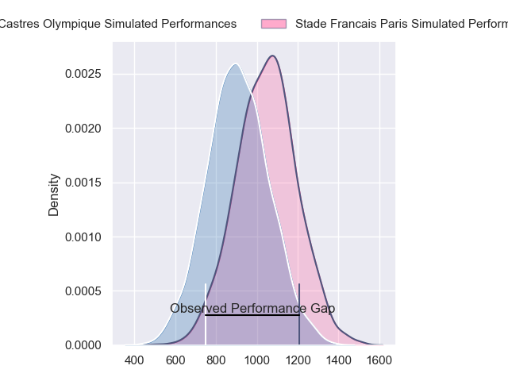
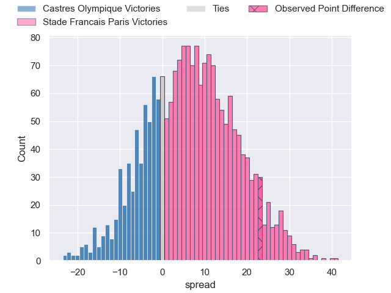
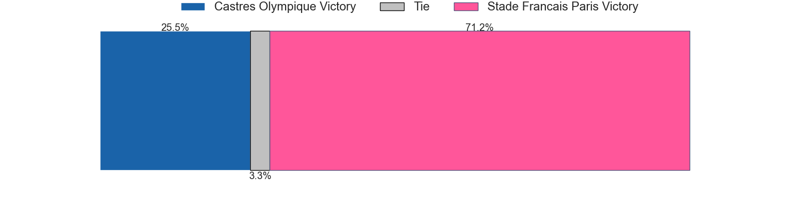
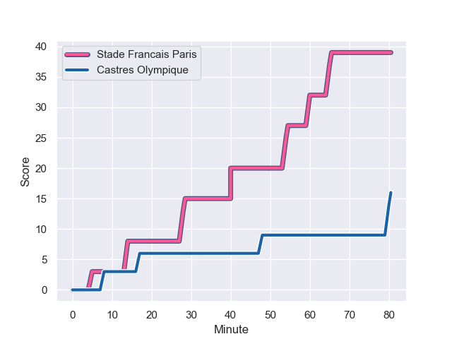
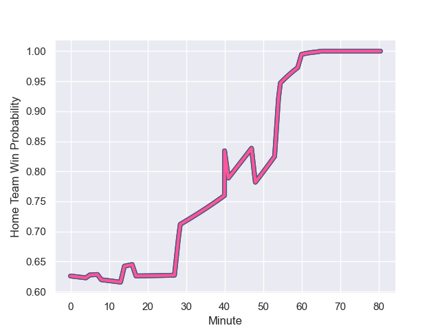

---  
layout: page  
title: Castres Olympique at Stade Francais Paris; 16-39  
date: 2023-11-04 18:00:00 -0500  
categories: "Top 14 Orange 2023" match review  
---
# Castres Olympique at Stade Francais Paris; 16-39

# Club Level Predictions

The first set of predictions treats a club as the smallest object, as the club develops its members, organizes a gameplan, and deploys its players as needed for each match. This club model has a prediction of 0.624, which translates to predicting Stade Francais Paris to win by 4.5.

Each club has a rating and a rating deviation (similar to a Glicko rating), and expected performances can be generated. This allows for simulated matches and spreads like the ones below.
## Projected Performances - Club Model

## Projected Spreads - Club Model

## Projected Results - Club Model

# Player Level Predictions - Version 2

Treating teams instead as an entity made up of the currently active players, I have ratings for each player in an altogether different system. These can be combined to form team ratings once teamsheets are announced, weighting starters a bit higher than the reserves. After the match is played, players can be weighted by their minutes on the field, allowing for an accurate measure of the team's composition. With these compiled team ratings, we can make predictions, measure inaccuracy, and update the individual player ratings.
## Prediction with Player Minutes: Stade Francais Paris by 5.6

Castres Olympique by 0.6 on a neutral field
## Prediction without Player Minutes: Stade Francais Paris by 4.6

Castres Olympique by 0.5 on a neutral pitch

## Projected Performances - Player Model

## Projected Spreads - Player Model

## Projected Results - Player Model

## Scores over Time

## Win Probability over Time

There were 7 large changes in win probability in this match

|   Away Minutes | Away Player         |   Away elo |   Number |   Home elo | Home Player          |   Home Minutes |
|---------------:|:--------------------|-----------:|---------:|-----------:|:---------------------|---------------:|
|             56 | Loïs Guerois        |      46.41 |        1 |      57.99 | Moses Alo-Emile      |             48 |
|             31 | Gaetan Barlot       |      79.72 |        2 |      43.22 | Lucas Peyresblanques |             41 |
|             56 | Wilfrid Hounkpatin  |      60.47 |        3 |      68.75 | Paul Alo-Emile       |             64 |
|             50 | Leone Nakarawa      |      79.02 |        4 |      69.9  | Paul Gabrillagues    |             48 |
|             80 | Tom Staniforth      |      70.53 |        5 |      74.49 | JJ van der Mescht    |             48 |
|             50 | Baptiste Delaporte  |      52.58 |        6 |      23.45 | Tanginoa Halaifonua  |             80 |
|             80 | Tyler Ardron        |      90.79 |        7 |      33.34 | Mathieu Hirigoyen    |             48 |
|             59 | Abraham Papali'i    |      54.67 |        8 |      87.1  | Sekou Macalou        |             80 |
|             66 | Santiago Arata      |      52.82 |        9 |     112.31 | Rory Kockott         |             66 |
|             80 | Pierre Popelin      |      58.02 |       10 |      61.31 | Zack Henry           |             80 |
|             80 | Nathanael Hulleu    |      75.51 |       11 |      63.84 | Lester Etien         |             80 |
|             80 | Louis Le Brun       |      48.44 |       12 |      58.48 | Leo Barre            |             80 |
|             59 | Vilimoni Botitu     |      60.22 |       13 |      86.31 | Jeremy Ward          |             69 |
|             80 | Josaia Raisuqe      |      53.59 |       14 |      46.65 | Charles Laloi        |             80 |
|             80 | Julien Dumora       |      69.17 |       15 |      44.45 | Kylan Hamdaoui       |             80 |
|             49 | Loris Zarantonello  |      44.05 |       16 |      92.18 | Mickael Ivaldi       |             39 |
|             30 | Gauthier Maravat    |      14.6  |       17 |      42.02 | Romain Briatte       |             32 |
|             30 | Baptiste Cope       |      44.02 |       18 |      46    | Pierre-Henri Azagoh  |             32 |
|             24 | Wayan de Benedittis |      51.06 |       19 |      71.39 | Baptiste Pesenti     |             32 |
|             24 | Levan Chilachava    |      59.13 |       20 |      59.75 | Sergo Abramishvili   |             32 |
|             21 | Geoffrey Palis      |      90.84 |       21 |      46.65 | Lendi Dakaj          |             16 |
|             21 | Yann Peysson        |      47.81 |       22 |      34.71 | Jules Gimbert        |             14 |
|             14 | Gauthier Doubrere   |      49.62 |       23 |      37.32 | Peniasi Dakuwaqa     |             11 |

