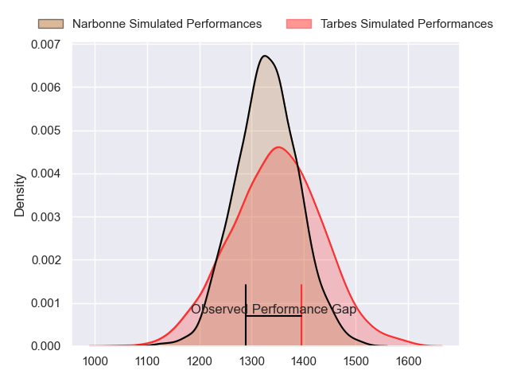
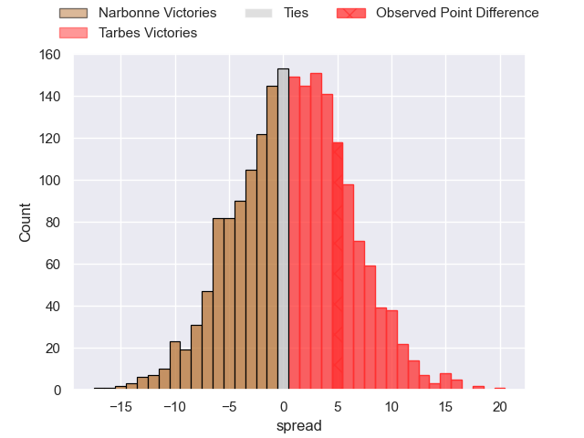
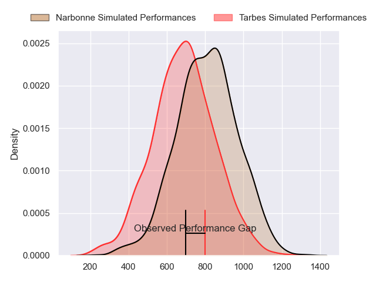
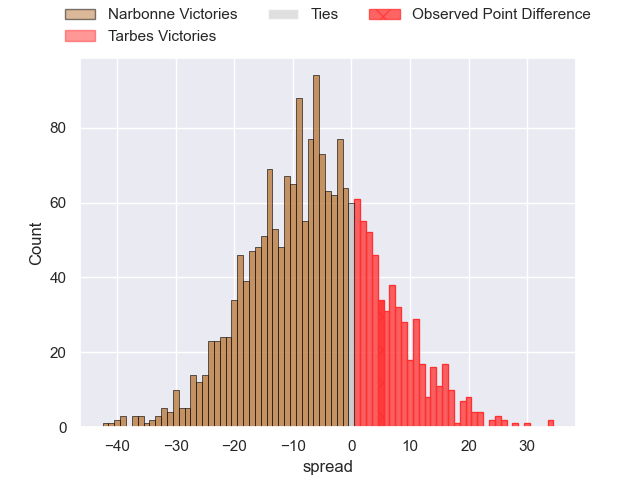
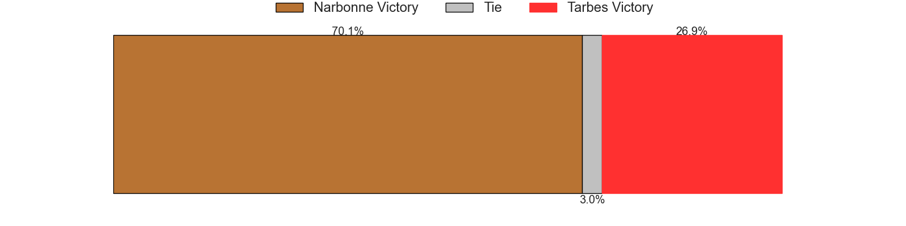
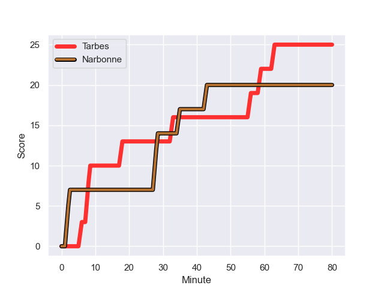
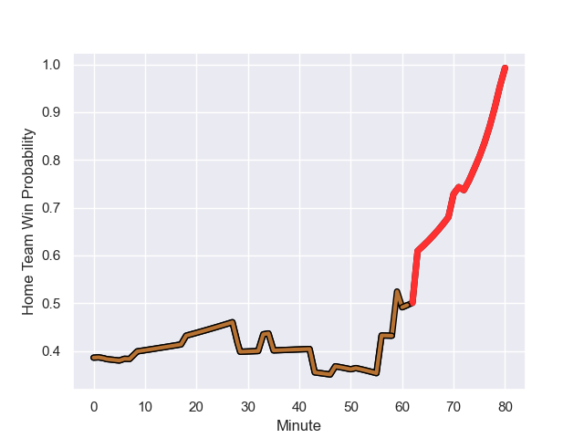

---  
layout: page  
title: Narbonne at Tarbes; 20-25  
date: 2023-11-04 18:00:00 -0500  
categories: "Nationale 2023" match review  
---
# Narbonne at Tarbes; 20-25

# Club Level Predictions

The first set of predictions treats a club as the smallest object, as the club develops its members, organizes a gameplan, and deploys its players as needed for each match. This club model has a prediction of 0.524, which translates to predicting Tarbes to win by 0.9.

Each club has a rating and a rating deviation (similar to a Glicko rating), and expected performances can be generated. This allows for simulated matches and spreads like the ones below.
## Projected Performances - Club Model

## Projected Spreads - Club Model

## Projected Results - Club Model

# Player Level Predictions - Version 2

Treating teams instead as an entity made up of the currently active players, I have ratings for each player in an altogether different system. These can be combined to form team ratings once teamsheets are announced, weighting starters a bit higher than the reserves. After the match is played, players can be weighted by their minutes on the field, allowing for an accurate measure of the team's composition. With these compiled team ratings, we can make predictions, measure inaccuracy, and update the individual player ratings.
## Prediction with Player Minutes: Narbonne by 5.1

Narbonne by 9.4 on a neutral field
## Prediction without Player Minutes: Narbonne by 4.9

Narbonne by 9.1 on a neutral pitch

## Projected Performances - Player Model

## Projected Spreads - Player Model

## Projected Results - Player Model

## Scores over Time

## Win Probability over Time

There were 15 large changes in win probability in this match

|   Away Minutes | Away Player            |   Away elo |   Number |   Home elo | Home Player            |   Home Minutes |
|---------------:|:-----------------------|-----------:|---------:|-----------:|:-----------------------|---------------:|
|             63 | Théo Castinel          |      54.17 |        1 |      38.02 | Johan Mees Erasmus     |             51 |
|             80 | Mehdi Boundjema        |      58.47 |        2 |      49.83 | Florian Lamothe        |             63 |
|             63 | Levi Tikoipau          |      50.12 |        3 |      47.19 | Toma Taufa             |             63 |
|             80 | Marius Antonescu       |      53.86 |        4 |      46.88 | Baptiste Peytavi       |             72 |
|             56 | Mauro Rebussone        |      50.95 |        5 |      30.83 | Jone Trevor Seuvou     |             80 |
|             80 | Thibault Clauzade      |      57.52 |        6 |      61.98 | Alexis Armary          |             80 |
|             80 | Baptiste Abescat-Leroy |      44.54 |        7 |      40.46 | Léo Saint-Guilhem      |             80 |
|             60 | Charles Malet          |      21.52 |        8 |      35.81 | Len Massyn             |             80 |
|             60 | Pierrick Nova          |      50.19 |        9 |      18.3  | Anthony Meric          |             47 |
|             70 | Tom Chauvet            |      48.95 |       10 |      20.59 | Anthony Fuertes        |             80 |
|             80 | Ambrose Curtis         |      32.69 |       11 |      35.76 | Savenaca Rawaca        |             74 |
|             80 | Peter Betham           |     117.22 |       12 |      47.78 | Kalione Nasoko         |             80 |
|             63 | Pierre Nueno           |      54.78 |       13 |      34.11 | William Pees           |             80 |
|             80 | Pierre-Hugo Ducom      |      41.7  |       14 |      25.67 | Johan Paulet           |             80 |
|             80 | James Kane             |      57.46 |       15 |      31.95 | Mathieu Berbizier      |             47 |
|             17 | Sylvain Abadie         |      34.61 |       16 |      47.12 | Antoine Palisse        |             29 |
|             17 | John Roy Jenkinson     |      63.73 |       17 |      39.8  | Enzo Mondon            |             17 |
|             24 | Enzo Melisse           |      46.65 |       18 |      38.22 | Aleksi Tchitchiashvili |             17 |
|             20 | Luke Nakobukobua       |      68.97 |       19 |      44.85 | Francis Rolland        |              8 |
|             20 | Josh Valentine         |      80.72 |       20 |      35.93 | Thibaut Dulucq         |             33 |
|             10 | Thibault Santoro       |      43.56 |       21 |      41.74 | Clement Latorre        |              6 |
|             17 | Théo Mias              |      34.77 |       22 |      48.01 | Yon Camou              |             33 |

