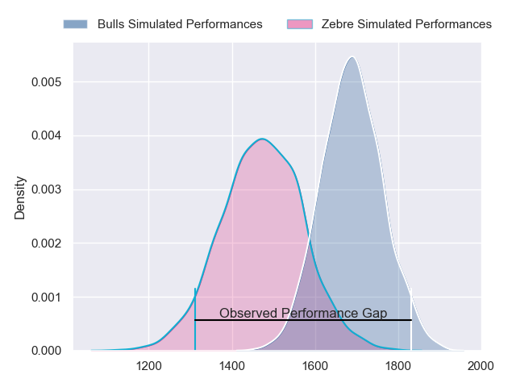
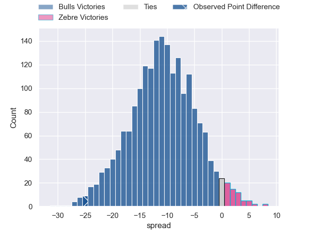
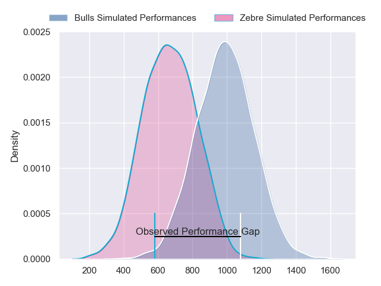
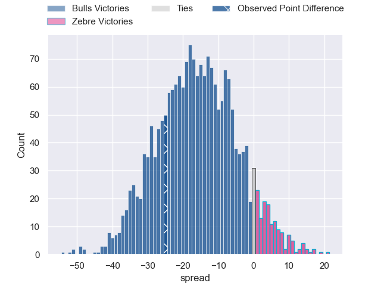
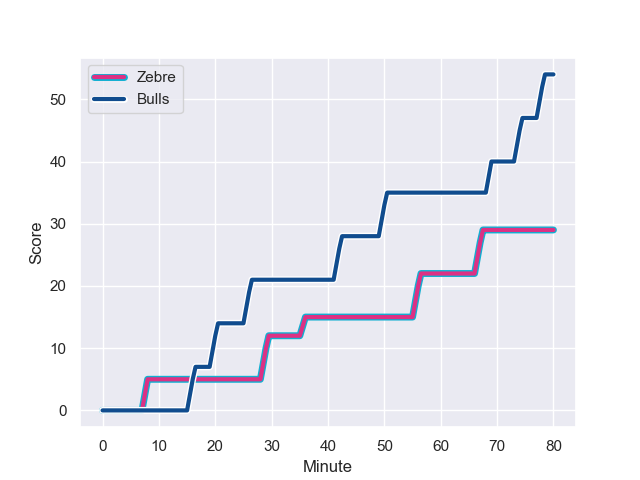
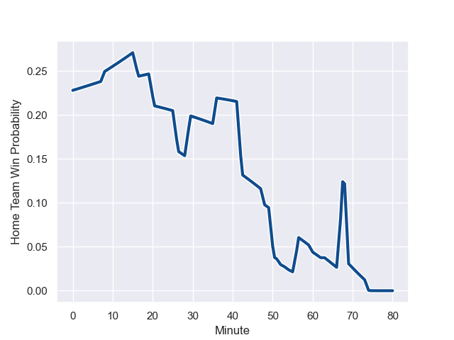

---  
layout: page  
title: Bulls at Zebre; 54-29  
date: 2023-11-04 18:00:00 -0500  
categories: "United Rugby Championship 2023" match review  
---
# Bulls at Zebre; 54-29

# Club Level Predictions

The first set of predictions treats a club as the smallest object, as the club develops its members, organizes a gameplan, and deploys its players as needed for each match. This club model has a prediction of 0.227, which translates to predicting Bulls to win by 10.9.

Each club has a rating and a rating deviation (similar to a Glicko rating), and expected performances can be generated. This allows for simulated matches and spreads like the ones below.
## Projected Performances - Club Model

## Projected Spreads - Club Model

## Projected Results - Club Model

# Player Level Predictions - Version 2

Treating teams instead as an entity made up of the currently active players, I have ratings for each player in an altogether different system. These can be combined to form team ratings once teamsheets are announced, weighting starters a bit higher than the reserves. After the match is played, players can be weighted by their minutes on the field, allowing for an accurate measure of the team's composition. With these compiled team ratings, we can make predictions, measure inaccuracy, and update the individual player ratings.
## Prediction with Player Minutes: Bulls by 13.5

Bulls by 17.2 on a neutral field
## Prediction without Player Minutes: Bulls by 13.0

Bulls by 16.7 on a neutral pitch

## Projected Performances - Player Model

## Projected Spreads - Player Model

## Projected Results - Player Model

## Scores over Time

## Win Probability over Time

There were 9 large changes in win probability in this match

|   Away Minutes | Away Player             |   Away elo |   Number |   Home elo | Home Player            |   Home Minutes |
|---------------:|:------------------------|-----------:|---------:|-----------:|:-----------------------|---------------:|
|             68 | Simphiwe Matanzima      |      53.67 |        1 |      44.57 | Danilo Fischetti       |             54 |
|             53 | Akker van der Merwe     |      94.35 |        2 |      14.95 | Marco Manfredi         |             52 |
|             68 | Wilco Louw              |     100.92 |        3 |      47.78 | Muhamed Hasa           |             48 |
|             71 | Janko Swanepoel         |      54.97 |        4 |      51.49 | Dylan De Leeuw         |             52 |
|             80 | Ruan Nortje             |      54.9  |        5 |      37.78 | Andrea Zambonin        |             80 |
|             63 | Marcell Coetzee         |      86    |        6 |      54.17 | Guido Volpi            |             48 |
|             80 | Elrigh Louw             |      62.34 |        7 |      12.1  | Iacopo Bianchi         |             80 |
|             80 | Cameron Hanekom         |      47.29 |        8 |      50.48 | Davide Ruggeri         |             60 |
|             63 | Zak Burger              |      68.37 |        9 |      29.22 | Alessandro Fusco       |             63 |
|             77 | Johan Goosen            |      52.13 |       10 |      70.1  | Geronimo Prisciantelli |             80 |
|             80 | Sergeal Petersen        |      72.23 |       11 |      12.56 | Simone Gesi            |             80 |
|             80 | David Kriel             |      59.02 |       12 |      47.95 | Enrico Lucchin         |             80 |
|             75 | Stedman-Gee Rivett Gans |      51.96 |       13 |      63.28 | Fetuli Paea            |             80 |
|             80 | Sebastian de Klerk      |      93.19 |       14 |      52.22 | Scott Gregory          |             71 |
|             80 | Devon Williams          |      48.13 |       15 |      25.99 | Lorenzo Pani           |             80 |
|             27 | Johan Grobbelaar        |      88.16 |       16 |      23.05 | Luca Andreani          |             32 |
|             17 | Nizaam Carr             |      77.69 |       17 |      28.77 | Ion Neculai            |             32 |
|             17 | Embrose Papier          |      76.4  |       18 |      37.48 | Giampietro Ribaldi     |             28 |
|             12 | Mornay Smith            |      52.4  |       19 |      -5.2  | Leonard Krumov         |             28 |
|              9 | Reinhardt Ludwig        |      31.06 |       20 |      33.17 | Luca Rizzoli           |             26 |
|              5 | Wandisile Simelane      |      60.66 |       21 |      13.47 | Jacopo Trulla          |             20 |
|              3 | Chris Smith             |      50.27 |       22 |      55.02 | Taina Fox-Matamua      |             17 |
|             12 | Dylan Smith             |      65.35 |       23 |      25.25 | Gonzalo Jesus Garcia   |              9 |

