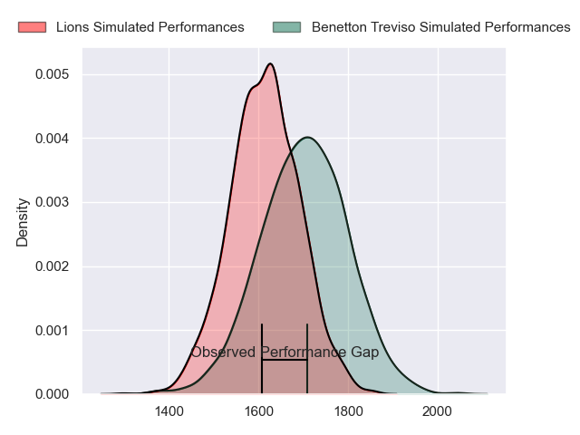
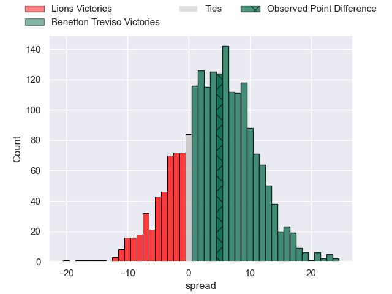
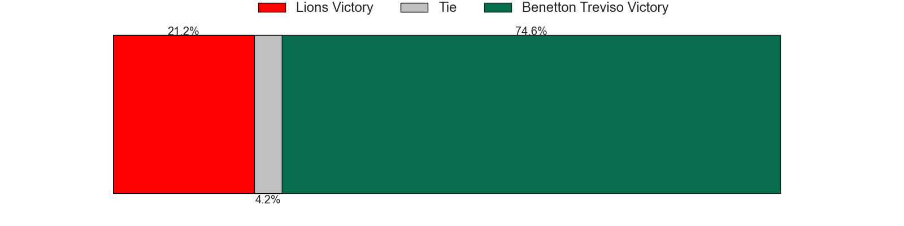
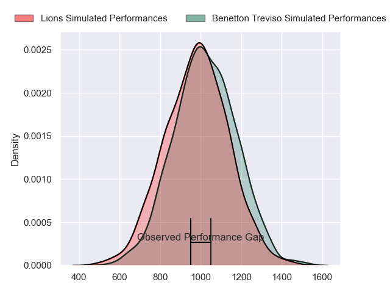
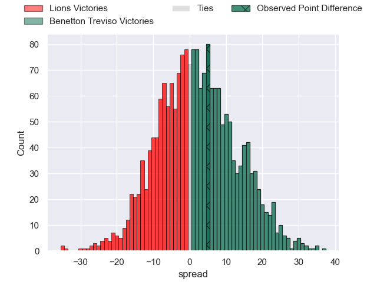
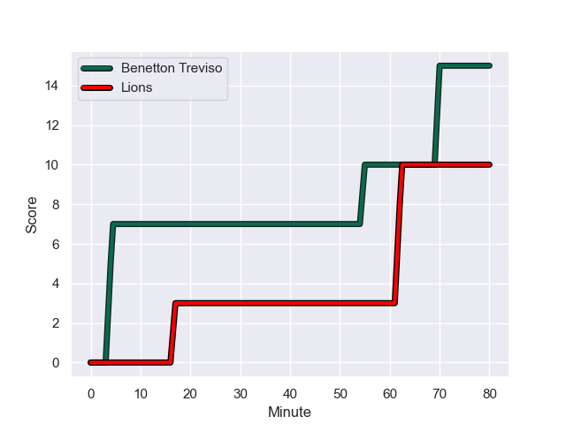
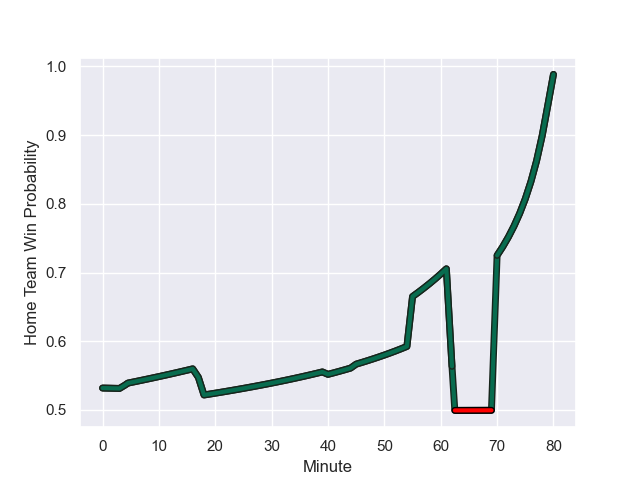

---  
layout: page  
title: Lions at Benetton Treviso; 10-15  
date: 2023-11-05 18:00:00 -0500  
categories: "United Rugby Championship 2023" match review  
---
# Lions at Benetton Treviso; 10-15

# Club Level Predictions

The first set of predictions treats a club as the smallest object, as the club develops its members, organizes a gameplan, and deploys its players as needed for each match. This club model has a prediction of 0.617, which translates to predicting Benetton Treviso to win by 4.3.

Each club has a rating and a rating deviation (similar to a Glicko rating), and expected performances can be generated. This allows for simulated matches and spreads like the ones below.
## Projected Performances - Club Model

## Projected Spreads - Club Model

## Projected Results - Club Model

# Player Level Predictions - Version 2

Treating teams instead as an entity made up of the currently active players, I have ratings for each player in an altogether different system. These can be combined to form team ratings once teamsheets are announced, weighting starters a bit higher than the reserves. After the match is played, players can be weighted by their minutes on the field, allowing for an accurate measure of the team's composition. With these compiled team ratings, we can make predictions, measure inaccuracy, and update the individual player ratings.
## Prediction with Player Minutes: Benetton Treviso by 1.4

Lions by 2.5 on a neutral field
## Prediction without Player Minutes: Benetton Treviso by 2.5

Lions by 1.4 on a neutral pitch

## Projected Performances - Player Model

## Projected Spreads - Player Model

## Projected Results - Player Model

## Scores over Time

## Win Probability over Time

There were 10 large changes in win probability in this match

|   Away Minutes | Away Player            |   Away elo |   Number |   Home elo | Home Player        |   Home Minutes |
|---------------:|:-----------------------|-----------:|---------:|-----------:|:-------------------|---------------:|
|             18 | Morgan Naude           |      43.72 |        1 |      67.65 | Thomas Gallo       |             80 |
|             54 | PJ Botha               |      42.29 |        2 |      95.99 | Giacomo Nicotera   |             56 |
|             54 | Ruan Dreyer            |     112.29 |        3 |      89.48 | Simone Ferrari     |             43 |
|             80 | Ruben Schoeman         |      77.59 |        4 |      58.33 | Edoardo Iachizzi   |             51 |
|             40 | Darrien-Lane Landsberg |      31.99 |        5 |      56.74 | Eli Snyman         |             80 |
|             80 | Hanru Sirgel           |      82.89 |        6 |      50.55 | Alessandro Izekor  |             80 |
|             80 | Emmanuel Tshituka      |      46    |        7 |      60.85 | Sebastian Negri    |             47 |
|             66 | Francke Horn           |     103.66 |        8 |      80.48 | Lorenzo Cannone    |             80 |
|             80 | Sanele Nohamba         |      89.87 |        9 |      34.52 | Andy Uren          |             56 |
|             51 | Jordan Hendrikse       |      40.58 |       10 |      66.8  | Tomas Albornoz     |             51 |
|             72 | Edwill van der Merwe   |      69.64 |       11 |      27.09 | Ignacio Mendy      |             80 |
|             80 | Marius Louw            |      78.54 |       12 |      42.29 | Filippo Drago      |             45 |
|             80 | Henco van Wyk          |      56.68 |       13 |      74.18 | Malakai Fekitoa    |             80 |
|             80 | Richard Kriel          |      31.8  |       14 |      50.97 | Edoardo Padovani   |             80 |
|             77 | Quan Horn              |      76.09 |       15 |      70.03 | Rhyno Smith        |             80 |
|             62 | Corne Fourie           |      79.93 |       16 |      48.3  | Giosue Zilocchi    |             37 |
|             40 | Willem Alberts         |      41.35 |       17 |      59    | Marco Zanon        |             35 |
|             29 | Morne Van den Berg     |      37.49 |       18 |      93.91 | Michele Lamaro     |             33 |
|             26 | Asenathi Ntlabakanye   |      26.67 |       19 |      39.54 | Niccolo Cannone    |             29 |
|             26 | Jaco Visagie           |      49.93 |       20 |      73.18 | Jacob Umaga        |             29 |
|             14 | Johannes JC Pretorius  |      57.88 |       21 |      57.68 | Alessandro Garbisi |             24 |
|              8 | Rynardt Jonker         |      64.16 |       22 |      59.78 | Gianmarco Lucchesi |             24 |
|              3 | Andries Coetzee        |      64.89 |       23 |     nan    | nan                |            nan |

