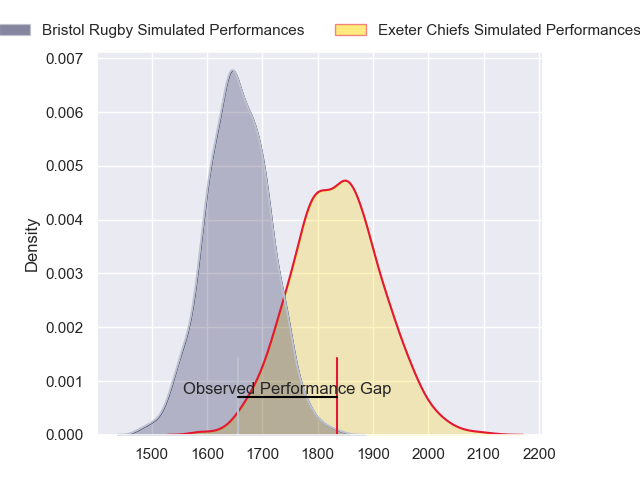
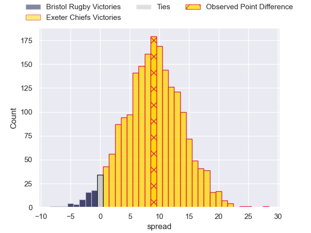
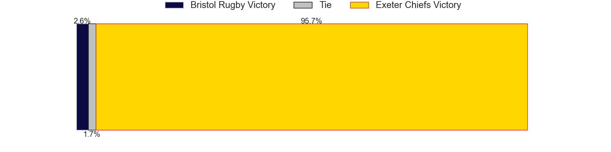
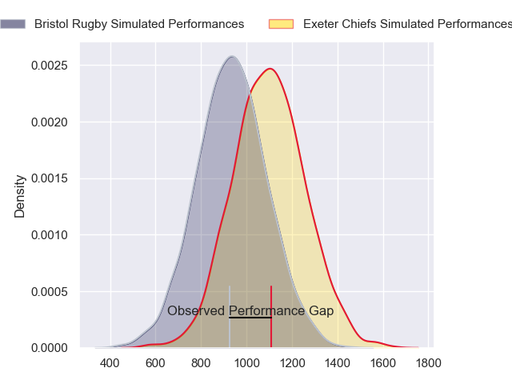
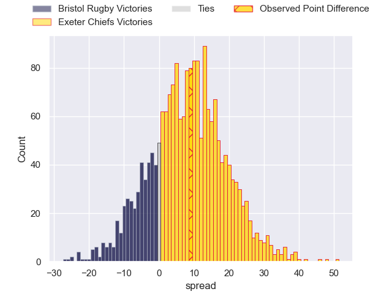
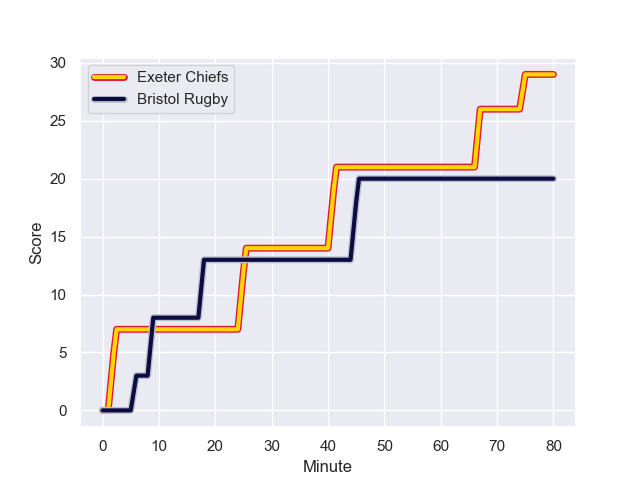
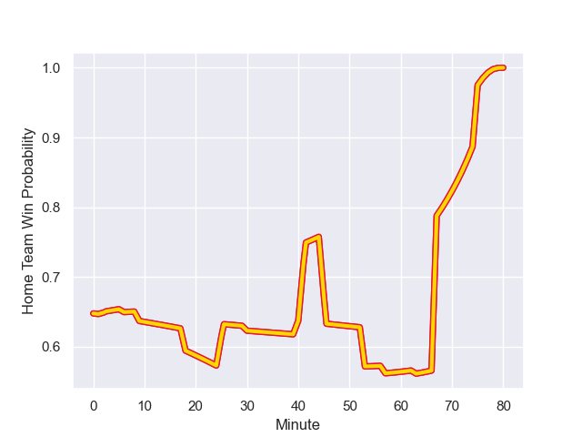

---  
layout: page  
title: Bristol Rugby at Exeter Chiefs; 20-29  
date: 2023-11-05 18:00:00 -0500  
categories: "Gallagher Premiership 2023" match review  
---
# Bristol Rugby at Exeter Chiefs; 20-29

# Club Level Predictions

The first set of predictions treats a club as the smallest object, as the club develops its members, organizes a gameplan, and deploys its players as needed for each match. This club model has a prediction of 0.733, which translates to predicting Exeter Chiefs to win by 8.9.

Each club has a rating and a rating deviation (similar to a Glicko rating), and expected performances can be generated. This allows for simulated matches and spreads like the ones below.
## Projected Performances - Club Model

## Projected Spreads - Club Model

## Projected Results - Club Model

# Player Level Predictions - Version 2

Treating teams instead as an entity made up of the currently active players, I have ratings for each player in an altogether different system. These can be combined to form team ratings once teamsheets are announced, weighting starters a bit higher than the reserves. After the match is played, players can be weighted by their minutes on the field, allowing for an accurate measure of the team's composition. With these compiled team ratings, we can make predictions, measure inaccuracy, and update the individual player ratings.
## Prediction with Player Minutes: Exeter Chiefs by 6.7

Exeter Chiefs by 2.5 on a neutral field
## Prediction without Player Minutes: Exeter Chiefs by 6.4

Exeter Chiefs by 2.3 on a neutral pitch

## Projected Performances - Player Model

## Projected Spreads - Player Model

## Projected Results - Player Model

## Scores over Time

## Win Probability over Time

There were 9 large changes in win probability in this match

|   Away Minutes | Away Player                 |   Away elo |   Number |   Home elo | Home Player           |   Home Minutes |
|---------------:|:----------------------------|-----------:|---------:|-----------:|:----------------------|---------------:|
|             30 | Samuel Alexander Grahamslaw |      76.63 |        1 |      85.01 | Scott Sio             |             47 |
|             30 | Will Capon                  |      35.52 |        2 |      80.96 | Jack Yeandle          |             47 |
|             30 | George Kloska               |      52.58 |        3 |      56.05 | Ehren Painter         |             47 |
|             40 | Josh Caulfield              |      65.16 |        4 |      37.76 | Rusiate Tuima         |             80 |
|             80 | Joe Batley                  |      57.4  |        5 |      51.39 | Lewis Pearson         |             53 |
|             70 | James Dun                   |      61.55 |        6 |      66.17 | Ethan Roots           |             80 |
|             80 | Fitz Harding                |      59.66 |        7 |      69.15 | Jacques Vermeulen     |             80 |
|             80 | Magnus Bradbury             |      48.65 |        8 |      49.64 | Ross Micheal Vintcent |             53 |
|             56 | Kieran Marmion              |      76.98 |        9 |      61.32 | Tom Cairns            |             57 |
|             80 | Callum Sheedy               |      73.36 |       10 |      41.59 | Harvey Skinner        |             80 |
|             80 | Gabriel Ibitoye             |      67.31 |       11 |      87.79 | Olly Woodburn         |             80 |
|             36 | Benhard Janse van Rensburg  |      70.48 |       12 |      62.46 | Tom Hendrickson       |             63 |
|             80 | Virimi Vakatawa             |      97.19 |       13 |     107.8  | Henry Slade           |             80 |
|             71 | Noah Heward                 |      52.38 |       14 |      66.76 | Immanuel Feyi-Waboso  |             80 |
|             80 | Richard Lane                |      66.93 |       15 |      82.05 | Tom Wyatt             |             80 |
|             50 | Jake Woolmore               |      60.78 |       16 |      69.7  | Nika Abuladze         |             33 |
|             50 | Harry Thacker               |      69.51 |       17 |      53.63 | Dan Frost             |             33 |
|             50 | Max Lahiff                  |      42.65 |       18 |      84.49 | Josh Iosefa-Scott     |             33 |
|             40 | Daniel Thomas               |      50.91 |       19 |      72.67 | Dafydd Jenkins        |             27 |
|             10 | Ed Holmes                   |      35.44 |       20 |      37.91 | Aidon Davis           |             27 |
|             24 | Harry Randall               |      73.35 |       21 |      51.17 | Niall Armstrong       |             23 |
|             44 | James Williams              |      36.63 |       22 |      35.35 | Joe Hawkins           |             17 |
|              9 | Piers O'Conor               |      25.13 |       23 |     nan    | nan                   |            nan |

