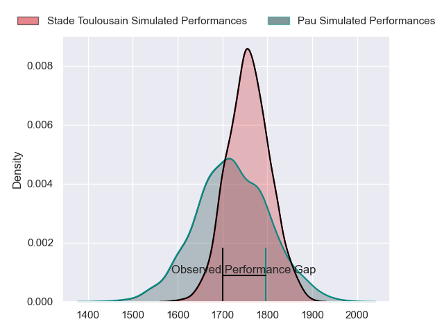
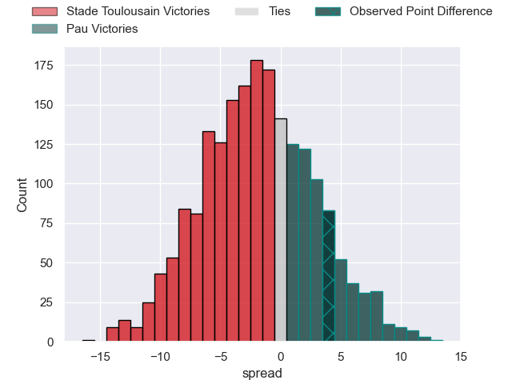
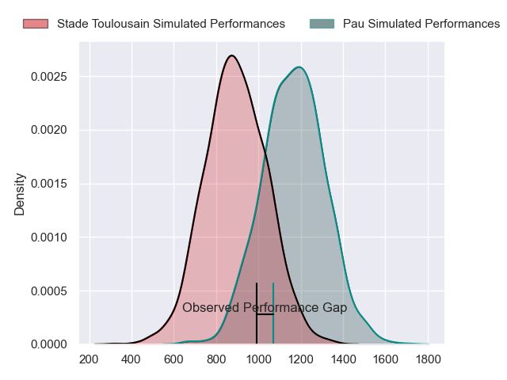
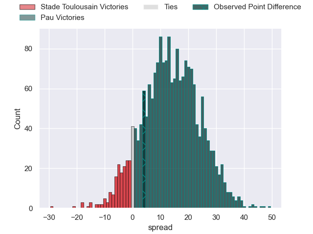
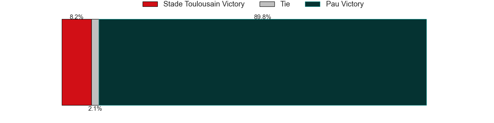
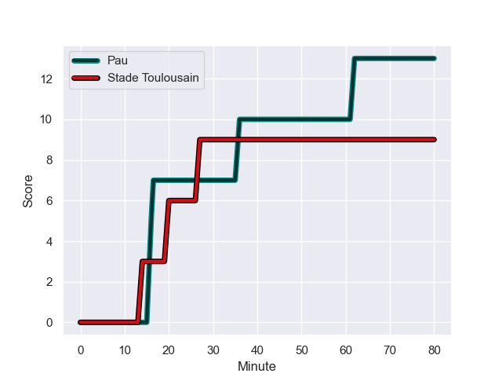
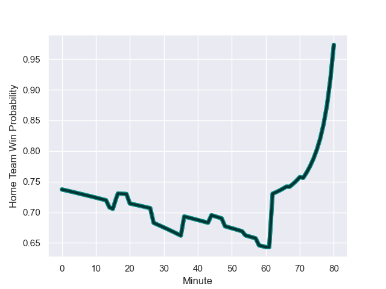

---  
layout: page  
title: Stade Toulousain at Pau; 9-13  
date: 2023-11-05 18:00:00 -0500  
categories: "Top 14 Orange 2023" match review  
---
# Stade Toulousain at Pau; 9-13

# Club Level Predictions

The first set of predictions treats a club as the smallest object, as the club develops its members, organizes a gameplan, and deploys its players as needed for each match. This club model has a prediction of 0.45, which translates to predicting Stade Toulousain to win by 1.8.

Each club has a rating and a rating deviation (similar to a Glicko rating), and expected performances can be generated. This allows for simulated matches and spreads like the ones below.
## Projected Performances - Club Model

## Projected Spreads - Club Model

## Projected Results - Club Model

# Player Level Predictions - Version 2

Treating teams instead as an entity made up of the currently active players, I have ratings for each player in an altogether different system. These can be combined to form team ratings once teamsheets are announced, weighting starters a bit higher than the reserves. After the match is played, players can be weighted by their minutes on the field, allowing for an accurate measure of the team's composition. With these compiled team ratings, we can make predictions, measure inaccuracy, and update the individual player ratings.
## Prediction with Player Minutes: Pau by 11.3

Pau by 6.4 on a neutral field
## Prediction without Player Minutes: Pau by 10.9

Pau by 6.0 on a neutral pitch

## Projected Performances - Player Model

## Projected Spreads - Player Model

## Projected Results - Player Model

## Scores over Time

## Win Probability over Time

There were 5 large changes in win probability in this match

|   Away Minutes | Away Player            |   Away elo |   Number |   Home elo | Home Player         |   Home Minutes |
|---------------:|:-----------------------|-----------:|---------:|-----------:|:--------------------|---------------:|
|             48 | David Ainu'u           |      60.37 |        1 |      38.96 | Facundo Gigena      |             27 |
|             80 | Peato Mauvaka          |      88.76 |        2 |      46.07 | Lucas Rey           |             54 |
|             48 | Owen Franks            |      62.68 |        3 |      76.51 | Siate Tokolahi      |             54 |
|             80 | Richie Arnold          |      39.72 |        4 |      29.3  | Hugo Auradou        |             54 |
|             54 | Piula Faasalele        |      65.99 |        5 |      51.23 | Mickael Capelli     |             54 |
|             44 | Theo Ntamack           |      48.5  |        6 |      74.78 | Lekima Tagitagivalu |             44 |
|             40 | Mathis Castro Ferreira |      47.7  |        7 |      48.31 | Reece Hewat         |             80 |
|             80 | Alexandre Roumat       |      86.58 |        8 |     121.09 | Luke Whitelock      |             80 |
|             80 | Paul Graou             |      42.95 |        9 |     111.24 | Dan Robson          |             58 |
|             71 | Baptiste Germain       |      12.54 |       10 |      92.91 | Joe Simmonds        |             80 |
|             51 | Setareki Bituniyata    |      61.42 |       11 |      43.49 | Théo Attissogbe     |             61 |
|             67 | Pita Ahki              |      39.75 |       12 |      87.29 | Tumua Manu          |             80 |
|             80 | Pierre-Louis Barassi   |      64.01 |       13 |      63.39 | Emilien Gailleton   |             80 |
|             80 | Ange Capuozzo          |      87.81 |       14 |     106.44 | Clement Laporte     |             80 |
|             80 | Melvyn Jaminet         |      66.75 |       15 |      56.48 | Jack Maddocks       |             80 |
|             32 | Rodrigue Neti          |      42.6  |       16 |      63.86 | Remi Seneca         |             53 |
|             32 | Dorian Aldegheri       |     102.87 |       17 |      40.06 | Romain Ruffenach    |             26 |
|             40 | Alban Placines         |      38.62 |       18 |      30.96 | Guram Papidze       |             26 |
|             26 | Joshua Brennan         |      44.23 |       19 |      35.17 | Guillaume Ducat     |             26 |
|             29 | Arthur Retiere         |      80.29 |       20 |      68.74 | Fabrice Metz        |             26 |
|             13 | Paul Costes            |      53.17 |       21 |      61.17 | Martin Puech        |             36 |
|              9 | Kalvin Gourgues        |      46.65 |       22 |      88.49 | Thibault Daubagna   |             22 |
|             36 | Guillaume Cramont      |      53.47 |       23 |      46.74 | Axel Desperes       |             19 |

