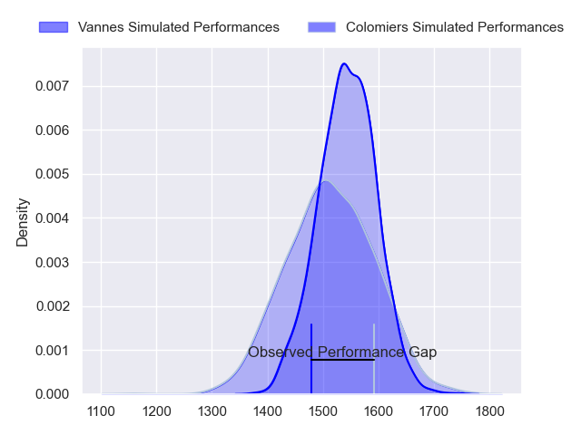
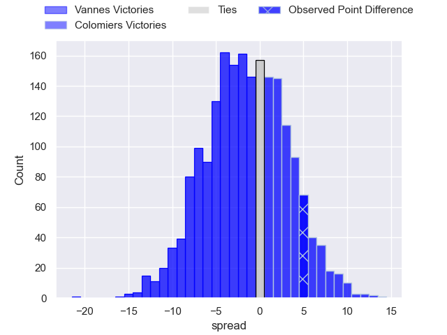
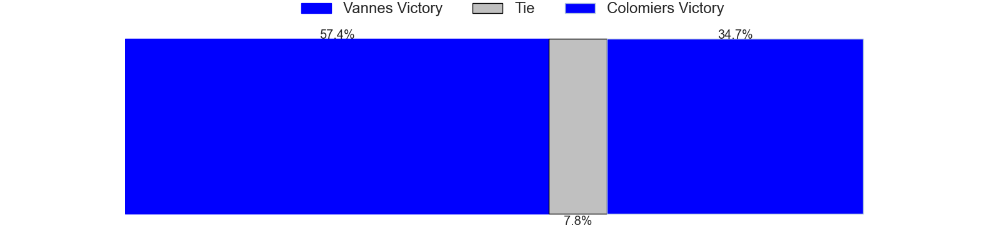
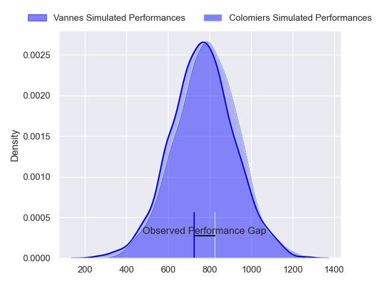
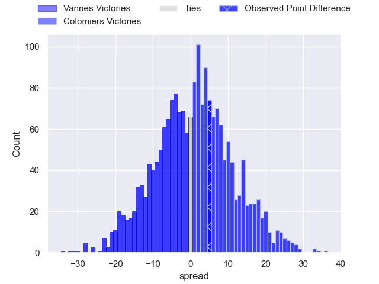
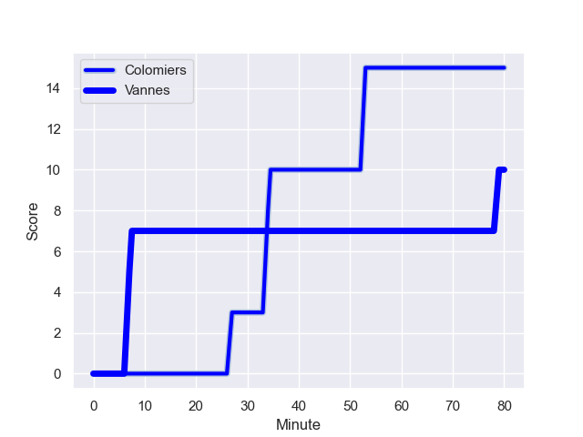
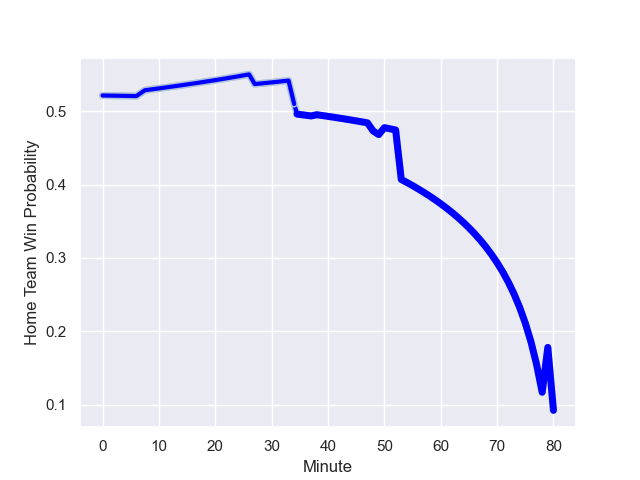

---  
layout: page  
title: Vannes at Colomiers; 10-15  
date: 2023-11-09 18:00:00 -0500  
categories: "Pro D2 2023" match review  
---
# Vannes at Colomiers; 10-15

# Club Level Predictions

The first set of predictions treats a club as the smallest object, as the club develops its members, organizes a gameplan, and deploys its players as needed for each match. This club model has a prediction of 0.453, which translates to predicting Vannes to win by 1.7.

Each club has a rating and a rating deviation (similar to a Glicko rating), and expected performances can be generated. This allows for simulated matches and spreads like the ones below.
## Projected Performances - Club Model

## Projected Spreads - Club Model

## Projected Results - Club Model

# Player Level Predictions - Version 2

Treating teams instead as an entity made up of the currently active players, I have ratings for each player in an altogether different system. These can be combined to form team ratings once teamsheets are announced, weighting starters a bit higher than the reserves. After the match is played, players can be weighted by their minutes on the field, allowing for an accurate measure of the team's composition. With these compiled team ratings, we can make predictions, measure inaccuracy, and update the individual player ratings.
## Prediction with Player Minutes: Colomiers by 0.9

Vannes by 3.6 on a neutral field
## Prediction without Player Minutes: Vannes by 0.9

Vannes by 5.4 on a neutral pitch

## Projected Performances - Player Model

## Projected Spreads - Player Model

## Projected Results - Player Model

## Scores over Time

## Win Probability over Time

There were 7 large changes in win probability in this match

|   Away Minutes | Away Player         |   Away elo |   Number |   Home elo | Home Player           |   Home Minutes |
|---------------:|:--------------------|-----------:|---------:|-----------:|:----------------------|---------------:|
|             60 | Andy Bordelai       |      68.53 |        1 |      46.87 | Guillaume Tartas      |             50 |
|             48 | Pat Leafa           |      75.56 |        2 |      33.55 | Andrew Ready          |             50 |
|             49 | Phil Kite           |      70.3  |        3 |      12.7  | Marco Fepulea'i       |             50 |
|             60 | Hamish Bain         |      58.51 |        4 |      82.08 | Rob Harley            |             80 |
|             48 | Mattéo Desjeux      |      46.17 |        5 |      34.78 | Janse Roux            |             60 |
|             56 | Léon Boulier        |      47.77 |        6 |      45.28 | Joseva Tamani         |             80 |
|             80 | Gregoire Bazin      |      40.51 |        7 |      32.6  | Anthony Coletta       |             60 |
|             80 | Joe Edwards         |      85.9  |        8 |      54.12 | Aldric Lescure        |             38 |
|             60 | Jules Le Bail       |      51.93 |        9 |      36.22 | Ugo Seguela           |             66 |
|             60 | Maxime Lafage       |     102.77 |       10 |      16.95 | Maxime Javaux         |             80 |
|             80 | Romaric Camou       |      48.6  |       11 |      86.45 | Rodrigo Marta         |             80 |
|             80 | Andres Vilaseca     |      19    |       12 |      43.67 | Ray Nu'u              |             80 |
|             80 | Arthur Proult       |       3.9  |       13 |      46.17 | Enzo Salles           |             56 |
|             80 | Martin Alonso Munoz |      44.41 |       14 |      62.45 | Vincent Pinto         |             80 |
|             80 | Paul Surano         |      53.72 |       15 |      29.69 | Thomas Girard         |             80 |
|             32 | Cyril Blanchard     |      43.62 |       16 |      46.62 | Jeremy Bechu          |             42 |
|             32 | Matthieu Uhila      |      47.75 |       17 |      -1.66 | Thomas Larrieu        |             30 |
|             31 | Jérémy Boyadjis     |      58.36 |       18 |      67.22 | Michael Simutoga      |             30 |
|             24 | Karl Chateau        |      28.8  |       19 |      42.4  | Pierre-Samuel Pacheco |             30 |
|             20 | Ximun Bessonart     |      37.85 |       20 |      56.09 | Paul Pimienta         |             24 |
|             20 | Sione Kalamafoni    |      53.43 |       21 |      44.23 | Louis Descoux         |             20 |
|             20 | Erwan Nicolas       |      40.63 |       22 |      45.72 | Waël Ponpon           |             20 |
|             20 | Massimo Ortolan     |      22.82 |       23 |      47.15 | Arthur Diaz           |             14 |

