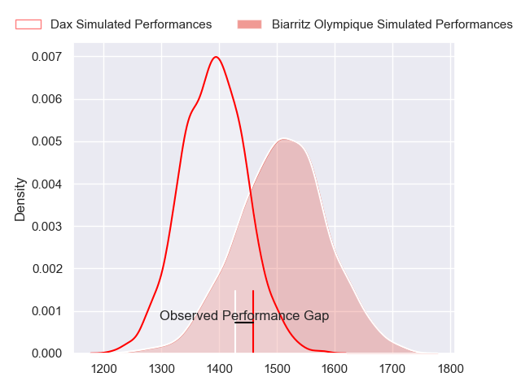
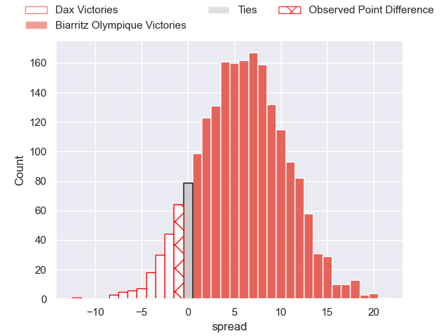
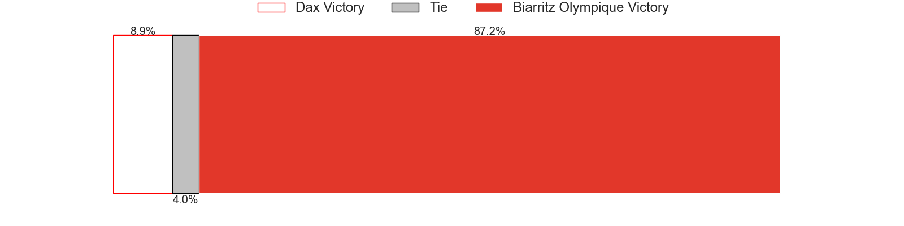
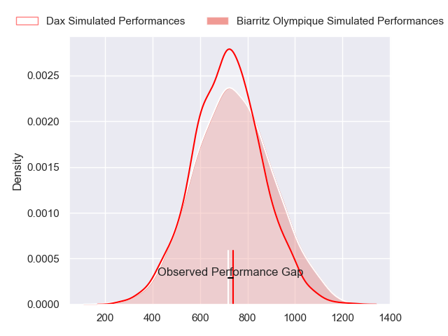
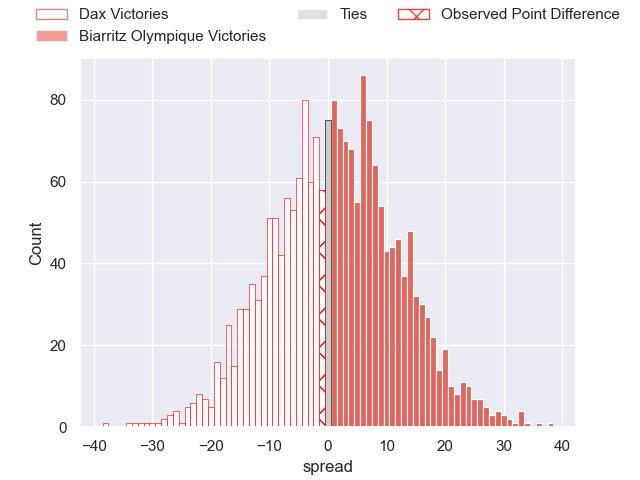
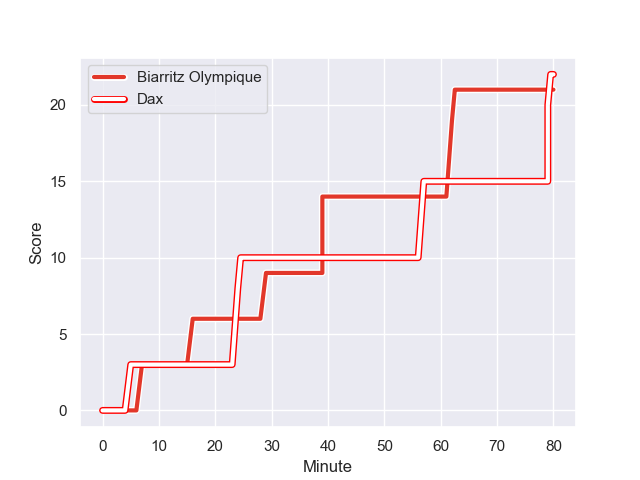
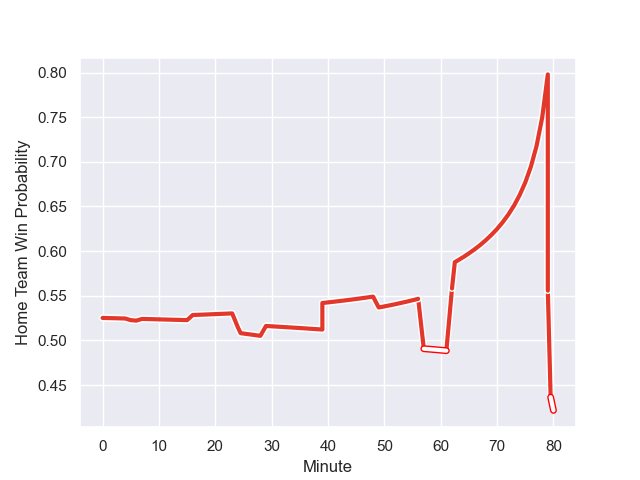

---  
layout: page  
title: Dax at Biarritz Olympique; 22-21  
date: 2023-11-10 18:00:00 -0500  
categories: "Pro D2 2023" match review  
---
# Dax at Biarritz Olympique; 22-21

# Club Level Predictions

The first set of predictions treats a club as the smallest object, as the club develops its members, organizes a gameplan, and deploys its players as needed for each match. This club model has a prediction of 0.661, which translates to predicting Biarritz Olympique to win by 5.9.

Each club has a rating and a rating deviation (similar to a Glicko rating), and expected performances can be generated. This allows for simulated matches and spreads like the ones below.
## Projected Performances - Club Model

## Projected Spreads - Club Model

## Projected Results - Club Model

# Player Level Predictions - Version 2

Treating teams instead as an entity made up of the currently active players, I have ratings for each player in an altogether different system. These can be combined to form team ratings once teamsheets are announced, weighting starters a bit higher than the reserves. After the match is played, players can be weighted by their minutes on the field, allowing for an accurate measure of the team's composition. With these compiled team ratings, we can make predictions, measure inaccuracy, and update the individual player ratings.
## Prediction with Player Minutes: Biarritz Olympique by 1.1

Dax by 4.0 on a neutral field
## Prediction without Player Minutes: Biarritz Olympique by 2.1

Dax by 3.0 on a neutral pitch

## Projected Performances - Player Model

## Projected Spreads - Player Model

## Projected Results - Player Model

## Scores over Time

## Win Probability over Time

There were 8 large changes in win probability in this match

|   Away Minutes | Away Player           |   Away elo |   Number |   Home elo | Home Player         |   Home Minutes |
|---------------:|:----------------------|-----------:|---------:|-----------:|:--------------------|---------------:|
|             45 | Thibaud Dréan         |      51.74 |        1 |      33.52 | Giorgi Nutsubidze   |             47 |
|             45 | Iban Hiriart-Urruty   |      51.09 |        2 |      53.79 | Thomas Sauveterre   |             80 |
|             45 | David Lolohea         |      26.47 |        3 |      51.11 | Mohamed Haouas      |             55 |
|             80 | Josh Furno            |      17.3  |        4 |       9.46 | Johnny Dyer         |             80 |
|             49 | Jean-Baptiste Singer  |      16.82 |        5 |      62.25 | Charlie Matthews    |             48 |
|             80 | Arnaud Aletti         |      51.46 |        6 |      23.46 | Charlie Francoz     |             80 |
|             40 | Théo Tremeau          |      43.16 |        7 |      41.92 | Simon Augry         |             80 |
|             63 | Paul Arnaud Ausset    |      62.73 |        8 |      40.98 | Thomas Hebert       |             64 |
|             55 | Simon Garrouteigt     |      65.44 |        9 |      43.88 | Kerman Aurrekoetxea |             80 |
|             80 | Romuald Séguy         |      37.81 |       10 |      53.66 | Joe Jonas           |             55 |
|             80 | Jope Naceava          |      45.75 |       11 |      48.88 | Steeve Barry        |             80 |
|             80 | Alex McHenry          |      72.01 |       12 |      81.17 | Yann David          |             64 |
|             55 | Hugo Fourquet         |      70.04 |       13 |      63.42 | Tyler Morgan        |             80 |
|             80 | Guillaume Bouche      |      53.99 |       14 |      25.34 | Zach Kibirige       |             80 |
|             80 | Hugo Cerisier         |      56.19 |       15 |      34.5  | Gervais Cordin      |             80 |
|             40 | Mat Luamanu           |      46.3  |       16 |      32.55 | Zakaria El Fakir    |             33 |
|             35 | Maxime Delonca        |      45.92 |       17 |      -0.14 | Adrian Motoc        |             32 |
|             35 | Louis Mary            |      55.7  |       18 |       9.53 | Chris Hilsenbeck    |             25 |
|             35 | Nephi Leatigaga       |      28.9  |       19 |      32.17 | Alfie Petch         |             25 |
|             31 | Jean-Baptiste Barrère |      35.7  |       20 |      31.61 | Tornike Jalagonia   |             16 |
|             25 | Sylvère Reteau        |      47.68 |       21 |      78.17 | Jonathan Joseph     |             16 |
|             25 | Bastien Daguerre      |      54.38 |       22 |     nan    | nan                 |            nan |
|             17 | Ratu Nacika           |      40.46 |       23 |     nan    | nan                 |            nan |

