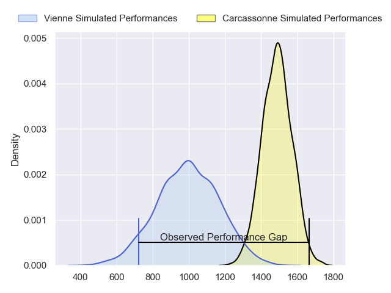
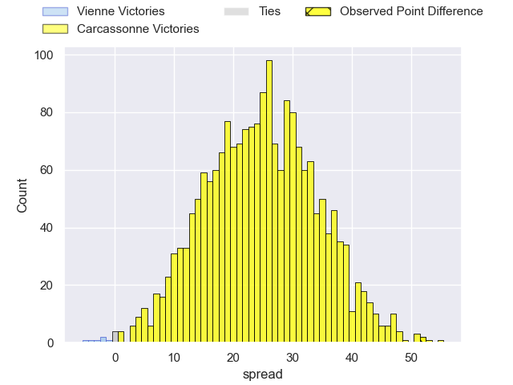
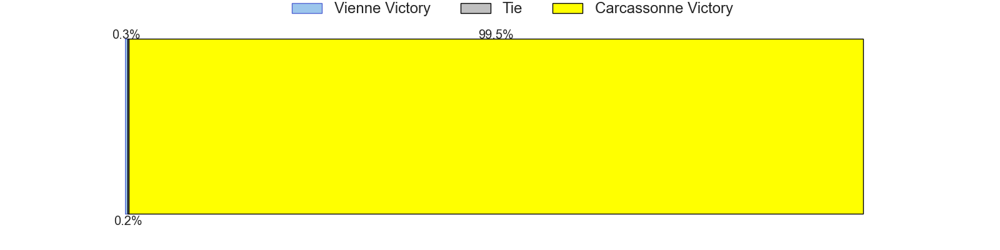
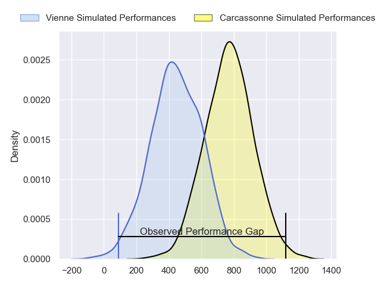
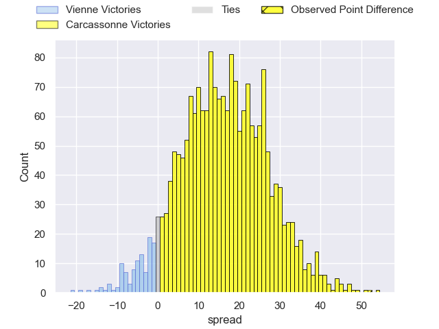
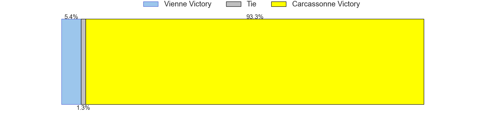
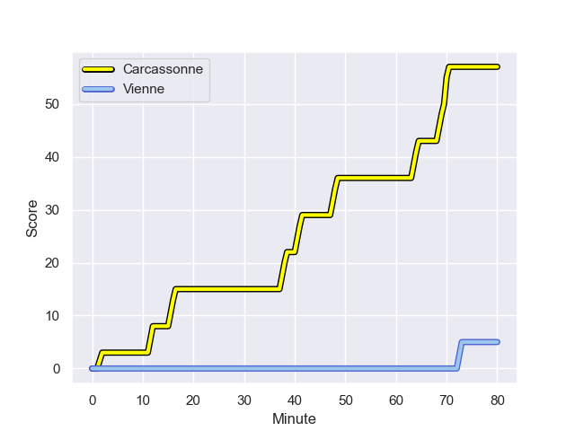
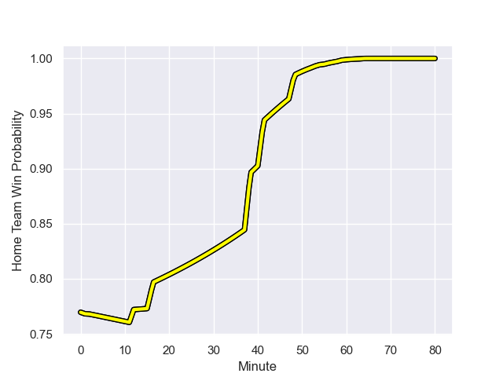

---  
layout: page  
title: Vienne at Carcassonne; 5-57  
date: 2023-11-10 18:00:00 -0500  
categories: "Nationale 2023" match review  
---
# Vienne at Carcassonne; 5-57

# Club Level Predictions

The first set of predictions treats a club as the smallest object, as the club develops its members, organizes a gameplan, and deploys its players as needed for each match. This club model has a prediction of 0.925, which translates to predicting Carcassonne to win by 24.8.

Each club has a rating and a rating deviation (similar to a Glicko rating), and expected performances can be generated. This allows for simulated matches and spreads like the ones below.
## Projected Performances - Club Model

## Projected Spreads - Club Model

## Projected Results - Club Model

# Player Level Predictions - Version 2

Treating teams instead as an entity made up of the currently active players, I have ratings for each player in an altogether different system. These can be combined to form team ratings once teamsheets are announced, weighting starters a bit higher than the reserves. After the match is played, players can be weighted by their minutes on the field, allowing for an accurate measure of the team's composition. With these compiled team ratings, we can make predictions, measure inaccuracy, and update the individual player ratings.
## Prediction with Player Minutes: Carcassonne by 13.3

Carcassonne by 9.0 on a neutral field
## Prediction without Player Minutes: Carcassonne by 13.4

Carcassonne by 9.2 on a neutral pitch

## Projected Performances - Player Model

## Projected Spreads - Player Model

## Projected Results - Player Model

## Scores over Time

## Win Probability over Time

There were 2 large changes in win probability in this match

|   Away Minutes | Away Player              |   Away elo |   Number |   Home elo | Home Player           |   Home Minutes |
|---------------:|:-------------------------|-----------:|---------:|-----------:|:----------------------|---------------:|
|             59 | Louan Capuano            |      32.65 |        1 |      42.47 | Florent Lorenzon      |             55 |
|             59 | Axel Benjamin            |      39.58 |        2 |      50.4  | Raphael Carbou        |             55 |
|             66 | Pierre-Mathieu Fernandes |      31.46 |        3 |      59.21 | Fabien Lorenzon       |             55 |
|             80 | Ciaran O'Flynn           |      22.91 |        4 |      25    | Romain Manchia        |             59 |
|             40 | Mathias Bastide          |      28.61 |        5 |      31.56 | Clément Fontaine      |             80 |
|             53 | Romain Falcoz            |      32.33 |        6 |      42.1  | Etienne Herjean       |             80 |
|             80 | Steven Giroud            |      25.57 |        7 |      47.33 | Valentin Sese         |             48 |
|             62 | Geoffrey Nouhaillaguet   |       7.4  |        8 |      52.2  | Carl Fearns           |             80 |
|             62 | Alexandre Jarguel        |      37.38 |        9 |      27.28 | Gaetan Pichon         |             59 |
|             80 | Tom Richard              |      19.07 |       10 |      57.46 | Gabin Michet          |             59 |
|             80 | Martin Arfi              |      37.36 |       11 |      60.08 | Clement Egiziano      |             80 |
|             80 | Axel Derderian           |      39.44 |       12 |      22.19 | Jordan Puletua        |             80 |
|             80 | Pierre Mollard           |      21    |       13 |      41.17 | Tutuila Vaea          |             80 |
|             80 | Mathieu Bonnet-Gonnnet   |      58.56 |       14 |      78.73 | Léo Darrelatour       |             80 |
|             75 | Brandon Bellavia         |      16.03 |       15 |      62.89 | Maxime Gianet         |             57 |
|             21 | Benjamin Robin           |      30.51 |       16 |      46.44 | Yan Arnold            |             25 |
|             21 | Romain Eliot             |      32.99 |       17 |      51.35 | Luka Petriashvili     |             25 |
|             14 | Tau Junior Fifita        |      43.89 |       18 |      22.69 | Vakhtangi Akhobadze   |             25 |
|             40 | Guillaume Moroldo        |      28.24 |       19 |      24.84 | Marius Iftimiciuc     |             21 |
|             18 | Nathanael Grosu          |      40.09 |       20 |      43.85 | Romain Guyot          |             32 |
|             27 | Charles Massot           |      23.3  |       21 |      -1.16 | Martin Landajo        |             21 |
|              5 | Julien Hervouet          |      34.45 |       22 |      43.25 | Damien Añon           |             21 |
|             18 | Malory Piet              |      15.73 |       23 |      31.07 | Sakiusa Bureitakiyaca |             23 |

