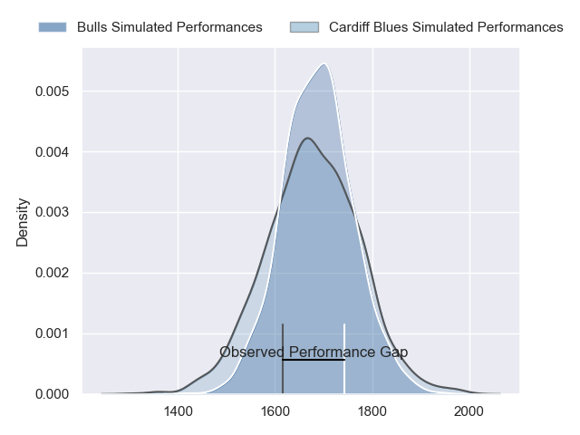
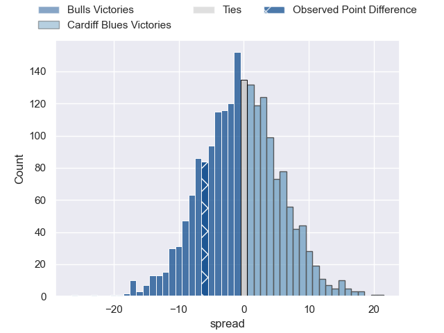
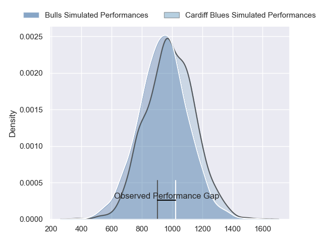
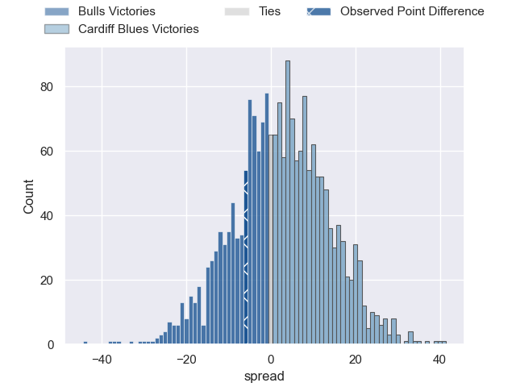
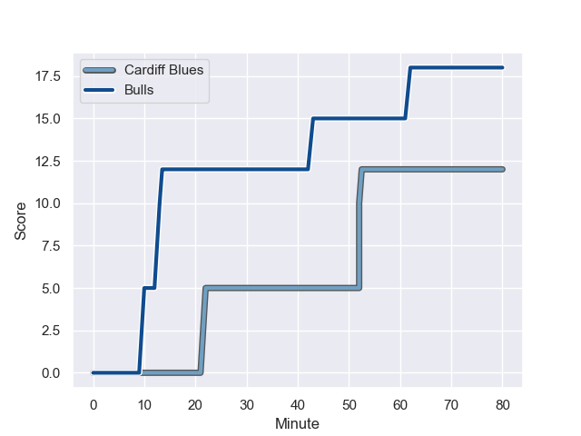
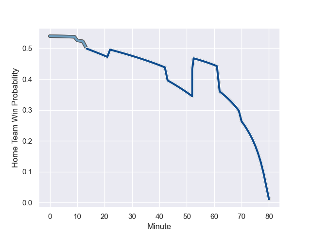

---  
layout: page  
title: Bulls at Cardiff Blues; 18-12  
date: 2023-11-10 18:00:00 -0500  
categories: "United Rugby Championship 2023" match review  
---
# Bulls at Cardiff Blues; 18-12

# Club Level Predictions

The first set of predictions treats a club as the smallest object, as the club develops its members, organizes a gameplan, and deploys its players as needed for each match. This club model has a prediction of 0.484, which translates to predicting Bulls to win by 0.6.

Each club has a rating and a rating deviation (similar to a Glicko rating), and expected performances can be generated. This allows for simulated matches and spreads like the ones below.
## Projected Performances - Club Model

## Projected Spreads - Club Model

## Projected Results - Club Model

# Player Level Predictions - Version 2

Treating teams instead as an entity made up of the currently active players, I have ratings for each player in an altogether different system. These can be combined to form team ratings once teamsheets are announced, weighting starters a bit higher than the reserves. After the match is played, players can be weighted by their minutes on the field, allowing for an accurate measure of the team's composition. With these compiled team ratings, we can make predictions, measure inaccuracy, and update the individual player ratings.
## Prediction with Player Minutes: Cardiff Blues by 1.7

Bulls by 2.7 on a neutral field
## Prediction without Player Minutes: Cardiff Blues by 1.6

Bulls by 2.9 on a neutral pitch

## Projected Performances - Player Model

## Projected Spreads - Player Model

## Projected Results - Player Model

## Scores over Time

## Win Probability over Time

There were 9 large changes in win probability in this match

|   Away Minutes | Away Player             |   Away elo |   Number |   Home elo | Home Player         |   Home Minutes |
|---------------:|:------------------------|-----------:|---------:|-----------:|:--------------------|---------------:|
|             40 | Simphiwe Matanzima      |      53.26 |        1 |      58.56 | Corey Domachowski   |             50 |
|             52 | Akker van der Merwe     |      95.16 |        2 |      46.17 | Efan Daniel         |             50 |
|             80 | Wilco Louw              |     100.49 |        3 |      48.45 | Rhys Litterick      |             63 |
|             80 | Reinhardt Ludwig        |      30.83 |        4 |      55    | Teddy Williams      |             80 |
|             52 | Janko Swanepoel         |      55.41 |        5 |      22.32 | Rory Thornton       |             50 |
|             80 | Nizaam Carr             |      77.94 |        6 |      43.6  | Alex Mann           |             80 |
|             59 | Cyle Brink              |      24.5  |        7 |      46.34 | Ellis Jenkins       |             80 |
|             40 | Celimpilo Gumede        |      46.49 |        8 |      64.56 | Lopeti Timani       |             50 |
|             70 | Embrose Papier          |      75.69 |        9 |      78.59 | Tomos Williams      |             80 |
|             80 | Chris Smith             |      50.79 |       10 |      71.73 | Tinus de Beer       |             54 |
|             80 | Sergeal Petersen        |      71.87 |       11 |      73.76 | Mason Grady         |             80 |
|             80 | David Kriel             |      60.04 |       12 |      96.91 | Uilisi Halaholo     |             80 |
|             80 | Stedman-Gee Rivett Gans |      52.1  |       13 |     105.27 | Rey Lee-Lo          |             80 |
|             80 | Sebastian de Klerk      |      93.16 |       14 |      38.14 | Harri Millard       |             80 |
|             80 | Devon Williams          |      48.14 |       15 |      34.72 | Jacob Beetham       |             72 |
|             40 | Gerhard Steenekamp      |      61.32 |       16 |      40.81 | Seb Davies          |             30 |
|             40 | Cameron Hanekom         |      47.15 |       17 |      84.73 | Thomas Young        |             30 |
|             28 | Ruan Nortje             |      54.45 |       18 |      33.02 | Rhys Carré          |             30 |
|             28 | Johan Grobbelaar        |      87    |       19 |      46.65 | Evan Lloyd          |             30 |
|             21 | Elrigh Louw             |      62.72 |       20 |      42.01 | Arwel Robson        |             26 |
|             10 | Keagan Johannes         |      31.21 |       21 |      34.39 | William Davies-King |             17 |
|            nan | nan                     |     nan    |       22 |      30.58 | Cam Winnett         |              8 |

